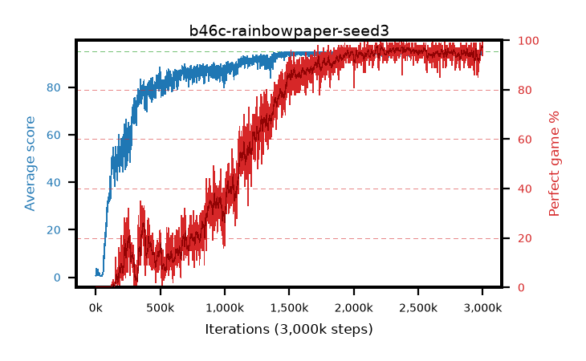

# b46c-rainbowpaper-seed3

step **3,000,000** · 3000 evals · trailing **94.57** · peak **94.73** @2,181,000 · sef **51.5** · best30 **96.9** @2,230,000

## Config

| | |
|---|---|
| adam_epsilon | 0.00015 |
| algo | rainbow |
| batch_size | 32 |
| beta_anneal_steps | 750000 |
| btr_blocks | 3 |
| btr_layer_norm | False |
| btr_residual | False |
| btr_spectral_norm | True |
| collect_envs | 1 |
| discount | 0.99 |
| dist_atoms | 51 |
| dist_embedding | 64 |
| dist_kappa | 1.0 |
| dist_policy_samples | 8 |
| dist_quantiles | 32 |
| dist_tau_prime_samples | 8 |
| dist_tau_samples | 8 |
| dist_v_max | 110.0 |
| dist_v_min | -10.0 |
| epsilon_anneal_steps | 1 |
| epsilon_schedule | linear |
| eval_interval | 1000 |
| eval_queue | True |
| eval_queue_depth | 16 |
| eval_workers | 8 |
| fc_layers | (320,) |
| fork_branches | 1 |
| gradient_clipping | 0.0 |
| graph_eval_episodes | 100 |
| guided_fraction | 0.0 |
| init_from | None |
| initial_collect_steps | 20000 |
| initial_epsilon | 0.0 |
| is_beta | 0.4 |
| is_beta_final | 1.0 |
| is_normalization | batch_max |
| is_weights | True |
| learning_rate | 6.25e-05 |
| max_steps | 3000000 |
| min_checkpoint_score | 40.0 |
| min_epsilon | 0.0 |
| munchausen_alpha | 0.0 |
| munchausen_l0 | -1.0 |
| munchausen_tau | 0.03 |
| n_step_update | 3 |
| priority_exponent | 0.5 |
| rainbow_double | True |
| rainbow_dueling | True |
| rainbow_epsilon_decay | linear |
| rainbow_epsilon_zero_at | 0.0 |
| rainbow_head | c51 |
| rainbow_munchausen_logpi | target |
| rainbow_noisy | True |
| rainbow_noisy_sigma | 0.5 |
| rainbow_prefill_epsilon | random |
| rainbow_stream_width | 512 |
| replay_buffer_max_length | 1000000 |
| replay_ratio | 0.25 |
| reset_alpha | 0.5 |
| reset_anneal_gamma |  |
| reset_anneal_n_step |  |
| reset_anneal_steps | 10000 |
| reset_interval | 0 |
| reset_stop_after | 0 |
| seed | 3 |
| target_update_period | 2000 |
| target_update_tau | 1.0 |
| torch_threads | 1 |

## Evals

| step | avg score | trailing avg | min score | max score | avg reward | perfect % | epsilon |
|---|---|---|---|---|---|---|---|
| 1000 | 0.65 | 0.65 | 0.0 | 3.0 | 0.096 | 0.0 | 0.0 |
| 2000 | 0.51 | 0.58 | 0.0 | 3.0 | -0.043 | 0.0 | 0.0 |
| 3000 | 2.07 | 1.08 | 0.0 | 9.0 | 1.511 | 0.0 | 0.0 |
| ... | ... | ... | ... | ... | ... | ... | ... |
| 2989000 | 94.82 | 94.59 | 81.0 | 95.0 | 190.369 | 97.0 | 0.0 |
| 2990000 | 93.9 | 94.54 | 20.0 | 95.0 | 189.456 | 97.0 | 0.0 |
| 2991000 | 94.8 | 94.54 | 77.0 | 95.0 | 190.334 | 97.0 | 0.0 |
| 2992000 | 94.82 | 94.54 | 81.0 | 95.0 | 191.418 | 98.0 | 0.0 |
| 2993000 | 94.46 | 94.54 | 42.0 | 95.0 | 191.015 | 98.0 | 0.0 |
| 2994000 | 93.67 | 94.53 | 17.0 | 95.0 | 189.253 | 97.0 | 0.0 |
| 2995000 | 94.6 | 94.55 | 69.0 | 95.0 | 190.166 | 97.0 | 0.0 |
| 2996000 | 95.0 | 94.53 | 95.0 | 95.0 | 193.646 | 100.0 | 0.0 |
| 2997000 | 94.48 | 94.55 | 46.0 | 95.0 | 190.002 | 97.0 | 0.0 |
| 2998000 | 94.97 | 94.55 | 94.0 | 95.0 | 190.468 | 97.0 | 0.0 |
| 2999000 | 94.92 | 94.56 | 92.0 | 95.0 | 190.544 | 97.0 | 0.0 |
| 3000000 | 94.26 | 94.57 | 74.0 | 95.0 | 186.651 | 94.0 | 0.0 |
