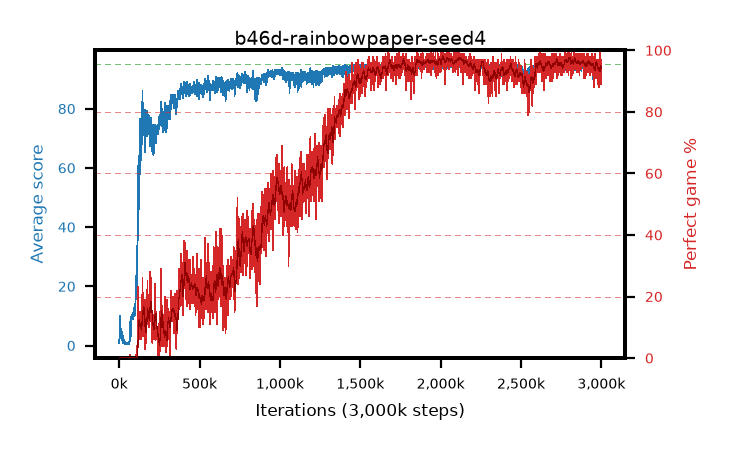

# b46d-rainbowpaper-seed4

step **3,000,000** · 3000 evals · trailing **93.56** · peak **94.75** @2,085,000 · sef **54.6** · best30 **97.3** @2,031,000

## Config

| | |
|---|---|
| adam_epsilon | 0.00015 |
| algo | rainbow |
| batch_size | 32 |
| beta_anneal_steps | 750000 |
| btr_blocks | 3 |
| btr_layer_norm | False |
| btr_residual | False |
| btr_spectral_norm | True |
| collect_envs | 1 |
| discount | 0.99 |
| dist_atoms | 51 |
| dist_embedding | 64 |
| dist_kappa | 1.0 |
| dist_policy_samples | 8 |
| dist_quantiles | 32 |
| dist_tau_prime_samples | 8 |
| dist_tau_samples | 8 |
| dist_v_max | 110.0 |
| dist_v_min | -10.0 |
| epsilon_anneal_steps | 1 |
| epsilon_schedule | linear |
| eval_interval | 1000 |
| eval_queue | True |
| eval_queue_depth | 16 |
| eval_workers | 8 |
| fc_layers | (320,) |
| fork_branches | 1 |
| gradient_clipping | 0.0 |
| graph_eval_episodes | 100 |
| guided_fraction | 0.0 |
| init_from | None |
| initial_collect_steps | 20000 |
| initial_epsilon | 0.0 |
| is_beta | 0.4 |
| is_beta_final | 1.0 |
| is_normalization | batch_max |
| is_weights | True |
| learning_rate | 6.25e-05 |
| max_steps | 3000000 |
| min_checkpoint_score | 40.0 |
| min_epsilon | 0.0 |
| munchausen_alpha | 0.0 |
| munchausen_l0 | -1.0 |
| munchausen_tau | 0.03 |
| n_step_update | 3 |
| priority_exponent | 0.5 |
| rainbow_double | True |
| rainbow_dueling | True |
| rainbow_epsilon_decay | linear |
| rainbow_epsilon_zero_at | 0.0 |
| rainbow_head | c51 |
| rainbow_munchausen_logpi | target |
| rainbow_noisy | True |
| rainbow_noisy_sigma | 0.5 |
| rainbow_prefill_epsilon | random |
| rainbow_stream_width | 512 |
| replay_buffer_max_length | 1000000 |
| replay_ratio | 0.25 |
| reset_alpha | 0.5 |
| reset_anneal_gamma |  |
| reset_anneal_n_step |  |
| reset_anneal_steps | 10000 |
| reset_interval | 0 |
| reset_stop_after | 0 |
| seed | 4 |
| target_update_period | 2000 |
| target_update_tau | 1.0 |
| torch_threads | 1 |

## Evals

| step | avg score | trailing avg | min score | max score | avg reward | perfect % | epsilon |
|---|---|---|---|---|---|---|---|
| 1000 | 0.76 | 0.76 | 0.0 | 3.0 | -3.625 | 0.0 | 0.0 |
| 2000 | 2.38 | 1.57 | 0.0 | 11.0 | 1.822 | 0.0 | 0.0 |
| 3000 | 3.19 | 2.11 | 0.0 | 9.0 | 2.355 | 0.0 | 0.0 |
| ... | ... | ... | ... | ... | ... | ... | ... |
| 2989000 | 95.0 | 93.47 | 95.0 | 95.0 | 193.631 | 100.0 | 0.0 |
| 2990000 | 94.55 | 93.54 | 79.0 | 95.0 | 186.13 | 93.0 | 0.0 |
| 2991000 | 94.86 | 93.5 | 89.0 | 95.0 | 189.436 | 96.0 | 0.0 |
| 2992000 | 93.2 | 93.45 | 21.0 | 95.0 | 180.699 | 89.0 | 0.0 |
| 2993000 | 94.3 | 93.49 | 26.0 | 95.0 | 190.847 | 98.0 | 0.0 |
| 2994000 | 94.34 | 93.51 | 34.0 | 95.0 | 188.839 | 96.0 | 0.0 |
| 2995000 | 94.84 | 93.54 | 89.0 | 95.0 | 188.362 | 95.0 | 0.0 |
| 2996000 | 93.87 | 93.49 | 9.0 | 95.0 | 188.38 | 96.0 | 0.0 |
| 2997000 | 92.79 | 93.52 | 19.0 | 95.0 | 184.163 | 93.0 | 0.0 |
| 2998000 | 93.67 | 93.59 | 24.0 | 95.0 | 183.23 | 91.0 | 0.0 |
| 2999000 | 94.94 | 93.61 | 92.0 | 95.0 | 190.475 | 97.0 | 0.0 |
| 3000000 | 92.72 | 93.56 | 13.0 | 95.0 | 180.088 | 89.0 | 0.0 |
