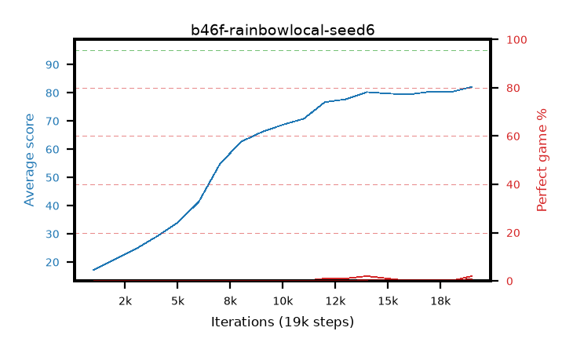

# b46f-rainbowlocal-seed6

step **19,000** · 19 evals · trailing **59.29** · peak **59.29** @19,000 · sef **0.0** · best30 **0.0** @19,000

## Config

| | |
|---|---|
| adam_epsilon | 1e-07 |
| algo | rainbow |
| batch_size | 128 |
| beta_anneal_steps | 300000 |
| btr_blocks | 3 |
| btr_layer_norm | False |
| btr_residual | False |
| btr_spectral_norm | True |
| collect_envs | 1 |
| discount | 0.99 |
| dist_atoms | 51 |
| dist_embedding | 64 |
| dist_kappa | 1.0 |
| dist_policy_samples | 8 |
| dist_quantiles | 32 |
| dist_tau_prime_samples | 8 |
| dist_tau_samples | 8 |
| dist_v_max | 110.0 |
| dist_v_min | -10.0 |
| epsilon_anneal_steps | 1 |
| epsilon_schedule | eval |
| eval_interval | 1000 |
| eval_queue | True |
| eval_queue_depth | 16 |
| eval_workers | 8 |
| fc_layers | (320,) |
| fork_branches | 4 |
| fork_max_steps | 60 |
| fork_min_length | 85 |
| fork_prob | 0.5 |
| gradient_clipping | 0.0 |
| graph_eval_episodes | 100 |
| guided_fraction | 0.8 |
| init_from | None |
| initial_collect_steps | 2000 |
| initial_epsilon | 0.4 |
| is_beta | 0.4 |
| is_beta_final | 1.0 |
| is_normalization | mean |
| is_weights | True |
| learning_rate | 1e-05 |
| max_steps | 3000000 |
| min_checkpoint_score | 40.0 |
| min_epsilon | 0.002 |
| munchausen_alpha | 0.0 |
| munchausen_l0 | -1.0 |
| munchausen_tau | 0.03 |
| n_step_update | 3 |
| priority_exponent | 0.6 |
| rainbow_double | True |
| rainbow_dueling | True |
| rainbow_epsilon_decay | linear |
| rainbow_epsilon_zero_at | 0.0 |
| rainbow_head | c51 |
| rainbow_munchausen_logpi | target |
| rainbow_noisy | True |
| rainbow_noisy_sigma | 0.5 |
| rainbow_prefill_epsilon | random |
| rainbow_stream_width | 512 |
| replay_buffer_max_length | 100000 |
| replay_ratio | 1.0 |
| reset_alpha | 0.5 |
| reset_anneal_gamma |  |
| reset_anneal_n_step |  |
| reset_anneal_steps | 10000 |
| reset_interval | 0 |
| reset_stop_after | 0 |
| seed | 6 |
| target_update_period | 8 |
| target_update_tau | 1.0 |
| torch_threads | 1 |

## Evals

| step | avg score | trailing avg | min score | max score | avg reward | perfect % | epsilon |
|---|---|---|---|---|---|---|---|
| 1000 | 17.2 | 17.2 | 0.0 | 41.0 | 12.392 | 0.0 | 0.4 |
| 2000 | 20.95 | 19.07 | 6.0 | 36.0 | 15.924 | 0.0 | 0.4 |
| 3000 | 24.6 | 20.92 | 8.0 | 43.0 | 19.563 | 0.0 | 0.05 |
| ... | ... | ... | ... | ... | ... | ... | ... |
| 8000 | 62.6 | 35.55 | 2.0 | 83.0 | 58.97 | 0.0 | 0.0125 |
| 9000 | 66.09 | 38.94 | 1.0 | 86.0 | 63.076 | 0.0 | 0.0125 |
| 10000 | 68.67 | 41.92 | 1.0 | 88.0 | 66.382 | 0.0 | 0.0125 |
| 11000 | 70.81 | 44.54 | 2.0 | 89.0 | 68.851 | 0.0 | 0.0125 |
| 12000 | 76.69 | 47.22 | 1.0 | 95.0 | 75.816 | 1.0 | 0.0125 |
| 13000 | 77.7 | 49.57 | 31.0 | 95.0 | 76.973 | 1.0 | 0.0125 |
| 14000 | 80.24 | 51.76 | 54.0 | 95.0 | 80.68 | 2.0 | 0.01248 |
| 15000 | 79.72 | 53.62 | 62.0 | 95.0 | 79.223 | 1.0 | 0.01246 |
| 16000 | 79.4 | 55.23 | 58.0 | 91.0 | 77.787 | 0.0 | 0.01242 |
| 17000 | 80.38 | 56.71 | 23.0 | 93.0 | 78.897 | 0.0 | 0.0124 |
| 18000 | 80.24 | 58.02 | 60.0 | 93.0 | 78.715 | 0.0 | 0.01241 |
| 19000 | 82.09 | 59.29 | 22.0 | 95.0 | 82.579 | 2.0 | 0.01242 |
