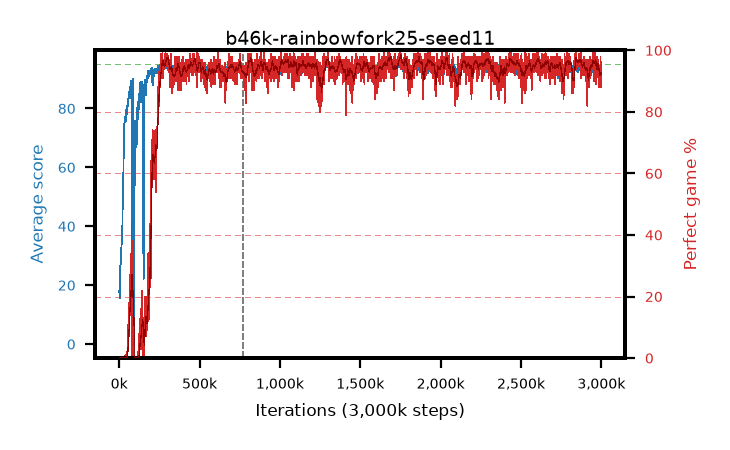

# b46k-rainbowfork25-seed11

step **3,000,000** · 3000 evals · trailing **93.42** · peak **94.67** @1,691,000 · sef **92.0** · best30 **97.1** @1,764,000

## Config

| | |
|---|---|
| adam_epsilon | 1e-07 |
| algo | rainbow |
| batch_size | 32 |
| beta_anneal_steps | 300000 |
| btr_blocks | 3 |
| btr_layer_norm | False |
| btr_residual | False |
| btr_spectral_norm | True |
| collect_envs | 1 |
| discount | 0.99 |
| dist_atoms | 51 |
| dist_embedding | 64 |
| dist_kappa | 1.0 |
| dist_policy_samples | 8 |
| dist_quantiles | 32 |
| dist_tau_prime_samples | 8 |
| dist_tau_samples | 8 |
| dist_v_max | 110.0 |
| dist_v_min | -10.0 |
| epsilon_anneal_steps | 1 |
| epsilon_schedule | eval |
| eval_interval | 1000 |
| eval_queue | True |
| eval_queue_depth | 16 |
| eval_workers | 8 |
| fc_layers | (320,) |
| fork_branches | 4 |
| fork_max_steps | 60 |
| fork_min_length | 85 |
| fork_prob | 0.5 |
| gradient_clipping | 0.0 |
| graph_eval_episodes | 100 |
| guided_fraction | 0.8 |
| init_from | None |
| initial_collect_steps | 2000 |
| initial_epsilon | 0.4 |
| is_beta | 0.4 |
| is_beta_final | 1.0 |
| is_normalization | mean |
| is_weights | True |
| learning_rate | 1e-05 |
| max_steps | 3000000 |
| min_checkpoint_score | 40.0 |
| min_epsilon | 0.002 |
| munchausen_alpha | 0.0 |
| munchausen_l0 | -1.0 |
| munchausen_tau | 0.03 |
| n_step_update | 3 |
| priority_exponent | 0.6 |
| rainbow_double | True |
| rainbow_dueling | True |
| rainbow_epsilon_decay | linear |
| rainbow_epsilon_zero_at | 0.0 |
| rainbow_head | c51 |
| rainbow_munchausen_logpi | target |
| rainbow_noisy | True |
| rainbow_noisy_sigma | 0.5 |
| rainbow_prefill_epsilon | random |
| rainbow_stream_width | 512 |
| replay_buffer_max_length | 100000 |
| replay_ratio | 0.25 |
| reset_alpha | 0.5 |
| reset_anneal_gamma |  |
| reset_anneal_n_step |  |
| reset_anneal_steps | 10000 |
| reset_interval | 0 |
| reset_stop_after | 0 |
| seed | 11 |
| target_update_period | 8 |
| target_update_tau | 1.0 |
| torch_threads | 1 |

## Resumes

Resumed at 770,000

## Evals

| step | avg score | trailing avg | min score | max score | avg reward | perfect % | epsilon |
|---|---|---|---|---|---|---|---|
| 1000 | 18.23 | 18.23 | 0.0 | 36.0 | 13.567 | 0.0 | 0.4 |
| 2000 | 17.08 | 17.66 | 1.0 | 38.0 | 12.259 | 0.0 | 0.4 |
| 3000 | 15.55 | 16.95 | 3.0 | 33.0 | 10.831 | 0.0 | 0.05 |
| ... | ... | ... | ... | ... | ... | ... | ... |
| 2989000 | 93.07 | 93.95 | 14.0 | 95.0 | 186.639 | 95.0 | 0.002 |
| 2990000 | 92.93 | 93.91 | 14.0 | 95.0 | 184.444 | 93.0 | 0.002 |
| 2991000 | 93.1 | 93.84 | 16.0 | 95.0 | 183.595 | 92.0 | 0.002 |
| 2992000 | 91.96 | 93.76 | 12.0 | 95.0 | 181.47 | 91.0 | 0.002 |
| 2993000 | 94.33 | 93.76 | 41.0 | 95.0 | 186.908 | 94.0 | 0.002 |
| 2994000 | 92.62 | 93.69 | 28.0 | 95.0 | 181.205 | 90.0 | 0.002 |
| 2995000 | 94.93 | 93.69 | 91.0 | 95.0 | 191.558 | 98.0 | 0.002 |
| 2996000 | 93.42 | 93.7 | 6.0 | 95.0 | 186.032 | 94.0 | 0.002 |
| 2997000 | 92.18 | 93.63 | 8.0 | 95.0 | 178.703 | 88.0 | 0.002 |
| 2998000 | 91.32 | 93.52 | 2.0 | 95.0 | 179.82 | 90.0 | 0.002 |
| 2999000 | 93.67 | 93.48 | 5.0 | 95.0 | 188.259 | 96.0 | 0.002 |
| 3000000 | 92.35 | 93.42 | 2.0 | 95.0 | 180.62 | 90.0 | 0.002 |
