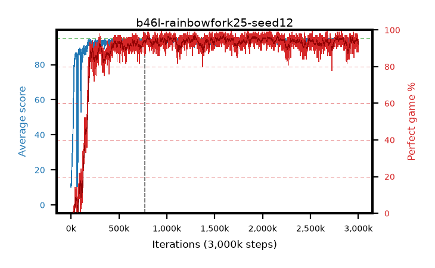

# b46l-rainbowfork25-seed12

step **3,000,000** · 3000 evals · trailing **93.96** · peak **94.44** @2,076,000 · sef **93.3** · best30 **96.1** @1,921,000

## Config

| | |
|---|---|
| adam_epsilon | 1e-07 |
| algo | rainbow |
| batch_size | 32 |
| beta_anneal_steps | 300000 |
| btr_blocks | 3 |
| btr_layer_norm | False |
| btr_residual | False |
| btr_spectral_norm | True |
| collect_envs | 1 |
| discount | 0.99 |
| dist_atoms | 51 |
| dist_embedding | 64 |
| dist_kappa | 1.0 |
| dist_policy_samples | 8 |
| dist_quantiles | 32 |
| dist_tau_prime_samples | 8 |
| dist_tau_samples | 8 |
| dist_v_max | 110.0 |
| dist_v_min | -10.0 |
| epsilon_anneal_steps | 1 |
| epsilon_schedule | eval |
| eval_interval | 1000 |
| eval_queue | True |
| eval_queue_depth | 16 |
| eval_workers | 8 |
| fc_layers | (320,) |
| fork_branches | 4 |
| fork_max_steps | 60 |
| fork_min_length | 85 |
| fork_prob | 0.5 |
| gradient_clipping | 0.0 |
| graph_eval_episodes | 100 |
| guided_fraction | 0.8 |
| init_from | None |
| initial_collect_steps | 2000 |
| initial_epsilon | 0.4 |
| is_beta | 0.4 |
| is_beta_final | 1.0 |
| is_normalization | mean |
| is_weights | True |
| learning_rate | 1e-05 |
| max_steps | 3000000 |
| min_checkpoint_score | 40.0 |
| min_epsilon | 0.002 |
| munchausen_alpha | 0.0 |
| munchausen_l0 | -1.0 |
| munchausen_tau | 0.03 |
| n_step_update | 3 |
| priority_exponent | 0.6 |
| rainbow_double | True |
| rainbow_dueling | True |
| rainbow_epsilon_decay | linear |
| rainbow_epsilon_zero_at | 0.0 |
| rainbow_head | c51 |
| rainbow_munchausen_logpi | target |
| rainbow_noisy | True |
| rainbow_noisy_sigma | 0.5 |
| rainbow_prefill_epsilon | random |
| rainbow_stream_width | 512 |
| replay_buffer_max_length | 100000 |
| replay_ratio | 0.25 |
| reset_alpha | 0.5 |
| reset_anneal_gamma |  |
| reset_anneal_n_step |  |
| reset_anneal_steps | 10000 |
| reset_interval | 0 |
| reset_stop_after | 0 |
| seed | 12 |
| target_update_period | 8 |
| target_update_tau | 1.0 |
| torch_threads | 1 |

## Resumes

Resumed at 770,000

## Evals

| step | avg score | trailing avg | min score | max score | avg reward | perfect % | epsilon |
|---|---|---|---|---|---|---|---|
| 1000 | 10.21 | 10.21 | 0.0 | 22.0 | 7.416 | 0.0 | 0.4 |
| 2000 | 14.04 | 12.12 | 6.0 | 23.0 | 10.253 | 0.0 | 0.4 |
| 3000 | 16.46 | 13.57 | 4.0 | 27.0 | 11.698 | 0.0 | 0.1 |
| ... | ... | ... | ... | ... | ... | ... | ... |
| 2989000 | 94.93 | 94.08 | 89.0 | 95.0 | 191.504 | 98.0 | 0.002 |
| 2990000 | 94.14 | 94.11 | 34.0 | 95.0 | 183.646 | 91.0 | 0.002 |
| 2991000 | 93.58 | 94.12 | 40.0 | 95.0 | 187.228 | 95.0 | 0.002 |
| 2992000 | 93.95 | 94.1 | 41.0 | 95.0 | 186.607 | 94.0 | 0.002 |
| 2993000 | 94.68 | 94.11 | 78.0 | 95.0 | 188.257 | 95.0 | 0.002 |
| 2994000 | 93.77 | 94.1 | 6.0 | 95.0 | 185.329 | 93.0 | 0.002 |
| 2995000 | 94.9 | 94.13 | 92.0 | 95.0 | 189.472 | 96.0 | 0.002 |
| 2996000 | 93.48 | 94.08 | 55.0 | 95.0 | 180.928 | 89.0 | 0.002 |
| 2997000 | 93.91 | 94.04 | 46.0 | 95.0 | 185.363 | 93.0 | 0.002 |
| 2998000 | 92.38 | 93.99 | 2.0 | 95.0 | 179.932 | 89.0 | 0.002 |
| 2999000 | 91.46 | 93.96 | 5.0 | 95.0 | 178.064 | 88.0 | 0.002 |
| 3000000 | 93.83 | 93.96 | 43.0 | 95.0 | 187.384 | 95.0 | 0.002 |
