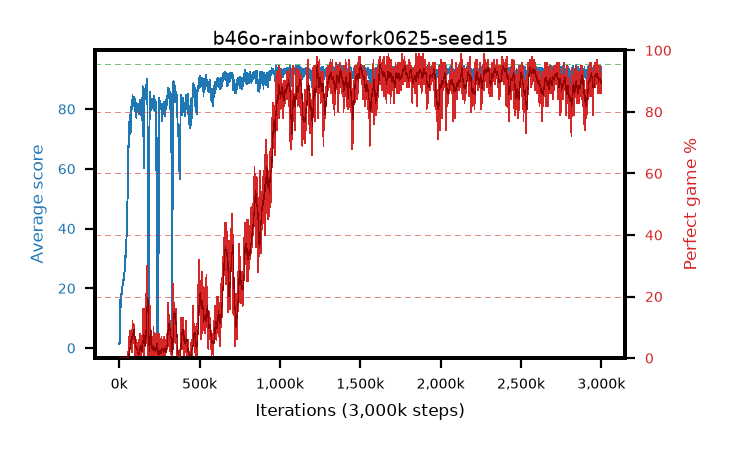

# b46o-rainbowfork0625-seed15

step **3,000,000** · 3000 evals · trailing **92.8** · peak **93.74** @1,775,000 · sef **64.4** · best30 **94.1** @2,406,000

## Config

| | |
|---|---|
| adam_epsilon | 1e-07 |
| algo | rainbow |
| batch_size | 32 |
| beta_anneal_steps | 300000 |
| btr_blocks | 3 |
| btr_layer_norm | False |
| btr_residual | False |
| btr_spectral_norm | True |
| collect_envs | 1 |
| discount | 0.99 |
| dist_atoms | 51 |
| dist_embedding | 64 |
| dist_kappa | 1.0 |
| dist_policy_samples | 8 |
| dist_quantiles | 32 |
| dist_tau_prime_samples | 8 |
| dist_tau_samples | 8 |
| dist_v_max | 110.0 |
| dist_v_min | -10.0 |
| epsilon_anneal_steps | 1 |
| epsilon_schedule | eval |
| eval_interval | 1000 |
| eval_queue | True |
| eval_queue_depth | 16 |
| eval_workers | 8 |
| fc_layers | (320,) |
| fork_branches | 4 |
| fork_max_steps | 60 |
| fork_min_length | 85 |
| fork_prob | 0.5 |
| gradient_clipping | 0.0 |
| graph_eval_episodes | 100 |
| guided_fraction | 0.8 |
| init_from | None |
| initial_collect_steps | 2000 |
| initial_epsilon | 0.4 |
| is_beta | 0.4 |
| is_beta_final | 1.0 |
| is_normalization | mean |
| is_weights | True |
| learning_rate | 1e-05 |
| max_steps | 3000000 |
| min_checkpoint_score | 40.0 |
| min_epsilon | 0.002 |
| munchausen_alpha | 0.0 |
| munchausen_l0 | -1.0 |
| munchausen_tau | 0.03 |
| n_step_update | 3 |
| priority_exponent | 0.6 |
| rainbow_double | True |
| rainbow_dueling | True |
| rainbow_epsilon_decay | linear |
| rainbow_epsilon_zero_at | 0.0 |
| rainbow_head | c51 |
| rainbow_munchausen_logpi | target |
| rainbow_noisy | True |
| rainbow_noisy_sigma | 0.5 |
| rainbow_prefill_epsilon | random |
| rainbow_stream_width | 512 |
| replay_buffer_max_length | 100000 |
| replay_ratio | 0.0625 |
| reset_alpha | 0.5 |
| reset_anneal_gamma |  |
| reset_anneal_n_step |  |
| reset_anneal_steps | 10000 |
| reset_interval | 0 |
| reset_stop_after | 0 |
| seed | 15 |
| target_update_period | 8 |
| target_update_tau | 1.0 |
| torch_threads | 1 |

## Evals

| step | avg score | trailing avg | min score | max score | avg reward | perfect % | epsilon |
|---|---|---|---|---|---|---|---|
| 1000 | 1.3 | 1.3 | 0.0 | 10.0 | -2.431 | 0.0 | 0.4 |
| 2000 | 1.94 | 1.62 | 0.0 | 12.0 | 1.337 | 0.0 | 0.4 |
| 3000 | 1.66 | 1.63 | 0.0 | 10.0 | 1.102 | 0.0 | 0.4 |
| ... | ... | ... | ... | ... | ... | ... | ... |
| 2989000 | 92.59 | 92.82 | 34.0 | 95.0 | 177.173 | 86.0 | 0.002 |
| 2990000 | 93.62 | 92.85 | 39.0 | 95.0 | 181.188 | 89.0 | 0.002 |
| 2991000 | 90.94 | 92.81 | 14.0 | 95.0 | 175.44 | 86.0 | 0.002 |
| 2992000 | 93.12 | 92.83 | 30.0 | 95.0 | 182.708 | 91.0 | 0.002 |
| 2993000 | 93.13 | 92.86 | 28.0 | 95.0 | 185.747 | 94.0 | 0.002 |
| 2994000 | 91.53 | 92.8 | 22.0 | 95.0 | 181.162 | 91.0 | 0.002 |
| 2995000 | 93.33 | 92.8 | 25.0 | 95.0 | 186.941 | 95.0 | 0.002 |
| 2996000 | 92.09 | 92.76 | 23.0 | 95.0 | 177.638 | 87.0 | 0.002 |
| 2997000 | 92.21 | 92.72 | 32.0 | 95.0 | 176.886 | 86.0 | 0.002 |
| 2998000 | 94.04 | 92.84 | 79.0 | 95.0 | 181.639 | 89.0 | 0.002 |
| 2999000 | 92.99 | 92.81 | 28.0 | 95.0 | 182.634 | 91.0 | 0.002 |
| 3000000 | 93.94 | 92.8 | 52.0 | 95.0 | 183.488 | 91.0 | 0.002 |
