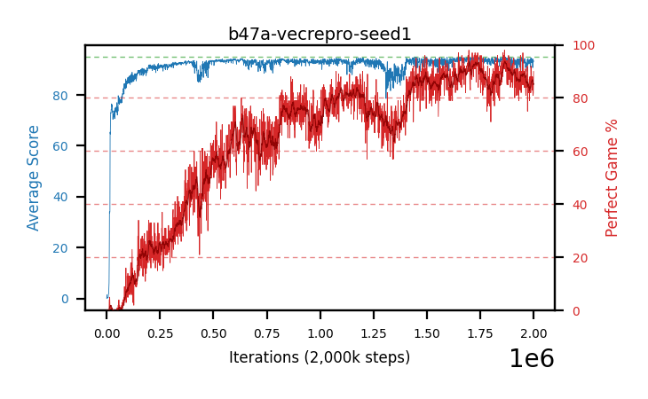

# b47a-vecrepro-seed1

Blue is average score (food eaten) on the left axis, red is perfect-game percentage on the right.

Latest eval: step 2000000, avg score 93.39, perfect games 90%.

## Config

| setting | value |
|---|---|
| policy_name | b47a-vecrepro-seed1 |
| seed | 1 |
| zeroed_observations | none |
| learning_rate | 1e-05 |
| adam_epsilon | 1e-07 |
| perfect_game_reward | 100.0 |
| batch_size | 128 |
| discount | 0.9975 |
| target_update_period | 1000 |
| target_update_tau | 1.0 |
| gradient_clipping | none |
| n_step_update | 1 |
| initial_epsilon | 0.4 |
| min_epsilon | 0.002 |
| epsilon_schedule | bootstrap on avg_reward [2, 5, 10, 15, 20] then geometric to floor by 80% trailing-30 perfect |
| guided_fraction | 0.8 |
| forking | up to 4 live branches including the main line, fork p=0.5 at length >= 85, branch capped at 60 steps, one branch advanced per iteration |
| exploration_shield | 80% of refinement-phase episodes draw the epsilon move from non-fatal actions; greedy moves never shielded |
| fc_layer_params | (320,) |
| algo | ddqn, scalar head, Huber TD error |
| replay_buffer | cpprb prioritized, capacity 100000 |
| priority_exponent (alpha) | 0.6 |
| priority_signal | td_error |
| importance_sampling_beta | disabled |
| max_steps | 2000000 |
| initial_populate_steps | 1000 |
| eval | 100 episodes every 1000 steps, engine vec, 100 lanes in-process, no worker processes |
| grid | 9x9, max possible score 95 |
| DEATH_REWARD | -5.0 |
| FOOD_REWARD | 1.0 |
| FOOD_DISTANCE_REWARD | 0.0 |
| CHASE_SAFE_SHAPING | c=0.1, potential-based on head/food/tail in one region, gated to snake length >= 75 |
| FREE_SPACE_SHAPING | off |
| eval_only | False |
| min_checkpoint_score | 40.0 |

## Evals

2001 evals so far. Full series in [`b47a-vecrepro-seed1_evals.json`](b47a-vecrepro-seed1_evals.json).

| step | avg score | trailing avg | min score | max score | avg reward | perfect % | epsilon |
|---|---|---|---|---|---|---|---|
| 0 | 0.01 | 0.01 | 0 | 1/95 | -4.99 | 0 | 0.4 |
| 1000 | 1.4 | 1.4 | 0 | 11/95 | 0.9 | 0 | 0.4 |
| 2000 | 0.28 | 0.84 | 0 | 2/95 | -0.22 | 0 | 0.4 |
| ... | | | | | | | |
| 1989000 | 92.77 | 92.75 | 3 | 95/95 | 179.785 | 88 | 0.002 |
| 1990000 | 94.3 | 93.43 | 78 | 95/95 | 180.319 | 87 | 0.002 |
| 1991000 | 94.16 | 93.96 | 68 | 95/95 | 179.14 | 86 | 0.002 |
| 1992000 | 94.23 | 94.01 | 74 | 95/95 | 180.249 | 87 | 0.002 |
| 1993000 | 94.13 | 93.92 | 60 | 95/95 | 181.146 | 88 | 0.002 |
| 1994000 | 92.91 | 93.95 | 13 | 95/95 | 174.95 | 83 | 0.002 |
| 1995000 | 92.96 | 93.68 | 6 | 95/95 | 179.975 | 88 | 0.002 |
| 1996000 | 90.72 | 92.99 | 6 | 95/95 | 175.701 | 86 | 0.002 |
| 1997000 | 94.0 | 92.94 | 76 | 95/95 | 175.044 | 82 | 0.002 |
| 1998000 | 94.07 | 92.93 | 80 | 95/95 | 174.076 | 81 | 0.002 |
| 1999000 | 92.95 | 92.94 | 8 | 95/95 | 173.995 | 82 | 0.002 |
| 2000000 | 93.39 | 93.03 | 20 | 95/95 | 182.395 | 90 | 0.002 |
