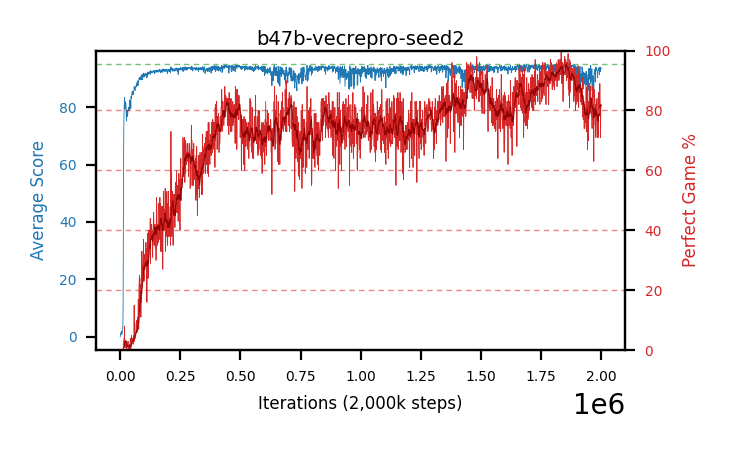

# b47b-vecrepro-seed2

Blue is average score (food eaten) on the left axis, red is perfect-game percentage on the right.

Latest eval: step 2000000, avg score 93.46, perfect games 82%.

## Config

| setting | value |
|---|---|
| policy_name | b47b-vecrepro-seed2 |
| seed | 2 |
| zeroed_observations | none |
| learning_rate | 1e-05 |
| adam_epsilon | 1e-07 |
| perfect_game_reward | 100.0 |
| batch_size | 128 |
| discount | 0.9975 |
| target_update_period | 1000 |
| target_update_tau | 1.0 |
| gradient_clipping | none |
| n_step_update | 1 |
| initial_epsilon | 0.4 |
| min_epsilon | 0.002 |
| epsilon_schedule | bootstrap on avg_reward [2, 5, 10, 15, 20] then geometric to floor by 80% trailing-30 perfect |
| guided_fraction | 0.8 |
| forking | up to 4 live branches including the main line, fork p=0.5 at length >= 85, branch capped at 60 steps, one branch advanced per iteration |
| exploration_shield | 80% of refinement-phase episodes draw the epsilon move from non-fatal actions; greedy moves never shielded |
| fc_layer_params | (320,) |
| algo | ddqn, scalar head, Huber TD error |
| replay_buffer | cpprb prioritized, capacity 100000 |
| priority_exponent (alpha) | 0.6 |
| priority_signal | td_error |
| importance_sampling_beta | disabled |
| max_steps | 2000000 |
| initial_populate_steps | 1000 |
| eval | 100 episodes every 1000 steps, engine vec, 100 lanes in-process, no worker processes |
| grid | 9x9, max possible score 95 |
| DEATH_REWARD | -5.0 |
| FOOD_REWARD | 1.0 |
| FOOD_DISTANCE_REWARD | 0.0 |
| CHASE_SAFE_SHAPING | c=0.1, potential-based on head/food/tail in one region, gated to snake length >= 75 |
| FREE_SPACE_SHAPING | off |
| eval_only | False |
| min_checkpoint_score | 40.0 |

## Evals

2001 evals so far. Full series in [`b47b-vecrepro-seed2_evals.json`](b47b-vecrepro-seed2_evals.json).

| step | avg score | trailing avg | min score | max score | avg reward | perfect % | epsilon |
|---|---|---|---|---|---|---|---|
| 0 | 0.05 | 0.05 | 0 | 1/95 | -3.465 | 0 | 0.4 |
| 1000 | 0.58 | 0.58 | 0 | 4/95 | 0.08 | 0 | 0.4 |
| 2000 | 1.21 | 0.9 | 0 | 6/95 | 0.71 | 0 | 0.4 |
| ... | | | | | | | |
| 1989000 | 93.36 | 91.9 | 2 | 95/95 | 178.254 | 86 | 0.0021 |
| 1990000 | 93.64 | 92.41 | 60 | 95/95 | 172.474 | 80 | 0.0021 |
| 1991000 | 93.1 | 92.99 | 6 | 95/95 | 174.961 | 83 | 0.0021 |
| 1992000 | 92.74 | 93.11 | 2 | 95/95 | 173.608 | 82 | 0.0021 |
| 1993000 | 93.63 | 93.29 | 66 | 95/95 | 174.454 | 82 | 0.002 |
| 1994000 | 91.38 | 92.9 | 0 | 95/95 | 171.254 | 81 | 0.002 |
| 1995000 | 93.97 | 92.96 | 46 | 95/95 | 181.981 | 89 | 0.002 |
| 1996000 | 92.53 | 92.85 | 2 | 95/95 | 174.392 | 83 | 0.002 |
| 1997000 | 93.61 | 93.02 | 20 | 95/95 | 174.434 | 82 | 0.002 |
| 1998000 | 92.52 | 92.8 | 62 | 95/95 | 162.49 | 71 | 0.002 |
| 1999000 | 93.82 | 93.29 | 76 | 95/95 | 173.829 | 81 | 0.002 |
| 2000000 | 93.46 | 93.19 | 25 | 95/95 | 174.284 | 82 | 0.002 |
