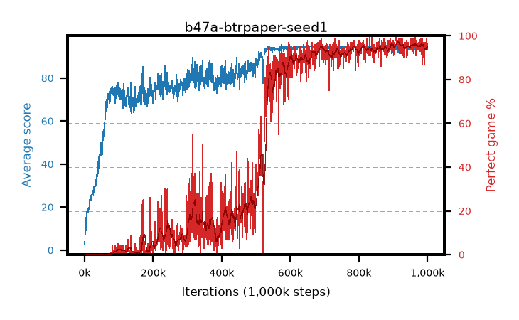

# b47a-btrpaper-seed1

step **1,000,000** · 1000 evals · trailing **94.11** · peak **94.65** @687,000 · sef **44.7** · best30 **96.2** @928,000

## Config

| | |
|---|---|
| adam_epsilon | 1.953125e-05 |
| algo | btr |
| batch_size | 256 |
| beta_anneal_steps | 1 |
| btr_blocks | 3 |
| btr_layer_norm | False |
| btr_residual | True |
| btr_spectral_norm | True |
| collect_envs | 64 |
| discount | 0.997 |
| dist_atoms | 51 |
| dist_embedding | 64 |
| dist_kappa | 1.0 |
| dist_policy_samples | 8 |
| dist_quantiles | 32 |
| dist_tau_prime_samples | 8 |
| dist_tau_samples | 8 |
| dist_v_max | 110.0 |
| dist_v_min | -10.0 |
| epsilon_anneal_steps | 2000000 |
| epsilon_schedule | linear |
| eval_interval | 1000 |
| eval_queue | True |
| eval_queue_depth | 16 |
| eval_workers | 8 |
| fc_layers | (320,) |
| fork_branches | 1 |
| gradient_clipping | 10.0 |
| graph_eval_episodes | 100 |
| guided_fraction | 0.0 |
| init_from | None |
| initial_collect_steps | 200000 |
| initial_epsilon | 1.0 |
| is_beta | 0.2 |
| is_beta_final | 0.2 |
| is_normalization | batch_max |
| is_weights | True |
| learning_rate | 0.0001 |
| max_steps | 1000000 |
| min_checkpoint_score | 40.0 |
| min_epsilon | 0.01 |
| munchausen_alpha | 0.9 |
| munchausen_l0 | -1.0 |
| munchausen_tau | 0.03 |
| n_step_update | 3 |
| priority_exponent | 0.2 |
| rainbow_double | False |
| rainbow_dueling | True |
| rainbow_epsilon_decay | geometric |
| rainbow_epsilon_zero_at | 0.5 |
| rainbow_head | iqn |
| rainbow_munchausen_logpi | online |
| rainbow_noisy | True |
| rainbow_noisy_sigma | 0.5 |
| rainbow_prefill_epsilon | schedule |
| rainbow_stream_width | 512 |
| replay_buffer_max_length | 1048576 |
| replay_ratio | 0.015625 |
| reset_alpha | 0.5 |
| reset_anneal_gamma |  |
| reset_anneal_n_step |  |
| reset_anneal_steps | 10000 |
| reset_interval | 0 |
| reset_stop_after | 0 |
| seed | 1 |
| target_update_period | 500 |
| target_update_tau | 1.0 |
| torch_threads | 1 |

## Evals

| step | avg score | trailing avg | min score | max score | avg reward | perfect % | epsilon |
|---|---|---|---|---|---|---|---|
| 1000 | 2.54 | 2.54 | 0.0 | 28.0 | 1.734 | 0.0 | 0.87759 |
| 2000 | 11.07 | 6.8 | 1.0 | 28.0 | 7.116 | 0.0 | 0.85027 |
| 3000 | 10.76 | 8.12 | 0.0 | 30.0 | 7.8 | 0.0 | 0.82381 |
| ... | ... | ... | ... | ... | ... | ... | ... |
| 989000 | 93.12 | 94.22 | 27.0 | 95.0 | 184.64 | 93.0 | 0.0 |
| 990000 | 94.06 | 94.19 | 3.0 | 95.0 | 190.697 | 98.0 | 0.0 |
| 991000 | 93.69 | 94.15 | 35.0 | 95.0 | 179.005 | 87.0 | 0.0 |
| 992000 | 94.43 | 94.13 | 43.0 | 95.0 | 190.045 | 97.0 | 0.0 |
| 993000 | 94.11 | 94.1 | 27.0 | 95.0 | 189.622 | 97.0 | 0.0 |
| 994000 | 94.72 | 94.15 | 73.0 | 95.0 | 189.366 | 96.0 | 0.0 |
| 995000 | 93.48 | 94.15 | 23.0 | 95.0 | 185.992 | 94.0 | 0.0 |
| 996000 | 93.46 | 94.11 | 22.0 | 95.0 | 185.955 | 94.0 | 0.0 |
| 997000 | 94.17 | 94.13 | 34.0 | 95.0 | 188.683 | 96.0 | 0.0 |
| 998000 | 94.24 | 94.11 | 19.0 | 95.0 | 191.848 | 99.0 | 0.0 |
| 999000 | 94.15 | 94.08 | 40.0 | 95.0 | 186.673 | 94.0 | 0.0 |
| 1000000 | 94.8 | 94.11 | 85.0 | 95.0 | 187.319 | 94.0 | 0.0 |
