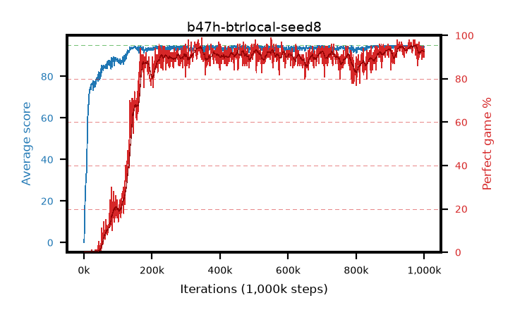

# b47h-btrlocal-seed8

step **1,000,000** · 1000 evals · trailing **94.28** · peak **94.48** @942,000 · sef **82.9** · best30 **94.9** @973,000

## Config

| | |
|---|---|
| adam_epsilon | 1e-07 |
| algo | btr |
| batch_size | 128 |
| beta_anneal_steps | 300000 |
| btr_blocks | 3 |
| btr_layer_norm | False |
| btr_residual | True |
| btr_spectral_norm | True |
| collect_envs | 1 |
| discount | 0.99 |
| dist_atoms | 51 |
| dist_embedding | 64 |
| dist_kappa | 1.0 |
| dist_policy_samples | 8 |
| dist_quantiles | 32 |
| dist_tau_prime_samples | 8 |
| dist_tau_samples | 8 |
| dist_v_max | 110.0 |
| dist_v_min | -10.0 |
| epsilon_anneal_steps | 2000000 |
| epsilon_schedule | eval |
| eval_interval | 1000 |
| eval_queue | True |
| eval_queue_depth | 16 |
| eval_workers | 8 |
| fc_layers | (320,) |
| fork_branches | 4 |
| fork_max_steps | 60 |
| fork_min_length | 85 |
| fork_prob | 0.5 |
| gradient_clipping | 0.0 |
| graph_eval_episodes | 100 |
| guided_fraction | 0.8 |
| init_from | None |
| initial_collect_steps | 2000 |
| initial_epsilon | 0.4 |
| is_beta | 0.4 |
| is_beta_final | 1.0 |
| is_normalization | mean |
| is_weights | True |
| learning_rate | 1e-05 |
| max_steps | 1000000 |
| min_checkpoint_score | 40.0 |
| min_epsilon | 0.002 |
| munchausen_alpha | 0.9 |
| munchausen_l0 | -1.0 |
| munchausen_tau | 0.03 |
| n_step_update | 3 |
| priority_exponent | 0.6 |
| rainbow_double | False |
| rainbow_dueling | True |
| rainbow_epsilon_decay | geometric |
| rainbow_epsilon_zero_at | 0.0 |
| rainbow_head | quantile |
| rainbow_munchausen_logpi | online |
| rainbow_noisy | True |
| rainbow_noisy_sigma | 0.5 |
| rainbow_prefill_epsilon | schedule |
| rainbow_stream_width | 512 |
| replay_buffer_max_length | 100000 |
| replay_ratio | 1.0 |
| reset_alpha | 0.5 |
| reset_anneal_gamma |  |
| reset_anneal_n_step |  |
| reset_anneal_steps | 10000 |
| reset_interval | 0 |
| reset_stop_after | 0 |
| seed | 8 |
| target_update_period | 8 |
| target_update_tau | 1.0 |
| torch_threads | 1 |

## Evals

| step | avg score | trailing avg | min score | max score | avg reward | perfect % | epsilon |
|---|---|---|---|---|---|---|---|
| 1000 | 0.06 | 0.06 | 0.0 | 2.0 | -0.489 | 0.0 | 0.4 |
| 2000 | 8.2 | 4.13 | 1.0 | 21.0 | 6.215 | 0.0 | 0.4 |
| 3000 | 16.14 | 8.13 | 8.0 | 30.0 | 11.112 | 0.0 | 0.4 |
| ... | ... | ... | ... | ... | ... | ... | ... |
| 989000 | 94.48 | 94.35 | 54.0 | 95.0 | 184.869 | 92.0 | 0.002 |
| 990000 | 93.91 | 94.33 | 49.0 | 95.0 | 185.393 | 93.0 | 0.002 |
| 991000 | 94.44 | 94.36 | 51.0 | 95.0 | 187.935 | 95.0 | 0.002 |
| 992000 | 94.09 | 94.36 | 40.0 | 95.0 | 185.679 | 93.0 | 0.002 |
| 993000 | 94.17 | 94.34 | 58.0 | 95.0 | 181.629 | 89.0 | 0.002 |
| 994000 | 93.6 | 94.31 | 46.0 | 95.0 | 184.131 | 92.0 | 0.002 |
| 995000 | 94.33 | 94.35 | 44.0 | 95.0 | 186.917 | 94.0 | 0.002 |
| 996000 | 94.21 | 94.36 | 53.0 | 95.0 | 186.677 | 94.0 | 0.002 |
| 997000 | 94.09 | 94.35 | 62.0 | 95.0 | 182.682 | 90.0 | 0.002 |
| 998000 | 94.09 | 94.32 | 49.0 | 95.0 | 187.677 | 95.0 | 0.002 |
| 999000 | 94.2 | 94.3 | 54.0 | 95.0 | 184.788 | 92.0 | 0.002 |
| 1000000 | 94.5 | 94.28 | 81.0 | 95.0 | 182.976 | 90.0 | 0.002 |
