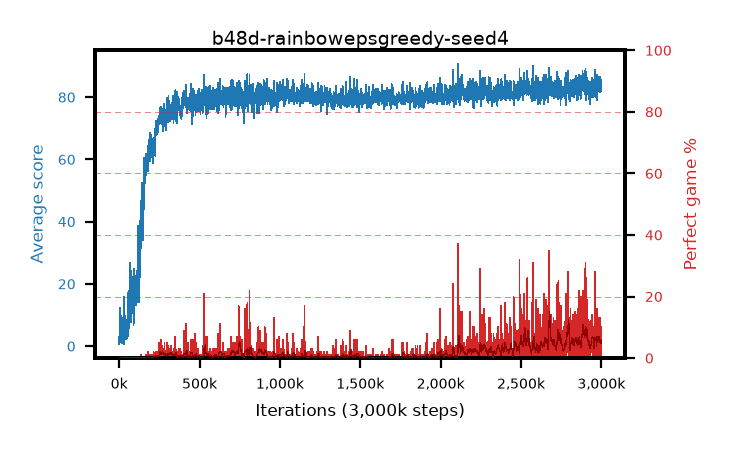

# b48d-rainbowepsgreedy-seed4

step **3,000,000** · 3000 evals · trailing **83.47** · peak **84.49** @2,906,000 · sef **0.0** · best30 **9.0** @2,902,000

## Config

| | |
|---|---|
| adam_epsilon | 0.00015 |
| algo | rainbow |
| batch_size | 32 |
| beta_anneal_steps | 750000 |
| btr_blocks | 3 |
| btr_layer_norm | False |
| btr_residual | False |
| btr_spectral_norm | True |
| collect_envs | 1 |
| discount | 0.99 |
| dist_atoms | 51 |
| dist_embedding | 64 |
| dist_kappa | 1.0 |
| dist_policy_samples | 8 |
| dist_quantiles | 32 |
| dist_tau_prime_samples | 8 |
| dist_tau_samples | 8 |
| dist_v_max | 110.0 |
| dist_v_min | -10.0 |
| epsilon_anneal_steps | 62500 |
| epsilon_schedule | linear |
| eval_interval | 1000 |
| eval_queue | True |
| eval_queue_depth | 16 |
| eval_workers | 8 |
| fc_layers | (320,) |
| fork_branches | 1 |
| gradient_clipping | 0.0 |
| graph_eval_episodes | 100 |
| guided_fraction | 0.0 |
| init_from | None |
| initial_collect_steps | 20000 |
| initial_epsilon | 1.0 |
| is_beta | 0.4 |
| is_beta_final | 1.0 |
| is_normalization | batch_max |
| is_weights | True |
| learning_rate | 6.25e-05 |
| max_steps | 3000000 |
| min_checkpoint_score | 40.0 |
| min_epsilon | 0.01 |
| munchausen_alpha | 0.0 |
| munchausen_l0 | -1.0 |
| munchausen_tau | 0.03 |
| n_step_update | 3 |
| priority_exponent | 0.5 |
| rainbow_double | True |
| rainbow_dueling | True |
| rainbow_epsilon_decay | linear |
| rainbow_epsilon_zero_at | 0.0 |
| rainbow_head | c51 |
| rainbow_munchausen_logpi | target |
| rainbow_noisy | False |
| rainbow_noisy_sigma | 0.5 |
| rainbow_prefill_epsilon | random |
| rainbow_stream_width | 512 |
| replay_buffer_max_length | 1000000 |
| replay_ratio | 0.25 |
| reset_alpha | 0.5 |
| reset_anneal_gamma |  |
| reset_anneal_n_step |  |
| reset_anneal_steps | 10000 |
| reset_interval | 0 |
| reset_stop_after | 0 |
| seed | 4 |
| target_update_period | 2000 |
| target_update_tau | 1.0 |
| torch_threads | 1 |

## Evals

| step | avg score | trailing avg | min score | max score | avg reward | perfect % | epsilon |
|---|---|---|---|---|---|---|---|
| 1000 | 0.7 | 0.7 | 0.0 | 7.0 | 0.146 | 0.0 | 0.98418 |
| 2000 | 4.74 | 2.72 | 0.0 | 17.0 | 3.413 | 0.0 | 0.96834 |
| 3000 | 11.42 | 5.62 | 0.0 | 32.0 | 7.429 | 0.0 | 0.9525 |
| ... | ... | ... | ... | ... | ... | ... | ... |
| 2989000 | 84.29 | 83.19 | 62.0 | 95.0 | 87.872 | 5.0 | 0.01 |
| 2990000 | 83.5 | 83.03 | 68.0 | 95.0 | 85.125 | 3.0 | 0.01 |
| 2991000 | 82.88 | 83.1 | 58.0 | 95.0 | 84.494 | 3.0 | 0.01 |
| 2992000 | 81.94 | 83.55 | 9.0 | 95.0 | 83.551 | 3.0 | 0.01 |
| 2993000 | 85.61 | 83.49 | 68.0 | 95.0 | 92.215 | 8.0 | 0.01 |
| 2994000 | 86.55 | 83.5 | 66.0 | 95.0 | 98.17 | 13.0 | 0.01 |
| 2995000 | 83.1 | 83.44 | 4.0 | 95.0 | 91.687 | 10.0 | 0.01 |
| 2996000 | 81.74 | 83.44 | 68.0 | 95.0 | 81.38 | 1.0 | 0.01 |
| 2997000 | 81.92 | 83.44 | 60.0 | 95.0 | 82.535 | 2.0 | 0.01 |
| 2998000 | 85.69 | 83.46 | 64.0 | 95.0 | 94.332 | 10.0 | 0.01 |
| 2999000 | 81.89 | 83.52 | 15.0 | 95.0 | 82.525 | 2.0 | 0.01 |
| 3000000 | 81.93 | 83.47 | 53.0 | 95.0 | 83.539 | 3.0 | 0.01 |
