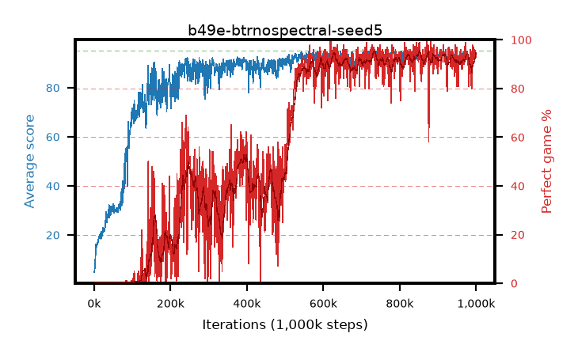

# b49e-btrnospectral-seed5

step **1,000,000** · 1000 evals · trailing **92.98** · peak **93.6** @637,000 · sef **46.4** · best30 **93.5** @875,000

## Config

| | |
|---|---|
| adam_epsilon | 1.953125e-05 |
| algo | btr |
| batch_size | 256 |
| beta_anneal_steps | 1 |
| btr_blocks | 3 |
| btr_layer_norm | False |
| btr_residual | True |
| btr_spectral_norm | False |
| collect_envs | 64 |
| discount | 0.997 |
| dist_atoms | 51 |
| dist_embedding | 64 |
| dist_kappa | 1.0 |
| dist_policy_samples | 8 |
| dist_quantiles | 32 |
| dist_tau_prime_samples | 8 |
| dist_tau_samples | 8 |
| dist_v_max | 110.0 |
| dist_v_min | -10.0 |
| epsilon_anneal_steps | 2000000 |
| epsilon_schedule | linear |
| eval_interval | 1000 |
| eval_queue | True |
| eval_queue_depth | 16 |
| eval_workers | 8 |
| fc_layers | (320,) |
| fork_branches | 1 |
| gradient_clipping | 10.0 |
| graph_eval_episodes | 100 |
| guided_fraction | 0.0 |
| init_from | None |
| initial_collect_steps | 200000 |
| initial_epsilon | 1.0 |
| is_beta | 0.2 |
| is_beta_final | 0.2 |
| is_normalization | batch_max |
| is_weights | True |
| learning_rate | 0.0001 |
| max_steps | 1000000 |
| min_checkpoint_score | 40.0 |
| min_epsilon | 0.01 |
| munchausen_alpha | 0.9 |
| munchausen_l0 | -1.0 |
| munchausen_tau | 0.03 |
| n_step_update | 3 |
| priority_exponent | 0.2 |
| rainbow_double | False |
| rainbow_dueling | True |
| rainbow_epsilon_decay | geometric |
| rainbow_epsilon_zero_at | 0.5 |
| rainbow_head | iqn |
| rainbow_munchausen_logpi | online |
| rainbow_noisy | True |
| rainbow_noisy_sigma | 0.5 |
| rainbow_prefill_epsilon | schedule |
| rainbow_stream_width | 512 |
| replay_buffer_max_length | 1048576 |
| replay_ratio | 0.015625 |
| reset_alpha | 0.5 |
| reset_anneal_gamma |  |
| reset_anneal_n_step |  |
| reset_anneal_steps | 10000 |
| reset_interval | 0 |
| reset_stop_after | 0 |
| seed | 5 |
| target_update_period | 500 |
| target_update_tau | 1.0 |
| torch_threads | 1 |

## Evals

| step | avg score | trailing avg | min score | max score | avg reward | perfect % | epsilon |
|---|---|---|---|---|---|---|---|
| 1000 | 4.83 | 4.83 | 0.0 | 15.0 | 2.581 | 0.0 | 0.87759 |
| 2000 | 7.75 | 6.29 | 0.0 | 23.0 | 3.82 | 0.0 | 0.85028 |
| 3000 | 9.01 | 7.2 | 0.0 | 22.0 | 4.911 | 0.0 | 0.82381 |
| ... | ... | ... | ... | ... | ... | ... | ... |
| 989000 | 90.43 | 92.73 | 9.0 | 95.0 | 169.334 | 81.0 | 0.0 |
| 990000 | 94.88 | 92.78 | 89.0 | 95.0 | 191.459 | 98.0 | 0.0 |
| 991000 | 94.32 | 92.9 | 38.0 | 95.0 | 187.867 | 95.0 | 0.0 |
| 992000 | 94.58 | 92.95 | 84.0 | 95.0 | 183.925 | 91.0 | 0.0 |
| 993000 | 92.77 | 93.0 | 13.0 | 95.0 | 186.285 | 95.0 | 0.0 |
| 994000 | 94.06 | 93.01 | 47.0 | 95.0 | 189.628 | 97.0 | 0.0 |
| 995000 | 94.32 | 93.05 | 50.0 | 95.0 | 186.76 | 94.0 | 0.0 |
| 996000 | 93.25 | 93.0 | 23.0 | 95.0 | 187.758 | 96.0 | 0.0 |
| 997000 | 94.14 | 92.99 | 45.0 | 95.0 | 187.58 | 95.0 | 0.0 |
| 998000 | 93.58 | 92.96 | 24.0 | 95.0 | 184.975 | 93.0 | 0.0 |
| 999000 | 93.95 | 92.98 | 47.0 | 95.0 | 185.298 | 93.0 | 0.0 |
| 1000000 | 93.32 | 92.98 | 40.0 | 95.0 | 185.734 | 94.0 | 0.0 |
