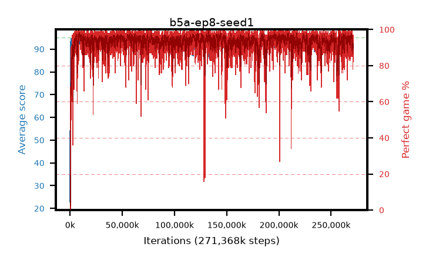

# b5a-ep8-seed1

step **271,368,192** · 16560 evals · trailing **92.7** · peak **94.62** @195,215,360 · sef **97.3** · best30 **97.9** @195,608,576

## Config

| | |
|---|---|
| algo | ppo |
| collect_envs | 128 |
| discount | 0.99 |
| eval_interval | 16384 |
| eval_queue | True |
| eval_queue_depth | 16 |
| eval_workers | 6 |
| fc_layers | (320,) |
| graph_eval_episodes | 100 |
| max_steps | 400000000 |
| min_checkpoint_score | 40.0 |
| ppo_adam_epsilon | 1e-07 |
| ppo_clip | 0.2 |
| ppo_entropy_coef | 0.01 |
| ppo_entropy_coef_final | None |
| ppo_epochs | 8 |
| ppo_gae_lambda | 0.98 |
| ppo_gradient_clipping | 0.5 |
| ppo_horizon | 33.6 |
| ppo_learning_rate | 0.0003 |
| ppo_minibatch | 256 |
| ppo_normalize_adv | True |
| ppo_rollout | 128 |
| ppo_target_kl | 0.0 |
| ppo_transitions_per_rollout | 16384 |
| ppo_value_loss | huber |
| ppo_vf_coef | 0.5 |
| seed | 1 |
| torch_threads | 1 |

## Evals

| step | avg score | trailing avg | min score | max score | avg reward | perfect % | epsilon |
|---|---|---|---|---|---|---|---|
| 16384 | 22.87 | 22.87 | 3.0 | 38.0 | 19.445 | 0.0 |  |
| 32768 | 54.27 | 42.22 | 12.0 | 83.0 | 49.855 | 0.0 |  |
| 49152 | 48.97 | 35.92 | 20.0 | 80.0 | 44.105 | 0.0 |  |
| ... | ... | ... | ... | ... | ... | ... | ... |
| 271138816 | 91.38 | 92.86 | 3.0 | 95.0 | 177.99 | 88.0 |  |
| 271155200 | 91.93 | 92.88 | 27.0 | 95.0 | 180.575 | 90.0 |  |
| 271171584 | 94.21 | 92.93 | 54.0 | 95.0 | 186.97 | 94.0 |  |
| 271187968 | 92.75 | 92.89 | 20.0 | 95.0 | 177.19 | 86.0 |  |
| 271204352 | 93.95 | 92.94 | 59.0 | 95.0 | 185.373 | 93.0 |  |
| 271220736 | 91.1 | 92.86 | 3.0 | 95.0 | 181.529 | 92.0 |  |
| 271237120 | 91.47 | 92.67 | 15.0 | 95.0 | 181.86 | 92.0 |  |
| 271286272 | 93.87 | 92.7 | 37.0 | 95.0 | 184.55 | 92.0 |  |
| 271302656 | 93.71 | 92.73 | 1.0 | 95.0 | 189.635 | 97.0 |  |
| 271335424 | 92.16 | 92.68 | 61.0 | 95.0 | 175.74 | 85.0 |  |
| 271351808 | 94.23 | 92.69 | 55.0 | 95.0 | 188.075 | 95.0 |  |
| 271368192 | 94.48 | 92.7 | 78.0 | 95.0 | 186.245 | 93.0 |  |
