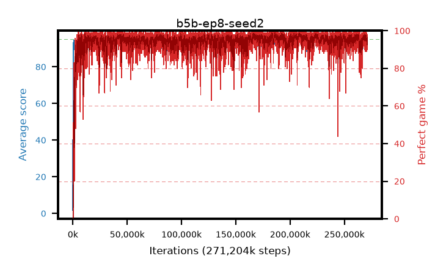

# b5b-ep8-seed2

step **271,204,352** · 16547 evals · trailing **93.73** · peak **94.79** @225,591,296 · sef **98.3** · best30 **98.4** @208,568,320

## Config

| | |
|---|---|
| algo | ppo |
| collect_envs | 128 |
| discount | 0.99 |
| eval_interval | 16384 |
| eval_queue | True |
| eval_queue_depth | 16 |
| eval_workers | 6 |
| fc_layers | (320,) |
| graph_eval_episodes | 100 |
| max_steps | 400000000 |
| min_checkpoint_score | 40.0 |
| ppo_adam_epsilon | 1e-07 |
| ppo_clip | 0.2 |
| ppo_entropy_coef | 0.01 |
| ppo_entropy_coef_final | None |
| ppo_epochs | 8 |
| ppo_gae_lambda | 0.98 |
| ppo_gradient_clipping | 0.5 |
| ppo_horizon | 33.6 |
| ppo_learning_rate | 0.0003 |
| ppo_minibatch | 256 |
| ppo_normalize_adv | True |
| ppo_rollout | 128 |
| ppo_target_kl | 0.0 |
| ppo_transitions_per_rollout | 16384 |
| ppo_value_loss | huber |
| ppo_vf_coef | 0.5 |
| seed | 2 |
| torch_threads | 1 |

## Evals

| step | avg score | trailing avg | min score | max score | avg reward | perfect % | epsilon |
|---|---|---|---|---|---|---|---|
| 16384 | 1.71 | 1.71 | 0.0 | 6.0 | -1.175 | 0.0 |  |
| 32768 | 17.62 | 9.67 | 5.0 | 37.0 | 12.89 | 0.0 |  |
| 49152 | 29.18 | 16.17 | 11.0 | 57.0 | 24.18 | 0.0 |  |
| ... | ... | ... | ... | ... | ... | ... | ... |
| 270925824 | 92.42 | 93.75 | 17.0 | 95.0 | 181.977 | 91.0 |  |
| 270942208 | 93.73 | 93.57 | 39.0 | 95.0 | 185.318 | 93.0 |  |
| 270958592 | 94.64 | 93.65 | 80.0 | 95.0 | 189.257 | 96.0 |  |
| 270974976 | 94.85 | 93.67 | 82.0 | 95.0 | 191.5 | 98.0 |  |
| 271007744 | 94.44 | 93.66 | 48.0 | 95.0 | 190.41 | 97.0 |  |
| 271024128 | 94.35 | 93.67 | 49.0 | 95.0 | 189.235 | 96.0 |  |
| 271040512 | 94.42 | 93.58 | 66.0 | 95.0 | 190.119 | 97.0 |  |
| 271056896 | 94.73 | 93.58 | 82.0 | 95.0 | 190.745 | 97.0 |  |
| 271073280 | 94.91 | 93.74 | 90.0 | 95.0 | 191.875 | 98.0 |  |
| 271089664 | 94.05 | 93.66 | 37.0 | 95.0 | 189.07 | 96.0 |  |
| 271106048 | 94.87 | 93.7 | 85.0 | 95.0 | 190.795 | 97.0 |  |
| 271204352 | 94.46 | 93.73 | 82.0 | 95.0 | 187.183 | 94.0 |  |
