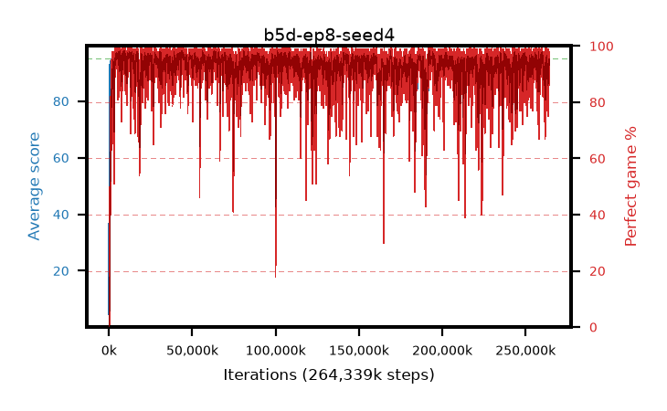

# b5d-ep8-seed4

step **264,339,456** · 16128 evals · trailing **94.38** · peak **94.63** @243,531,776 · sef **95.2** · best30 **97.8** @63,242,240

## Config

| | |
|---|---|
| algo | ppo |
| collect_envs | 128 |
| discount | 0.99 |
| eval_interval | 16384 |
| eval_queue | True |
| eval_queue_depth | 16 |
| eval_workers | 6 |
| fc_layers | (320,) |
| graph_eval_episodes | 100 |
| max_steps | 400000000 |
| min_checkpoint_score | 40.0 |
| ppo_adam_epsilon | 1e-07 |
| ppo_clip | 0.2 |
| ppo_entropy_coef | 0.01 |
| ppo_entropy_coef_final | None |
| ppo_epochs | 8 |
| ppo_gae_lambda | 0.98 |
| ppo_gradient_clipping | 0.5 |
| ppo_horizon | 33.6 |
| ppo_learning_rate | 0.0003 |
| ppo_minibatch | 256 |
| ppo_normalize_adv | True |
| ppo_rollout | 128 |
| ppo_target_kl | 0.0 |
| ppo_transitions_per_rollout | 16384 |
| ppo_value_loss | huber |
| ppo_vf_coef | 0.5 |
| seed | 4 |
| torch_threads | 1 |

## Evals

| step | avg score | trailing avg | min score | max score | avg reward | perfect % | epsilon |
|---|---|---|---|---|---|---|---|
| 16384 | 4.61 | 4.61 | 0.0 | 10.0 | 0.6 | 0.0 |  |
| 32768 | 36.68 | 20.64 | 7.0 | 67.0 | 31.77 | 0.0 |  |
| 49152 | 32.45 | 24.58 | 5.0 | 54.0 | 27.495 | 0.0 |  |
| ... | ... | ... | ... | ... | ... | ... | ... |
| 264060928 | 94.08 | 94.33 | 85.0 | 95.0 | 180.6 | 88.0 |  |
| 264077312 | 94.04 | 94.26 | 9.0 | 95.0 | 191.005 | 98.0 |  |
| 264093696 | 94.08 | 94.33 | 77.0 | 95.0 | 181.297 | 89.0 |  |
| 264110080 | 94.74 | 94.39 | 87.0 | 95.0 | 189.253 | 96.0 |  |
| 264126464 | 94.53 | 94.4 | 74.0 | 95.0 | 189.048 | 96.0 |  |
| 264175616 | 94.39 | 94.39 | 73.0 | 95.0 | 189.32 | 96.0 |  |
| 264192000 | 94.07 | 94.38 | 17.0 | 95.0 | 190.99 | 98.0 |  |
| 264208384 | 94.74 | 94.37 | 71.0 | 95.0 | 191.66 | 98.0 |  |
| 264224768 | 94.43 | 94.39 | 83.0 | 95.0 | 185.11 | 92.0 |  |
| 264241152 | 93.71 | 94.37 | 74.0 | 95.0 | 178.195 | 86.0 |  |
| 264257536 | 94.53 | 94.4 | 78.0 | 95.0 | 187.29 | 94.0 |  |
| 264339456 | 93.94 | 94.38 | 76.0 | 95.0 | 179.094 | 87.0 |  |
