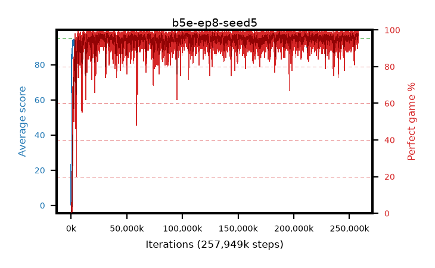

# b5e-ep8-seed5

step **257,949,696** · 15736 evals · trailing **94.12** · peak **94.69** @182,255,616 · sef **98.0** · best30 **98.1** @210,157,568

## Config

| | |
|---|---|
| algo | ppo |
| collect_envs | 128 |
| discount | 0.99 |
| eval_interval | 16384 |
| eval_queue | True |
| eval_queue_depth | 16 |
| eval_workers | 6 |
| fc_layers | (320,) |
| graph_eval_episodes | 100 |
| max_steps | 400000000 |
| min_checkpoint_score | 40.0 |
| ppo_adam_epsilon | 1e-07 |
| ppo_clip | 0.2 |
| ppo_entropy_coef | 0.01 |
| ppo_entropy_coef_final | None |
| ppo_epochs | 8 |
| ppo_gae_lambda | 0.98 |
| ppo_gradient_clipping | 0.5 |
| ppo_horizon | 33.6 |
| ppo_learning_rate | 0.0003 |
| ppo_minibatch | 256 |
| ppo_normalize_adv | True |
| ppo_rollout | 128 |
| ppo_target_kl | 0.0 |
| ppo_transitions_per_rollout | 16384 |
| ppo_value_loss | huber |
| ppo_vf_coef | 0.5 |
| seed | 5 |
| torch_threads | 1 |

## Evals

| step | avg score | trailing avg | min score | max score | avg reward | perfect % | epsilon |
|---|---|---|---|---|---|---|---|
| 16384 | 0.27 | 0.27 | 0.0 | 3.0 | -4.73 | 0.0 |  |
| 32768 | 13.8 | 7.04 | 1.0 | 29.0 | 9.16 | 0.0 |  |
| 49152 | 23.07 | 12.38 | 0.0 | 43.0 | 18.295 | 0.0 |  |
| ... | ... | ... | ... | ... | ... | ... | ... |
| 257638400 | 92.59 | 93.91 | 3.0 | 95.0 | 187.565 | 96.0 |  |
| 257654784 | 94.35 | 93.9 | 61.0 | 95.0 | 191.069 | 98.0 |  |
| 257671168 | 94.87 | 93.88 | 86.0 | 95.0 | 191.538 | 98.0 |  |
| 257687552 | 94.95 | 94.02 | 90.0 | 95.0 | 192.664 | 99.0 |  |
| 257703936 | 94.33 | 94.08 | 60.0 | 95.0 | 189.062 | 96.0 |  |
| 257736704 | 94.61 | 94.02 | 56.0 | 95.0 | 192.57 | 99.0 |  |
| 257785856 | 94.97 | 93.94 | 92.0 | 95.0 | 192.685 | 99.0 |  |
| 257802240 | 94.42 | 93.97 | 68.0 | 95.0 | 188.355 | 95.0 |  |
| 257818624 | 93.16 | 94.03 | 31.0 | 95.0 | 185.195 | 93.0 |  |
| 257835008 | 93.48 | 94.05 | 40.0 | 95.0 | 187.37 | 95.0 |  |
| 257933312 | 93.85 | 94.11 | 5.0 | 95.0 | 190.576 | 98.0 |  |
| 257949696 | 94.07 | 94.12 | 5.0 | 95.0 | 191.035 | 98.0 |  |
