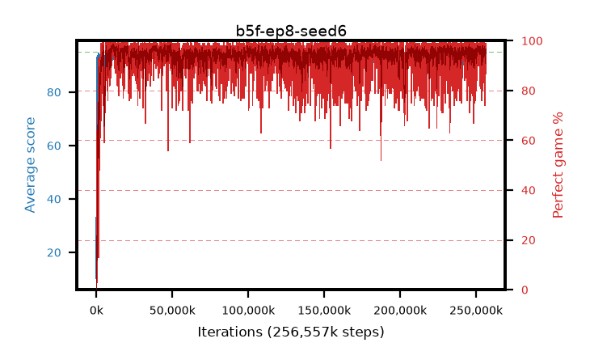

# b5f-ep8-seed6

step **256,557,056** · 15652 evals · trailing **94.09** · peak **94.63** @39,452,672 · sef **97.0** · best30 **97.9** @10,862,592

## Config

| | |
|---|---|
| algo | ppo |
| collect_envs | 128 |
| discount | 0.99 |
| eval_interval | 16384 |
| eval_queue | True |
| eval_queue_depth | 16 |
| eval_workers | 6 |
| fc_layers | (320,) |
| graph_eval_episodes | 100 |
| max_steps | 400000000 |
| min_checkpoint_score | 40.0 |
| ppo_adam_epsilon | 1e-07 |
| ppo_clip | 0.2 |
| ppo_entropy_coef | 0.01 |
| ppo_entropy_coef_final | None |
| ppo_epochs | 8 |
| ppo_gae_lambda | 0.98 |
| ppo_gradient_clipping | 0.5 |
| ppo_horizon | 33.6 |
| ppo_learning_rate | 0.0003 |
| ppo_minibatch | 256 |
| ppo_normalize_adv | True |
| ppo_rollout | 128 |
| ppo_target_kl | 0.0 |
| ppo_transitions_per_rollout | 16384 |
| ppo_value_loss | huber |
| ppo_vf_coef | 0.5 |
| seed | 6 |
| torch_threads | 1 |

## Evals

| step | avg score | trailing avg | min score | max score | avg reward | perfect % | epsilon |
|---|---|---|---|---|---|---|---|
| 16384 | 10.27 | 10.27 | 1.0 | 21.0 | 6.62 | 0.0 |  |
| 32768 | 33.21 | 30.49 | 0.0 | 89.0 | 29.065 | 0.0 |  |
| 49152 | 29.8 | 20.04 | 11.0 | 54.0 | 24.8 | 0.0 |  |
| ... | ... | ... | ... | ... | ... | ... | ... |
| 256262144 | 94.88 | 93.73 | 89.0 | 95.0 | 190.76 | 97.0 |  |
| 256278528 | 93.56 | 93.77 | 43.0 | 95.0 | 186.365 | 94.0 |  |
| 256294912 | 94.12 | 93.47 | 7.0 | 95.0 | 191.839 | 99.0 |  |
| 256311296 | 93.12 | 93.74 | 11.0 | 95.0 | 184.664 | 93.0 |  |
| 256327680 | 93.72 | 93.91 | 28.0 | 95.0 | 186.267 | 94.0 |  |
| 256344064 | 93.49 | 94.06 | 3.0 | 95.0 | 186.032 | 94.0 |  |
| 256360448 | 93.26 | 93.91 | 54.0 | 95.0 | 181.045 | 89.0 |  |
| 256409600 | 94.89 | 93.77 | 89.0 | 95.0 | 191.509 | 98.0 |  |
| 256425984 | 93.93 | 93.82 | 26.0 | 95.0 | 187.82 | 95.0 |  |
| 256442368 | 94.46 | 93.9 | 49.0 | 95.0 | 189.3 | 96.0 |  |
| 256458752 | 94.3 | 94.04 | 32.0 | 95.0 | 191.265 | 98.0 |  |
| 256557056 | 94.06 | 94.09 | 51.0 | 95.0 | 187.86 | 95.0 |  |
