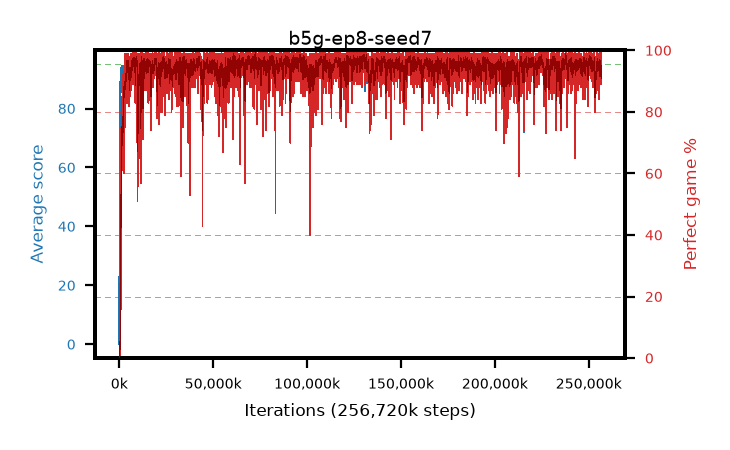

# b5g-ep8-seed7

step **256,720,896** · 15664 evals · trailing **93.82** · peak **94.65** @153,862,144 · sef **98.3** · best30 **97.9** @237,944,832

## Config

| | |
|---|---|
| algo | ppo |
| collect_envs | 128 |
| discount | 0.99 |
| eval_interval | 16384 |
| eval_queue | True |
| eval_queue_depth | 16 |
| eval_workers | 6 |
| fc_layers | (320,) |
| graph_eval_episodes | 100 |
| max_steps | 400000000 |
| min_checkpoint_score | 40.0 |
| ppo_adam_epsilon | 1e-07 |
| ppo_clip | 0.2 |
| ppo_entropy_coef | 0.01 |
| ppo_entropy_coef_final | None |
| ppo_epochs | 8 |
| ppo_gae_lambda | 0.98 |
| ppo_gradient_clipping | 0.5 |
| ppo_horizon | 33.6 |
| ppo_learning_rate | 0.0003 |
| ppo_minibatch | 256 |
| ppo_normalize_adv | True |
| ppo_rollout | 128 |
| ppo_target_kl | 0.0 |
| ppo_transitions_per_rollout | 16384 |
| ppo_value_loss | huber |
| ppo_vf_coef | 0.5 |
| seed | 7 |
| torch_threads | 1 |

## Evals

| step | avg score | trailing avg | min score | max score | avg reward | perfect % | epsilon |
|---|---|---|---|---|---|---|---|
| 16384 | 0.03 | 0.03 | 0.0 | 1.0 | -4.97 | 0.0 |  |
| 32768 | 15.24 | 18.82 | 0.0 | 30.0 | 11.005 | 0.0 |  |
| 49152 | 27.33 | 13.68 | 5.0 | 50.0 | 22.375 | 0.0 |  |
| ... | ... | ... | ... | ... | ... | ... | ... |
| 256458752 | 93.99 | 93.81 | 55.0 | 95.0 | 185.451 | 93.0 |  |
| 256475136 | 92.71 | 93.92 | 36.0 | 95.0 | 181.172 | 90.0 |  |
| 256491520 | 93.43 | 93.77 | 46.0 | 95.0 | 183.88 | 92.0 |  |
| 256507904 | 93.39 | 93.8 | 63.0 | 95.0 | 181.777 | 90.0 |  |
| 256540672 | 93.01 | 93.89 | 47.0 | 95.0 | 182.74 | 91.0 |  |
| 256557056 | 92.67 | 93.76 | 34.0 | 95.0 | 181.36 | 90.0 |  |
| 256589824 | 92.96 | 93.91 | 40.0 | 95.0 | 182.38 | 91.0 |  |
| 256606208 | 93.38 | 93.92 | 42.0 | 95.0 | 184.105 | 92.0 |  |
| 256622592 | 92.81 | 93.86 | 28.0 | 95.0 | 183.58 | 92.0 |  |
| 256638976 | 91.61 | 93.79 | 3.0 | 95.0 | 179.35 | 89.0 |  |
| 256655360 | 93.55 | 93.77 | 53.0 | 95.0 | 186.355 | 94.0 |  |
| 256720896 | 94.47 | 93.82 | 79.0 | 95.0 | 188.026 | 95.0 |  |
