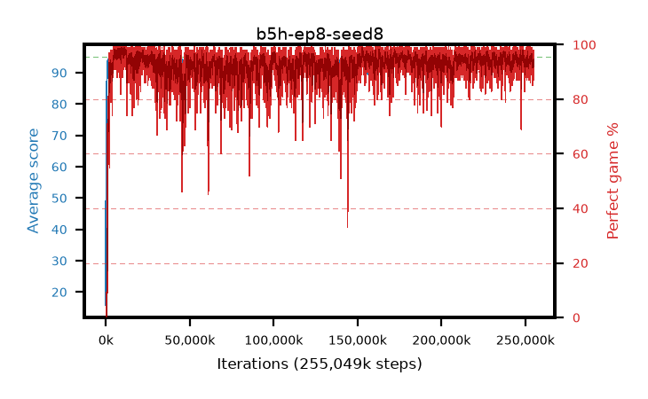

# b5h-ep8-seed8

step **255,049,728** · 15560 evals · trailing **93.09** · peak **94.72** @152,731,648 · sef **96.9** · best30 **98.5** @9,945,088

## Config

| | |
|---|---|
| algo | ppo |
| collect_envs | 128 |
| discount | 0.99 |
| eval_interval | 16384 |
| eval_queue | True |
| eval_queue_depth | 16 |
| eval_workers | 6 |
| fc_layers | (320,) |
| graph_eval_episodes | 100 |
| max_steps | 400000000 |
| min_checkpoint_score | 40.0 |
| ppo_adam_epsilon | 1e-07 |
| ppo_clip | 0.2 |
| ppo_entropy_coef | 0.01 |
| ppo_entropy_coef_final | None |
| ppo_epochs | 8 |
| ppo_gae_lambda | 0.98 |
| ppo_gradient_clipping | 0.5 |
| ppo_horizon | 33.6 |
| ppo_learning_rate | 0.0003 |
| ppo_minibatch | 256 |
| ppo_normalize_adv | True |
| ppo_rollout | 128 |
| ppo_target_kl | 0.0 |
| ppo_transitions_per_rollout | 16384 |
| ppo_value_loss | huber |
| ppo_vf_coef | 0.5 |
| seed | 8 |
| torch_threads | 1 |

## Evals

| step | avg score | trailing avg | min score | max score | avg reward | perfect % | epsilon |
|---|---|---|---|---|---|---|---|
| 16384 | 15.81 | 15.81 | 5.0 | 29.0 | 10.81 | 0.0 |  |
| 32768 | 42.1 | 28.96 | 11.0 | 77.0 | 37.145 | 0.0 |  |
| 49152 | 46.0 | 34.64 | 13.0 | 79.0 | 41.0 | 0.0 |  |
| ... | ... | ... | ... | ... | ... | ... | ... |
| 254754816 | 93.62 | 92.4 | 55.0 | 95.0 | 182.49 | 90.0 |  |
| 254771200 | 93.27 | 92.61 | 26.0 | 95.0 | 184.175 | 92.0 |  |
| 254787584 | 93.99 | 92.78 | 38.0 | 95.0 | 187.925 | 95.0 |  |
| 254803968 | 93.46 | 92.36 | 43.0 | 95.0 | 183.415 | 91.0 |  |
| 254820352 | 92.67 | 92.67 | 18.0 | 95.0 | 185.231 | 94.0 |  |
| 254836736 | 93.52 | 93.03 | 12.0 | 95.0 | 185.16 | 93.0 |  |
| 254869504 | 93.89 | 93.0 | 32.0 | 95.0 | 189.77 | 97.0 |  |
| 254918656 | 92.69 | 92.82 | 19.0 | 95.0 | 186.288 | 95.0 |  |
| 254935040 | 94.33 | 92.94 | 46.0 | 95.0 | 191.25 | 98.0 |  |
| 254951424 | 94.04 | 93.07 | 24.0 | 95.0 | 189.015 | 96.0 |  |
| 254967808 | 92.26 | 93.09 | 9.0 | 95.0 | 180.995 | 90.0 |  |
| 255049728 | 93.64 | 93.09 | 3.0 | 95.0 | 186.294 | 94.0 |  |
