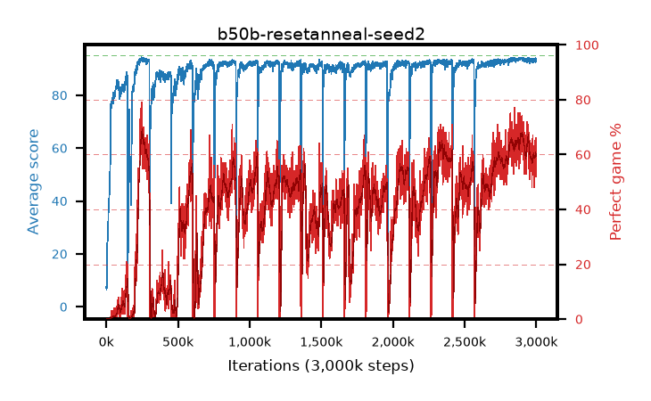

# b50b-resetanneal-seed2

step **3,000,000** · 3000 evals · trailing **93.32** · peak **93.91** @2,906,000 · sef **0.0** · best30 **67.1** @2,910,000

## Config

| | |
|---|---|
| adam_epsilon | 1e-07 |
| algo | qrdqn |
| batch_size | 128 |
| beta_anneal_steps | 300000 |
| collect_envs | 1 |
| discount | 0.99 |
| dist_atoms | 51 |
| dist_embedding | 64 |
| dist_fraction_entropy | 0.001 |
| dist_fraction_lr | 2.5e-09 |
| dist_kappa | 1.0 |
| dist_policy_samples | 32 |
| dist_quantiles | 32 |
| dist_risk_alpha | 1.0 |
| dist_risk_train | False |
| dist_tau_prime_samples | 64 |
| dist_tau_samples | 64 |
| dist_v_max | 110.0 |
| dist_v_min | -10.0 |
| epsilon_anneal_steps | 250000 |
| epsilon_schedule | eval |
| eval_interval | 1000 |
| eval_queue | True |
| eval_queue_depth | 16 |
| eval_workers | 8 |
| fc_layers | (320,) |
| fork_branches | 4 |
| fork_max_steps | 60 |
| fork_min_length | 85 |
| fork_prob | 0.5 |
| gradient_clipping | 0.0 |
| graph_eval_episodes | 100 |
| guided_fraction | 0.8 |
| init_from | None |
| initial_collect_steps | 2000 |
| initial_epsilon | 0.4 |
| is_beta | 0.4 |
| is_beta_final | 1.0 |
| is_weights | True |
| learning_rate | 1e-05 |
| max_steps | 3000000 |
| min_checkpoint_score | 40.0 |
| min_epsilon | 0.002 |
| munchausen_alpha | 0.9 |
| munchausen_l0 | -1.0 |
| munchausen_tau | 0.03 |
| n_step_update | 1 |
| priority_exponent | 0.6 |
| replay_buffer_max_length | 100000 |
| replay_ratio | 1.0 |
| reset_alpha | 0.5 |
| reset_anneal_gamma | 0.97,0.997 |
| reset_anneal_n_step | 10,3 |
| reset_anneal_steps | 10000 |
| reset_interval | 600000 |
| reset_stop_after | 10500000 |
| seed | 2 |
| target_update_period | 8 |
| target_update_tau | 1.0 |
| torch_threads | 1 |

## Evals

| step | avg score | trailing avg | min score | max score | avg reward | perfect % | epsilon |
|---|---|---|---|---|---|---|---|
| 1000 | 7.66 | 7.66 | 0.0 | 16.0 | 2.87 | 0.0 | 0.4 |
| 2000 | 6.47 | 7.06 | 1.0 | 14.0 | 1.596 | 0.0 | 0.4 |
| 3000 | 7.23 | 7.12 | 1.0 | 16.0 | 2.312 | 0.0 | 0.2 |
| ... | ... | ... | ... | ... | ... | ... | ... |
| 2989000 | 93.97 | 93.31 | 80.0 | 95.0 | 156.8 | 65.0 | 0.00325 |
| 2990000 | 93.73 | 93.32 | 76.0 | 95.0 | 156.538 | 65.0 | 0.00327 |
| 2991000 | 93.55 | 93.32 | 68.0 | 95.0 | 147.931 | 57.0 | 0.00327 |
| 2992000 | 92.71 | 93.3 | 38.0 | 95.0 | 146.489 | 56.0 | 0.00322 |
| 2993000 | 92.54 | 93.27 | 2.0 | 95.0 | 149.321 | 59.0 | 0.00322 |
| 2994000 | 93.31 | 93.26 | 72.0 | 95.0 | 153.053 | 62.0 | 0.00322 |
| 2995000 | 94.02 | 93.26 | 82.0 | 95.0 | 156.763 | 65.0 | 0.00324 |
| 2996000 | 93.75 | 93.27 | 82.0 | 95.0 | 149.558 | 58.0 | 0.00324 |
| 2997000 | 92.59 | 93.23 | 20.0 | 95.0 | 142.113 | 52.0 | 0.00323 |
| 2998000 | 93.9 | 93.26 | 86.0 | 95.0 | 155.514 | 64.0 | 0.00321 |
| 2999000 | 93.73 | 93.29 | 82.0 | 95.0 | 157.644 | 66.0 | 0.0032 |
| 3000000 | 93.36 | 93.32 | 76.0 | 95.0 | 145.108 | 54.0 | 0.00322 |
