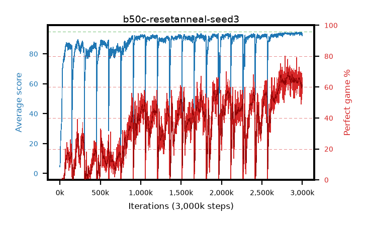

# b50c-resetanneal-seed3

step **3,000,000** · 3000 evals · trailing **93.49** · peak **93.87** @2,944,000 · sef **0.0** · best30 **67.8** @2,833,000

## Config

| | |
|---|---|
| adam_epsilon | 1e-07 |
| algo | qrdqn |
| batch_size | 128 |
| beta_anneal_steps | 300000 |
| collect_envs | 1 |
| discount | 0.99 |
| dist_atoms | 51 |
| dist_embedding | 64 |
| dist_fraction_entropy | 0.001 |
| dist_fraction_lr | 2.5e-09 |
| dist_kappa | 1.0 |
| dist_policy_samples | 32 |
| dist_quantiles | 32 |
| dist_risk_alpha | 1.0 |
| dist_risk_train | False |
| dist_tau_prime_samples | 64 |
| dist_tau_samples | 64 |
| dist_v_max | 110.0 |
| dist_v_min | -10.0 |
| epsilon_anneal_steps | 250000 |
| epsilon_schedule | eval |
| eval_interval | 1000 |
| eval_queue | True |
| eval_queue_depth | 16 |
| eval_workers | 8 |
| fc_layers | (320,) |
| fork_branches | 4 |
| fork_max_steps | 60 |
| fork_min_length | 85 |
| fork_prob | 0.5 |
| gradient_clipping | 0.0 |
| graph_eval_episodes | 100 |
| guided_fraction | 0.8 |
| init_from | None |
| initial_collect_steps | 2000 |
| initial_epsilon | 0.4 |
| is_beta | 0.4 |
| is_beta_final | 1.0 |
| is_weights | True |
| learning_rate | 1e-05 |
| max_steps | 3000000 |
| min_checkpoint_score | 40.0 |
| min_epsilon | 0.002 |
| munchausen_alpha | 0.9 |
| munchausen_l0 | -1.0 |
| munchausen_tau | 0.03 |
| n_step_update | 1 |
| priority_exponent | 0.6 |
| replay_buffer_max_length | 100000 |
| replay_ratio | 1.0 |
| reset_alpha | 0.5 |
| reset_anneal_gamma | 0.97,0.997 |
| reset_anneal_n_step | 10,3 |
| reset_anneal_steps | 10000 |
| reset_interval | 600000 |
| reset_stop_after | 10500000 |
| seed | 3 |
| target_update_period | 8 |
| target_update_tau | 1.0 |
| torch_threads | 1 |

## Evals

| step | avg score | trailing avg | min score | max score | avg reward | perfect % | epsilon |
|---|---|---|---|---|---|---|---|
| 1000 | 4.37 | 4.37 | 0.0 | 13.0 | 2.288 | 0.0 | 0.4 |
| 2000 | 6.01 | 5.19 | 2.0 | 14.0 | 1.004 | 0.0 | 0.4 |
| 3000 | 7.6 | 5.99 | 2.0 | 23.0 | 2.593 | 0.0 | 0.2 |
| ... | ... | ... | ... | ... | ... | ... | ... |
| 2989000 | 93.84 | 93.69 | 57.0 | 95.0 | 160.881 | 69.0 | 0.00291 |
| 2990000 | 93.0 | 93.65 | 66.0 | 95.0 | 142.915 | 52.0 | 0.00291 |
| 2991000 | 93.43 | 93.62 | 70.0 | 95.0 | 148.367 | 57.0 | 0.00295 |
| 2992000 | 93.69 | 93.63 | 78.0 | 95.0 | 153.766 | 62.0 | 0.00294 |
| 2993000 | 94.2 | 93.63 | 88.0 | 95.0 | 161.312 | 69.0 | 0.00298 |
| 2994000 | 93.5 | 93.63 | 78.0 | 95.0 | 150.542 | 59.0 | 0.00301 |
| 2995000 | 92.86 | 93.61 | 35.0 | 95.0 | 157.982 | 67.0 | 0.00301 |
| 2996000 | 93.55 | 93.61 | 74.0 | 95.0 | 155.624 | 64.0 | 0.00301 |
| 2997000 | 92.42 | 93.55 | 21.0 | 95.0 | 148.377 | 58.0 | 0.00303 |
| 2998000 | 92.2 | 93.53 | 2.0 | 95.0 | 145.987 | 56.0 | 0.00302 |
| 2999000 | 93.64 | 93.53 | 76.0 | 95.0 | 152.465 | 61.0 | 0.003 |
| 3000000 | 92.84 | 93.49 | 2.0 | 95.0 | 154.056 | 63.0 | 0.00302 |
