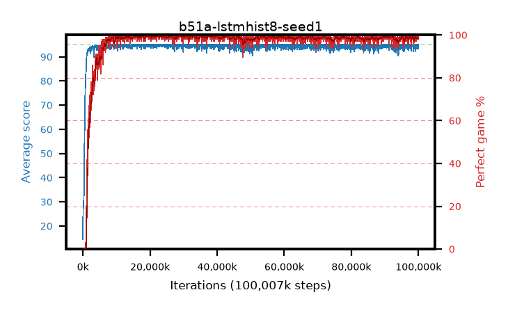

# b51a-lstmhist8-seed1

step **100,007,936** · 3052 evals · trailing **94.22** · peak **94.81** @23,330,816 · sef **96.7** · best30 **99.5** @29,392,896

## Config

| | |
|---|---|
| algo | ppo |
| collect_envs | 128 |
| discount | 0.99 |
| eval_interval | 32768 |
| eval_queue | True |
| eval_queue_depth | 16 |
| eval_workers | 8 |
| fc_layers | (320,) |
| graph_eval_episodes | 100 |
| init_from | None |
| max_steps | 100007936 |
| min_checkpoint_score | 40.0 |
| ppo_adam_epsilon | 1e-07 |
| ppo_anneal_fraction | 0.5 |
| ppo_clip | 0.2 |
| ppo_clip_final | None |
| ppo_discount_final | 0.999 |
| ppo_entropy_coef | 0.01 |
| ppo_entropy_coef_final | 0.001 |
| ppo_epochs | 4 |
| ppo_gae_lambda | 0.95 |
| ppo_gae_lambda_final | 0.999 |
| ppo_gradient_clipping | 0.5 |
| ppo_horizon | 16.8 |
| ppo_horizon_final | 500.3 |
| ppo_learning_rate | 0.00025 |
| ppo_learning_rate_final | None |
| ppo_minibatch | 512 |
| ppo_normalize_adv | True |
| ppo_recurrent | lstm |
| ppo_recurrent_hidden | 128 |
| ppo_rollout | 256 |
| ppo_seq_minibatch | 2 |
| ppo_target_kl | 0.0 |
| ppo_transitions_per_rollout | 32768 |
| ppo_value_loss | huber |
| ppo_vf_coef | 0.5 |
| seed | 1 |
| torch_threads | 1 |

## Evals

| step | avg score | trailing avg | min score | max score | avg reward | perfect % | epsilon |
|---|---|---|---|---|---|---|---|
| 32768 | 14.49 | 14.49 | 0.0 | 31.0 | 9.992 | 0.0 |  |
| 65536 | 30.34 | 22.41 | 0.0 | 54.0 | 25.477 | 0.0 |  |
| 98304 | 28.75 | 24.53 | 3.0 | 65.0 | 23.788 | 0.0 |  |
| ... | ... | ... | ... | ... | ... | ... | ... |
| 99647488 | 94.12 | 94.39 | 44.0 | 95.0 | 190.815 | 98.0 |  |
| 99680256 | 94.72 | 94.44 | 67.0 | 95.0 | 192.456 | 99.0 |  |
| 99713024 | 94.1 | 94.42 | 10.0 | 95.0 | 190.835 | 98.0 |  |
| 99745792 | 93.23 | 94.37 | 1.0 | 95.0 | 190.013 | 98.0 |  |
| 99778560 | 93.78 | 94.33 | 24.0 | 95.0 | 190.475 | 98.0 |  |
| 99811328 | 93.3 | 94.27 | 2.0 | 95.0 | 189.997 | 98.0 |  |
| 99844096 | 95.0 | 94.27 | 95.0 | 95.0 | 193.772 | 100.0 |  |
| 99876864 | 93.27 | 94.22 | 2.0 | 95.0 | 190.011 | 98.0 |  |
| 99909632 | 94.55 | 94.21 | 50.0 | 95.0 | 192.277 | 99.0 |  |
| 99942400 | 94.99 | 94.26 | 94.0 | 95.0 | 192.716 | 99.0 |  |
| 99975168 | 95.0 | 94.26 | 95.0 | 95.0 | 193.77 | 100.0 |  |
| 100007936 | 93.57 | 94.22 | 7.0 | 95.0 | 190.302 | 98.0 |  |
