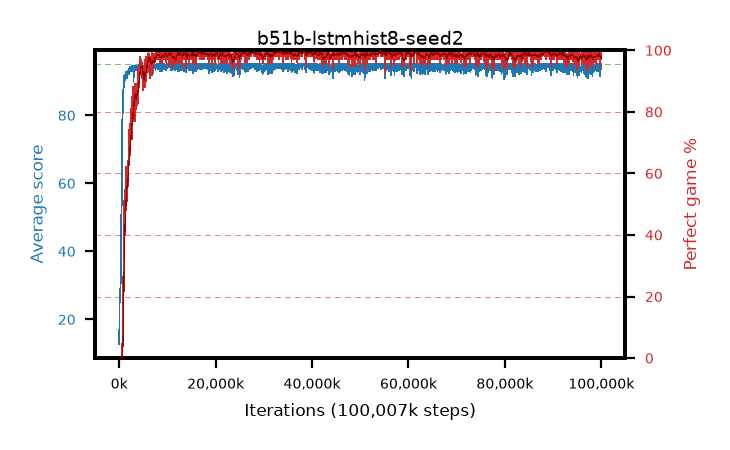

# b51b-lstmhist8-seed2

step **100,007,936** · 3052 evals · trailing **93.99** · peak **94.76** @33,357,824 · sef **97.2** · best30 **99.5** @33,357,824

## Config

| | |
|---|---|
| algo | ppo |
| collect_envs | 128 |
| discount | 0.99 |
| eval_interval | 32768 |
| eval_queue | True |
| eval_queue_depth | 16 |
| eval_workers | 8 |
| fc_layers | (320,) |
| graph_eval_episodes | 100 |
| init_from | None |
| max_steps | 100007936 |
| min_checkpoint_score | 40.0 |
| ppo_adam_epsilon | 1e-07 |
| ppo_anneal_fraction | 0.5 |
| ppo_clip | 0.2 |
| ppo_clip_final | None |
| ppo_discount_final | 0.999 |
| ppo_entropy_coef | 0.01 |
| ppo_entropy_coef_final | 0.001 |
| ppo_epochs | 4 |
| ppo_gae_lambda | 0.95 |
| ppo_gae_lambda_final | 0.999 |
| ppo_gradient_clipping | 0.5 |
| ppo_horizon | 16.8 |
| ppo_horizon_final | 500.3 |
| ppo_learning_rate | 0.00025 |
| ppo_learning_rate_final | None |
| ppo_minibatch | 512 |
| ppo_normalize_adv | True |
| ppo_recurrent | lstm |
| ppo_recurrent_hidden | 128 |
| ppo_rollout | 256 |
| ppo_seq_minibatch | 2 |
| ppo_target_kl | 0.0 |
| ppo_transitions_per_rollout | 32768 |
| ppo_value_loss | huber |
| ppo_vf_coef | 0.5 |
| seed | 2 |
| torch_threads | 1 |

## Evals

| step | avg score | trailing avg | min score | max score | avg reward | perfect % | epsilon |
|---|---|---|---|---|---|---|---|
| 32768 | 12.73 | 12.73 | 2.0 | 31.0 | 7.918 | 0.0 |  |
| 65536 | 23.35 | 18.04 | 3.0 | 44.0 | 18.697 | 0.0 |  |
| 98304 | 27.29 | 21.12 | 10.0 | 51.0 | 22.339 | 0.0 |  |
| ... | ... | ... | ... | ... | ... | ... | ... |
| 99647488 | 93.0 | 94.05 | 4.0 | 95.0 | 188.665 | 97.0 |  |
| 99680256 | 91.58 | 93.99 | 16.0 | 95.0 | 185.17 | 95.0 |  |
| 99713024 | 94.16 | 94.0 | 36.0 | 95.0 | 190.863 | 98.0 |  |
| 99745792 | 93.97 | 93.99 | 35.0 | 95.0 | 190.673 | 98.0 |  |
| 99778560 | 93.3 | 93.93 | 28.0 | 95.0 | 187.923 | 96.0 |  |
| 99811328 | 94.52 | 93.98 | 47.0 | 95.0 | 192.26 | 99.0 |  |
| 99844096 | 94.28 | 93.97 | 23.0 | 95.0 | 192.026 | 99.0 |  |
| 99876864 | 94.26 | 93.98 | 54.0 | 95.0 | 190.963 | 98.0 |  |
| 99909632 | 93.45 | 93.95 | 18.0 | 95.0 | 189.114 | 97.0 |  |
| 99942400 | 93.95 | 93.96 | 32.0 | 95.0 | 190.654 | 98.0 |  |
| 99975168 | 95.0 | 94.0 | 95.0 | 95.0 | 193.781 | 100.0 |  |
| 100007936 | 93.83 | 93.99 | 12.0 | 95.0 | 190.535 | 98.0 |  |
