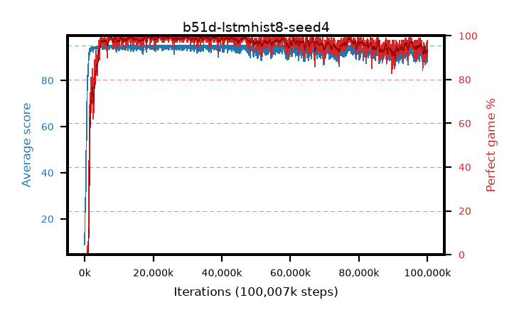

# b51d-lstmhist8-seed4

step **100,007,936** · 3052 evals · trailing **90.15** · peak **94.82** @22,446,080 · sef **97.3** · best30 **99.6** @22,446,080

## Config

| | |
|---|---|
| algo | ppo |
| collect_envs | 128 |
| discount | 0.99 |
| eval_interval | 32768 |
| eval_queue | True |
| eval_queue_depth | 16 |
| eval_workers | 8 |
| fc_layers | (320,) |
| graph_eval_episodes | 100 |
| init_from | None |
| max_steps | 100007936 |
| min_checkpoint_score | 40.0 |
| ppo_adam_epsilon | 1e-07 |
| ppo_anneal_fraction | 0.5 |
| ppo_clip | 0.2 |
| ppo_clip_final | None |
| ppo_discount_final | 0.999 |
| ppo_entropy_coef | 0.01 |
| ppo_entropy_coef_final | 0.001 |
| ppo_epochs | 4 |
| ppo_gae_lambda | 0.95 |
| ppo_gae_lambda_final | 0.999 |
| ppo_gradient_clipping | 0.5 |
| ppo_horizon | 16.8 |
| ppo_horizon_final | 500.3 |
| ppo_learning_rate | 0.00025 |
| ppo_learning_rate_final | None |
| ppo_minibatch | 512 |
| ppo_normalize_adv | True |
| ppo_recurrent | lstm |
| ppo_recurrent_hidden | 128 |
| ppo_rollout | 256 |
| ppo_seq_minibatch | 2 |
| ppo_target_kl | 0.0 |
| ppo_transitions_per_rollout | 32768 |
| ppo_value_loss | huber |
| ppo_vf_coef | 0.5 |
| seed | 4 |
| torch_threads | 1 |

## Evals

| step | avg score | trailing avg | min score | max score | avg reward | perfect % | epsilon |
|---|---|---|---|---|---|---|---|
| 32768 | 8.83 | 8.83 | 1.0 | 23.0 | 4.067 | 0.0 |  |
| 65536 | 21.46 | 15.14 | 2.0 | 49.0 | 16.56 | 0.0 |  |
| 98304 | 25.43 | 18.57 | 4.0 | 54.0 | 20.398 | 0.0 |  |
| ... | ... | ... | ... | ... | ... | ... | ... |
| 99647488 | 89.26 | 90.21 | 22.0 | 95.0 | 178.712 | 91.0 |  |
| 99680256 | 91.97 | 90.25 | 23.0 | 95.0 | 185.567 | 95.0 |  |
| 99713024 | 91.46 | 90.26 | 11.0 | 95.0 | 185.062 | 95.0 |  |
| 99745792 | 92.79 | 90.41 | 20.0 | 95.0 | 188.468 | 97.0 |  |
| 99778560 | 88.04 | 90.41 | 14.0 | 95.0 | 176.455 | 90.0 |  |
| 99811328 | 91.2 | 90.39 | 19.0 | 95.0 | 183.762 | 94.0 |  |
| 99844096 | 90.32 | 90.3 | 12.0 | 95.0 | 181.832 | 93.0 |  |
| 99876864 | 89.53 | 90.25 | 19.0 | 95.0 | 180.016 | 92.0 |  |
| 99909632 | 87.84 | 90.13 | 8.0 | 95.0 | 176.245 | 90.0 |  |
| 99942400 | 91.16 | 90.09 | 22.0 | 95.0 | 183.719 | 94.0 |  |
| 99975168 | 91.16 | 90.11 | 5.0 | 95.0 | 183.718 | 94.0 |  |
| 100007936 | 93.86 | 90.15 | 30.0 | 95.0 | 190.568 | 98.0 |  |
