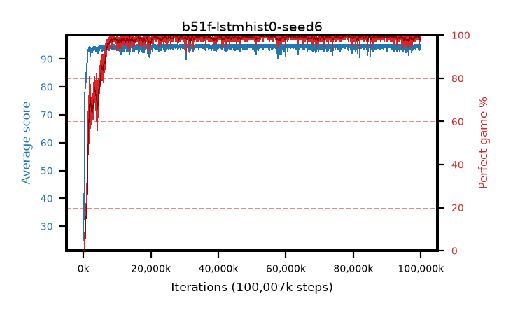

# b51f-lstmhist0-seed6

step **100,007,936** · 3052 evals · trailing **94.39** · peak **94.88** @54,165,504 · sef **95.2** · best30 **99.7** @54,165,504

## Config

| | |
|---|---|
| algo | ppo |
| collect_envs | 128 |
| discount | 0.99 |
| eval_interval | 32768 |
| eval_queue | True |
| eval_queue_depth | 16 |
| eval_workers | 8 |
| fc_layers | (320,) |
| graph_eval_episodes | 100 |
| init_from | None |
| max_steps | 100007936 |
| min_checkpoint_score | 40.0 |
| ppo_adam_epsilon | 1e-07 |
| ppo_anneal_fraction | 0.5 |
| ppo_clip | 0.2 |
| ppo_clip_final | None |
| ppo_discount_final | 0.999 |
| ppo_entropy_coef | 0.01 |
| ppo_entropy_coef_final | 0.001 |
| ppo_epochs | 4 |
| ppo_gae_lambda | 0.95 |
| ppo_gae_lambda_final | 0.999 |
| ppo_gradient_clipping | 0.5 |
| ppo_horizon | 16.8 |
| ppo_horizon_final | 500.3 |
| ppo_learning_rate | 0.00025 |
| ppo_learning_rate_final | None |
| ppo_minibatch | 512 |
| ppo_normalize_adv | True |
| ppo_recurrent | lstm |
| ppo_recurrent_hidden | 128 |
| ppo_rollout | 256 |
| ppo_seq_minibatch | 2 |
| ppo_target_kl | 0.0 |
| ppo_transitions_per_rollout | 32768 |
| ppo_value_loss | huber |
| ppo_vf_coef | 0.5 |
| seed | 6 |
| torch_threads | 1 |

## Evals

| step | avg score | trailing avg | min score | max score | avg reward | perfect % | epsilon |
|---|---|---|---|---|---|---|---|
| 32768 | 24.74 | 24.74 | 0.0 | 48.0 | 19.946 | 0.0 |  |
| 65536 | 41.58 | 33.16 | 15.0 | 79.0 | 36.515 | 0.0 |  |
| 98304 | 32.47 | 32.93 | 11.0 | 55.0 | 27.411 | 0.0 |  |
| ... | ... | ... | ... | ... | ... | ... | ... |
| 99647488 | 94.39 | 94.53 | 39.0 | 95.0 | 191.094 | 98.0 |  |
| 99680256 | 93.86 | 94.52 | 28.0 | 95.0 | 190.564 | 98.0 |  |
| 99713024 | 94.39 | 94.5 | 59.0 | 95.0 | 191.104 | 98.0 |  |
| 99745792 | 93.52 | 94.46 | 5.0 | 95.0 | 190.226 | 98.0 |  |
| 99778560 | 95.0 | 94.46 | 95.0 | 95.0 | 193.783 | 100.0 |  |
| 99811328 | 95.0 | 94.47 | 95.0 | 95.0 | 193.786 | 100.0 |  |
| 99844096 | 94.19 | 94.45 | 14.0 | 95.0 | 191.941 | 99.0 |  |
| 99876864 | 93.21 | 94.39 | 14.0 | 95.0 | 188.872 | 97.0 |  |
| 99909632 | 95.0 | 94.42 | 95.0 | 95.0 | 193.781 | 100.0 |  |
| 99942400 | 93.92 | 94.39 | 38.0 | 95.0 | 189.587 | 97.0 |  |
| 99975168 | 94.21 | 94.39 | 50.0 | 95.0 | 190.916 | 98.0 |  |
| 100007936 | 94.94 | 94.39 | 89.0 | 95.0 | 192.68 | 99.0 |  |
