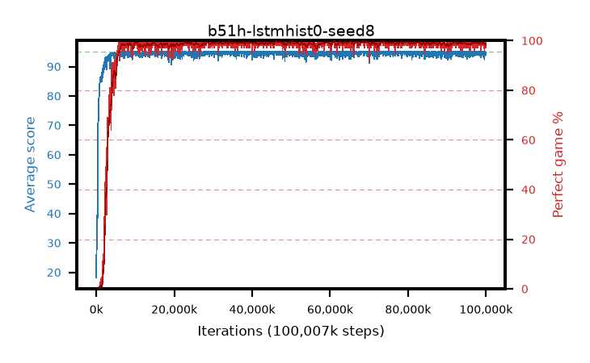

# b51h-lstmhist0-seed8

step **100,007,936** · 3052 evals · trailing **94.35** · peak **94.86** @73,596,928 · sef **96.2** · best30 **99.5** @65,175,552

## Config

| | |
|---|---|
| algo | ppo |
| collect_envs | 128 |
| discount | 0.99 |
| eval_interval | 32768 |
| eval_queue | True |
| eval_queue_depth | 16 |
| eval_workers | 8 |
| fc_layers | (320,) |
| graph_eval_episodes | 100 |
| init_from | None |
| max_steps | 100007936 |
| min_checkpoint_score | 40.0 |
| ppo_adam_epsilon | 1e-07 |
| ppo_anneal_fraction | 0.5 |
| ppo_clip | 0.2 |
| ppo_clip_final | None |
| ppo_discount_final | 0.999 |
| ppo_entropy_coef | 0.01 |
| ppo_entropy_coef_final | 0.001 |
| ppo_epochs | 4 |
| ppo_gae_lambda | 0.95 |
| ppo_gae_lambda_final | 0.999 |
| ppo_gradient_clipping | 0.5 |
| ppo_horizon | 16.8 |
| ppo_horizon_final | 500.3 |
| ppo_learning_rate | 0.00025 |
| ppo_learning_rate_final | None |
| ppo_minibatch | 512 |
| ppo_normalize_adv | True |
| ppo_recurrent | lstm |
| ppo_recurrent_hidden | 128 |
| ppo_rollout | 256 |
| ppo_seq_minibatch | 2 |
| ppo_target_kl | 0.0 |
| ppo_transitions_per_rollout | 32768 |
| ppo_value_loss | huber |
| ppo_vf_coef | 0.5 |
| seed | 8 |
| torch_threads | 1 |

## Evals

| step | avg score | trailing avg | min score | max score | avg reward | perfect % | epsilon |
|---|---|---|---|---|---|---|---|
| 32768 | 18.2 | 18.2 | 0.0 | 42.0 | 13.708 | 0.0 |  |
| 65536 | 31.32 | 24.76 | 5.0 | 64.0 | 26.293 | 0.0 |  |
| 98304 | 30.37 | 26.63 | 6.0 | 53.0 | 25.327 | 0.0 |  |
| ... | ... | ... | ... | ... | ... | ... | ... |
| 99647488 | 93.71 | 94.36 | 6.0 | 95.0 | 189.412 | 97.0 |  |
| 99680256 | 95.0 | 94.36 | 95.0 | 95.0 | 193.775 | 100.0 |  |
| 99713024 | 95.0 | 94.42 | 95.0 | 95.0 | 193.775 | 100.0 |  |
| 99745792 | 93.82 | 94.38 | 6.0 | 95.0 | 190.558 | 98.0 |  |
| 99778560 | 95.0 | 94.41 | 95.0 | 95.0 | 193.772 | 100.0 |  |
| 99811328 | 94.37 | 94.41 | 38.0 | 95.0 | 191.065 | 98.0 |  |
| 99844096 | 94.57 | 94.41 | 52.0 | 95.0 | 192.303 | 99.0 |  |
| 99876864 | 94.99 | 94.41 | 94.0 | 95.0 | 192.718 | 99.0 |  |
| 99909632 | 94.13 | 94.4 | 8.0 | 95.0 | 191.905 | 99.0 |  |
| 99942400 | 94.12 | 94.37 | 7.0 | 95.0 | 191.899 | 99.0 |  |
| 99975168 | 94.12 | 94.38 | 51.0 | 95.0 | 189.772 | 97.0 |  |
| 100007936 | 94.07 | 94.35 | 2.0 | 95.0 | 191.851 | 99.0 |  |
