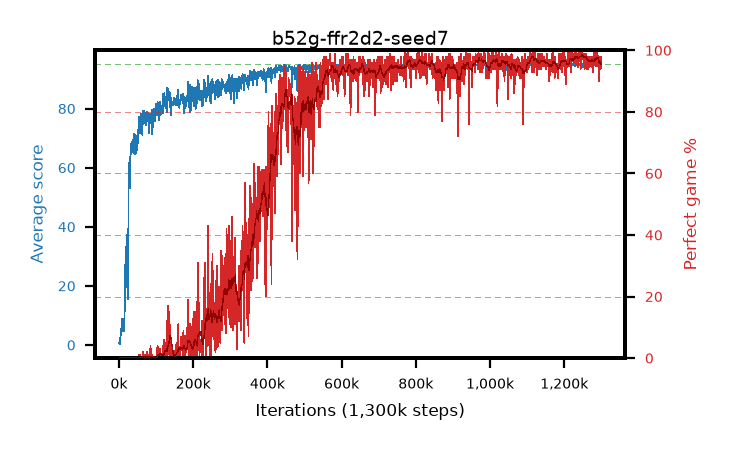

# b52g-ffr2d2-seed7

step **1,300,000** · 1300 evals · trailing **94.73** · peak **94.84** @1,242,000 · sef **63.8** · best30 **97.9** @1,249,000

## Config

| | |
|---|---|
| adam_epsilon | 0.001 |
| algo | r2d2 |
| apex_alpha | 7.0 |
| batch_size | 64 |
| collect_envs | 32 |
| discount | 0.997 |
| dist_atoms | 51 |
| dist_v_max | 110.0 |
| dist_v_min | -10.0 |
| epsilon_anneal_steps | 0 |
| epsilon_schedule | apex |
| eval_interval | 1000 |
| eval_queue | True |
| eval_queue_depth | 16 |
| eval_workers | 8 |
| fc_layers | (320,) |
| gradient_clipping | 40.0 |
| graph_eval_episodes | 100 |
| init_from | None |
| initial_collect_steps | 20000 |
| initial_epsilon | 0.4 |
| learning_rate | 0.0001 |
| max_steps | 1300000 |
| min_checkpoint_score | 40.0 |
| min_epsilon | 0.0 |
| n_step_update | 5 |
| priority_exponent | 0.9 |
| r2d2_burn_in | 40 |
| r2d2_head | scalar |
| r2d2_hidden | 512 |
| r2d2_is_beta | 0.6 |
| r2d2_prev_input | True |
| r2d2_priority_eta | 0.9 |
| r2d2_recurrent | dense |
| r2d2_rescale | True |
| r2d2_rescale_eps | 0.001 |
| r2d2_seq_length | 120 |
| r2d2_stream_width | 512 |
| r2d2_stride | 40 |
| r2d2_windows | 30000 |
| replay_ratio | 0.003125 |
| seed | 7 |
| target_update_period | 2500 |
| torch_threads | 1 |

## Evals

| step | avg score | trailing avg | min score | max score | avg reward | perfect % | epsilon |
|---|---|---|---|---|---|---|---|
| 1000 | 0.64 | 0.64 | 0.0 | 3.0 | -4.373 | 0.0 | 0.4 |
| 2000 | 0.3 | 0.47 | 0.0 | 4.0 | -0.473 | 0.0 | 0.4 |
| 3000 | 0.79 | 0.58 | 0.0 | 5.0 | -0.478 | 0.0 | 0.4 |
| ... | ... | ... | ... | ... | ... | ... | ... |
| 1289000 | 95.0 | 94.68 | 95.0 | 95.0 | 193.604 | 100.0 | 0.4 |
| 1290000 | 94.75 | 94.72 | 82.0 | 95.0 | 191.344 | 98.0 | 0.4 |
| 1291000 | 94.65 | 94.71 | 83.0 | 95.0 | 189.224 | 96.0 | 0.4 |
| 1292000 | 94.82 | 94.72 | 85.0 | 95.0 | 188.314 | 95.0 | 0.4 |
| 1293000 | 94.89 | 94.72 | 89.0 | 95.0 | 189.336 | 96.0 | 0.4 |
| 1294000 | 94.61 | 94.72 | 81.0 | 95.0 | 182.85 | 90.0 | 0.4 |
| 1295000 | 94.73 | 94.72 | 85.0 | 95.0 | 188.179 | 95.0 | 0.4 |
| 1296000 | 94.27 | 94.69 | 36.0 | 95.0 | 189.823 | 97.0 | 0.4 |
| 1297000 | 94.94 | 94.71 | 92.0 | 95.0 | 191.478 | 98.0 | 0.4 |
| 1298000 | 94.65 | 94.73 | 82.0 | 95.0 | 187.174 | 94.0 | 0.4 |
| 1299000 | 94.95 | 94.73 | 93.0 | 95.0 | 190.422 | 97.0 | 0.4 |
| 1300000 | 94.92 | 94.73 | 90.0 | 95.0 | 191.534 | 98.0 | 0.4 |
