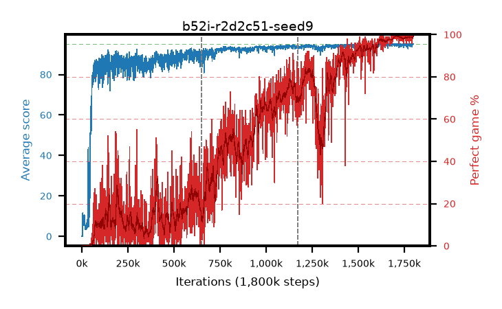

# b52i-r2d2c51-seed9

step **1,800,000** · 1800 evals · trailing **94.73** · peak **94.83** @1,661,000 · sef **28.2** · best30 **99.1** @1,719,000

## Config

| | |
|---|---|
| adam_epsilon | 0.001 |
| algo | r2d2 |
| apex_alpha | 7.0 |
| batch_size | 64 |
| collect_envs | 32 |
| discount | 0.997 |
| dist_atoms | 51 |
| dist_v_max | 110.0 |
| dist_v_min | -10.0 |
| epsilon_anneal_steps | 0 |
| epsilon_schedule | apex |
| eval_interval | 1000 |
| eval_queue | True |
| eval_queue_depth | 16 |
| eval_workers | 8 |
| fc_layers | (320,) |
| gradient_clipping | 40.0 |
| graph_eval_episodes | 100 |
| init_from | None |
| initial_collect_steps | 20000 |
| initial_epsilon | 0.4 |
| learning_rate | 0.0001 |
| max_steps | 1800000 |
| min_checkpoint_score | 40.0 |
| min_epsilon | 0.0 |
| n_step_update | 5 |
| priority_exponent | 0.9 |
| r2d2_burn_in | 40 |
| r2d2_head | c51 |
| r2d2_hidden | 512 |
| r2d2_is_beta | 0.6 |
| r2d2_prev_input | True |
| r2d2_priority_eta | 0.9 |
| r2d2_recurrent | lstm |
| r2d2_rescale | False |
| r2d2_rescale_eps | 0.001 |
| r2d2_seq_length | 120 |
| r2d2_stream_width | 512 |
| r2d2_stride | 40 |
| r2d2_windows | 30000 |
| replay_ratio | 0.003125 |
| seed | 9 |
| target_update_period | 2500 |
| torch_threads | 1 |

## Resumes

Resumed at 650,000, 1,170,000

## Evals

| step | avg score | trailing avg | min score | max score | avg reward | perfect % | epsilon |
|---|---|---|---|---|---|---|---|
| 1000 | 0.02 | 0.02 | 0.0 | 1.0 | -4.983 | 0.0 | 0.4 |
| 2000 | 0.02 | 0.02 | 0.0 | 1.0 | -4.983 | 0.0 | 0.4 |
| 3000 | 1.32 | 0.45 | 0.0 | 5.0 | -1.478 | 0.0 | 0.4 |
| ... | ... | ... | ... | ... | ... | ... | ... |
| 1789000 | 95.0 | 94.59 | 95.0 | 95.0 | 193.671 | 100.0 | 0.4 |
| 1790000 | 94.57 | 94.6 | 54.0 | 95.0 | 191.203 | 98.0 | 0.4 |
| 1791000 | 95.0 | 94.62 | 95.0 | 95.0 | 193.668 | 100.0 | 0.4 |
| 1792000 | 93.64 | 94.62 | 56.0 | 95.0 | 188.207 | 96.0 | 0.4 |
| 1793000 | 95.0 | 94.62 | 95.0 | 95.0 | 193.671 | 100.0 | 0.4 |
| 1794000 | 94.97 | 94.64 | 92.0 | 95.0 | 192.643 | 99.0 | 0.4 |
| 1795000 | 95.0 | 94.64 | 95.0 | 95.0 | 193.673 | 100.0 | 0.4 |
| 1796000 | 94.63 | 94.63 | 60.0 | 95.0 | 191.266 | 98.0 | 0.4 |
| 1797000 | 94.99 | 94.63 | 94.0 | 95.0 | 192.63 | 99.0 | 0.4 |
| 1798000 | 95.0 | 94.63 | 95.0 | 95.0 | 193.665 | 100.0 | 0.4 |
| 1799000 | 94.99 | 94.65 | 94.0 | 95.0 | 192.628 | 99.0 | 0.4 |
| 1800000 | 95.0 | 94.73 | 95.0 | 95.0 | 193.679 | 100.0 | 0.4 |
