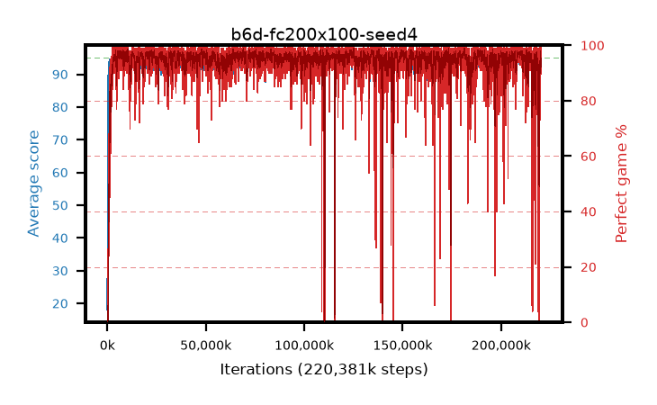

# b6d-fc200x100-seed4

step **220,381,184** · 13449 evals · trailing **94.11** · peak **94.7** @208,502,784 · sef **97.3** · best30 **98.3** @125,173,760

## Config

| | |
|---|---|
| algo | ppo |
| collect_envs | 128 |
| discount | 0.99 |
| eval_interval | 16384 |
| eval_queue | True |
| eval_queue_depth | 16 |
| eval_workers | 6 |
| fc_layers | (200, 100) |
| graph_eval_episodes | 100 |
| max_steps | 400000000 |
| min_checkpoint_score | 40.0 |
| ppo_adam_epsilon | 1e-07 |
| ppo_clip | 0.2 |
| ppo_entropy_coef | 0.01 |
| ppo_entropy_coef_final | None |
| ppo_epochs | 4 |
| ppo_gae_lambda | 0.98 |
| ppo_gradient_clipping | 0.5 |
| ppo_horizon | 33.6 |
| ppo_learning_rate | 0.0003 |
| ppo_minibatch | 256 |
| ppo_normalize_adv | True |
| ppo_rollout | 128 |
| ppo_target_kl | 0.0 |
| ppo_transitions_per_rollout | 16384 |
| ppo_value_loss | huber |
| ppo_vf_coef | 0.5 |
| seed | 4 |
| torch_threads | 1 |

## Evals

| step | avg score | trailing avg | min score | max score | avg reward | perfect % | epsilon |
|---|---|---|---|---|---|---|---|
| 16384 | 18.06 | 18.06 | 2.0 | 36.0 | 13.285 | 0.0 |  |
| 32768 | 32.44 | 26.48 | 10.0 | 57.0 | 27.44 | 0.0 |  |
| 49152 | 28.95 | 23.5 | 7.0 | 50.0 | 24.13 | 0.0 |  |
| ... | ... | ... | ... | ... | ... | ... | ... |
| 220168192 | 94.64 | 94.18 | 81.0 | 95.0 | 189.48 | 96.0 |  |
| 220184576 | 94.03 | 94.06 | 66.0 | 95.0 | 186.925 | 94.0 |  |
| 220200960 | 94.83 | 94.13 | 84.0 | 95.0 | 191.795 | 98.0 |  |
| 220217344 | 94.87 | 94.16 | 88.0 | 95.0 | 190.75 | 97.0 |  |
| 220233728 | 94.32 | 94.15 | 65.0 | 95.0 | 188.165 | 95.0 |  |
| 220282880 | 94.05 | 94.04 | 70.0 | 95.0 | 183.735 | 91.0 |  |
| 220299264 | 94.4 | 94.07 | 74.0 | 95.0 | 187.25 | 94.0 |  |
| 220315648 | 94.23 | 94.11 | 75.0 | 95.0 | 188.12 | 95.0 |  |
| 220332032 | 93.95 | 94.17 | 34.0 | 95.0 | 188.88 | 96.0 |  |
| 220348416 | 94.95 | 94.19 | 90.0 | 95.0 | 192.91 | 99.0 |  |
| 220364800 | 93.92 | 94.15 | 49.0 | 95.0 | 184.6 | 92.0 |  |
| 220381184 | 94.71 | 94.11 | 83.0 | 95.0 | 190.59 | 97.0 |  |
