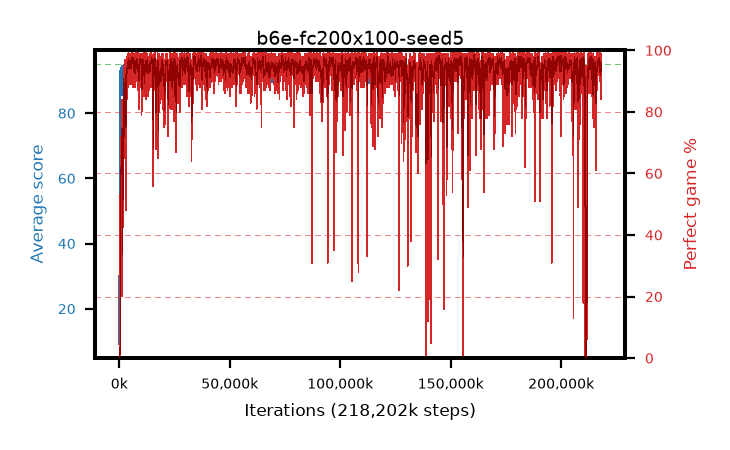

# b6e-fc200x100-seed5

step **218,202,112** · 13316 evals · trailing **93.96** · peak **94.69** @198,770,688 · sef **96.1** · best30 **97.9** @73,924,608

## Config

| | |
|---|---|
| algo | ppo |
| collect_envs | 128 |
| discount | 0.99 |
| eval_interval | 16384 |
| eval_queue | True |
| eval_queue_depth | 16 |
| eval_workers | 6 |
| fc_layers | (200, 100) |
| graph_eval_episodes | 100 |
| max_steps | 400000000 |
| min_checkpoint_score | 40.0 |
| ppo_adam_epsilon | 1e-07 |
| ppo_clip | 0.2 |
| ppo_entropy_coef | 0.01 |
| ppo_entropy_coef_final | None |
| ppo_epochs | 4 |
| ppo_gae_lambda | 0.98 |
| ppo_gradient_clipping | 0.5 |
| ppo_horizon | 33.6 |
| ppo_learning_rate | 0.0003 |
| ppo_minibatch | 256 |
| ppo_normalize_adv | True |
| ppo_rollout | 128 |
| ppo_target_kl | 0.0 |
| ppo_transitions_per_rollout | 16384 |
| ppo_value_loss | huber |
| ppo_vf_coef | 0.5 |
| seed | 5 |
| torch_threads | 1 |

## Evals

| step | avg score | trailing avg | min score | max score | avg reward | perfect % | epsilon |
|---|---|---|---|---|---|---|---|
| 16384 | 9.14 | 9.14 | 1.0 | 27.0 | 7.2 | 0.0 |  |
| 32768 | 29.71 | 19.43 | 7.0 | 52.0 | 24.71 | 0.0 |  |
| 49152 | 30.96 | 23.27 | 13.0 | 54.0 | 25.96 | 0.0 |  |
| ... | ... | ... | ... | ... | ... | ... | ... |
| 217989120 | 94.09 | 93.96 | 57.0 | 95.0 | 187.03 | 94.0 |  |
| 218005504 | 94.11 | 93.87 | 62.0 | 95.0 | 189.13 | 96.0 |  |
| 218021888 | 94.33 | 93.89 | 66.0 | 95.0 | 187.27 | 94.0 |  |
| 218071040 | 92.62 | 94.01 | 49.0 | 95.0 | 181.535 | 90.0 |  |
| 218087424 | 94.91 | 94.03 | 86.0 | 95.0 | 192.915 | 99.0 |  |
| 218103808 | 94.38 | 93.97 | 79.0 | 95.0 | 188.36 | 95.0 |  |
| 218120192 | 94.6 | 93.94 | 80.0 | 95.0 | 188.49 | 95.0 |  |
| 218136576 | 93.29 | 93.91 | 46.0 | 95.0 | 183.2 | 91.0 |  |
| 218152960 | 93.46 | 93.92 | 36.0 | 95.0 | 186.355 | 94.0 |  |
| 218169344 | 93.39 | 93.9 | 42.0 | 95.0 | 185.335 | 93.0 |  |
| 218185728 | 94.49 | 93.91 | 50.0 | 95.0 | 190.37 | 97.0 |  |
| 218202112 | 94.17 | 93.96 | 50.0 | 95.0 | 190.095 | 97.0 |  |
