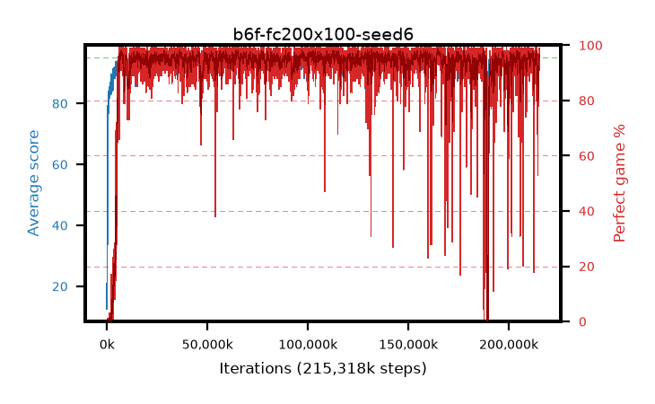

# b6f-fc200x100-seed6

step **215,318,528** · 13140 evals · trailing **93.27** · peak **94.6** @102,612,992 · sef **95.9** · best30 **97.9** @131,989,504

## Config

| | |
|---|---|
| algo | ppo |
| collect_envs | 128 |
| discount | 0.99 |
| eval_interval | 16384 |
| eval_queue | True |
| eval_queue_depth | 16 |
| eval_workers | 6 |
| fc_layers | (200, 100) |
| graph_eval_episodes | 100 |
| max_steps | 400000000 |
| min_checkpoint_score | 40.0 |
| ppo_adam_epsilon | 1e-07 |
| ppo_clip | 0.2 |
| ppo_entropy_coef | 0.01 |
| ppo_entropy_coef_final | None |
| ppo_epochs | 4 |
| ppo_gae_lambda | 0.98 |
| ppo_gradient_clipping | 0.5 |
| ppo_horizon | 33.6 |
| ppo_learning_rate | 0.0003 |
| ppo_minibatch | 256 |
| ppo_normalize_adv | True |
| ppo_rollout | 128 |
| ppo_target_kl | 0.0 |
| ppo_transitions_per_rollout | 16384 |
| ppo_value_loss | huber |
| ppo_vf_coef | 0.5 |
| seed | 6 |
| torch_threads | 1 |

## Evals

| step | avg score | trailing avg | min score | max score | avg reward | perfect % | epsilon |
|---|---|---|---|---|---|---|---|
| 16384 | 12.57 | 12.57 | 1.0 | 44.0 | 8.335 | 0.0 |  |
| 32768 | 20.39 | 16.48 | 1.0 | 42.0 | 15.435 | 0.0 |  |
| 49152 | 28.49 | 20.48 | 9.0 | 49.0 | 23.535 | 0.0 |  |
| ... | ... | ... | ... | ... | ... | ... | ... |
| 215105536 | 94.79 | 93.76 | 82.0 | 95.0 | 191.8 | 98.0 |  |
| 215121920 | 94.73 | 92.62 | 84.0 | 95.0 | 190.745 | 97.0 |  |
| 215138304 | 94.05 | 93.02 | 14.0 | 95.0 | 191.06 | 98.0 |  |
| 215154688 | 94.39 | 93.16 | 64.0 | 95.0 | 190.405 | 97.0 |  |
| 215171072 | 94.32 | 93.69 | 70.0 | 95.0 | 187.26 | 94.0 |  |
| 215187456 | 94.96 | 93.83 | 91.0 | 95.0 | 192.965 | 99.0 |  |
| 215236608 | 93.25 | 92.91 | 3.0 | 95.0 | 185.15 | 93.0 |  |
| 215252992 | 93.27 | 93.06 | 18.0 | 95.0 | 187.25 | 95.0 |  |
| 215269376 | 94.7 | 93.37 | 65.0 | 95.0 | 192.66 | 99.0 |  |
| 215285760 | 93.87 | 93.55 | 13.0 | 95.0 | 187.805 | 95.0 |  |
| 215302144 | 93.33 | 93.35 | 5.0 | 95.0 | 184.145 | 92.0 |  |
| 215318528 | 94.79 | 93.27 | 85.0 | 95.0 | 189.63 | 96.0 |  |
