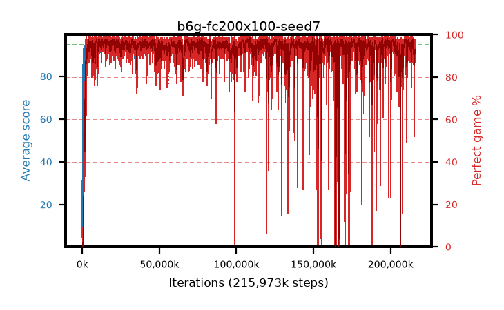

# b6g-fc200x100-seed7

step **215,973,888** · 13179 evals · trailing **93.26** · peak **94.75** @214,532,096 · sef **96.3** · best30 **98.0** @149,438,464

## Config

| | |
|---|---|
| algo | ppo |
| collect_envs | 128 |
| discount | 0.99 |
| eval_interval | 16384 |
| eval_queue | True |
| eval_queue_depth | 16 |
| eval_workers | 6 |
| fc_layers | (200, 100) |
| graph_eval_episodes | 100 |
| max_steps | 400000000 |
| min_checkpoint_score | 40.0 |
| ppo_adam_epsilon | 1e-07 |
| ppo_clip | 0.2 |
| ppo_entropy_coef | 0.01 |
| ppo_entropy_coef_final | None |
| ppo_epochs | 4 |
| ppo_gae_lambda | 0.98 |
| ppo_gradient_clipping | 0.5 |
| ppo_horizon | 33.6 |
| ppo_learning_rate | 0.0003 |
| ppo_minibatch | 256 |
| ppo_normalize_adv | True |
| ppo_rollout | 128 |
| ppo_target_kl | 0.0 |
| ppo_transitions_per_rollout | 16384 |
| ppo_value_loss | huber |
| ppo_vf_coef | 0.5 |
| seed | 7 |
| torch_threads | 1 |

## Evals

| step | avg score | trailing avg | min score | max score | avg reward | perfect % | epsilon |
|---|---|---|---|---|---|---|---|
| 16384 | 4.78 | 4.78 | 0.0 | 19.0 | 2.435 | 0.0 |  |
| 32768 | 27.1 | 15.94 | 4.0 | 49.0 | 22.1 | 0.0 |  |
| 49152 | 31.29 | 21.06 | 4.0 | 65.0 | 26.29 | 0.0 |  |
| ... | ... | ... | ... | ... | ... | ... | ... |
| 215744512 | 90.03 | 93.43 | 1.0 | 95.0 | 177.68 | 89.0 |  |
| 215760896 | 93.79 | 92.97 | 45.0 | 95.0 | 188.675 | 96.0 |  |
| 215777280 | 93.32 | 93.02 | 60.0 | 95.0 | 180.88 | 89.0 |  |
| 215793664 | 94.49 | 93.25 | 74.0 | 95.0 | 186.255 | 93.0 |  |
| 215859200 | 94.49 | 93.02 | 56.0 | 95.0 | 189.375 | 96.0 |  |
| 215875584 | 94.43 | 93.09 | 83.0 | 95.0 | 185.155 | 92.0 |  |
| 215891968 | 92.83 | 93.21 | 34.0 | 95.0 | 178.355 | 87.0 |  |
| 215908352 | 93.97 | 93.15 | 66.0 | 95.0 | 183.655 | 91.0 |  |
| 215924736 | 92.63 | 93.17 | 23.0 | 95.0 | 182.36 | 91.0 |  |
| 215941120 | 92.93 | 93.23 | 5.0 | 95.0 | 185.69 | 94.0 |  |
| 215957504 | 94.64 | 93.2 | 66.0 | 95.0 | 190.565 | 97.0 |  |
| 215973888 | 94.45 | 93.26 | 64.0 | 95.0 | 191.46 | 98.0 |  |
