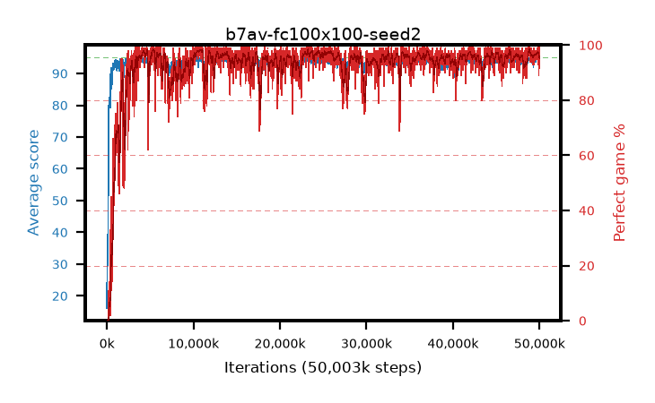

# b7av-fc100x100-seed2

step **50,003,968** · 3052 evals · trailing **94.49** · peak **94.58** @23,068,672 · sef **94.5** · best30 **98.1** @11,026,432

## Config

| | |
|---|---|
| algo | ppo |
| collect_envs | 128 |
| discount | 0.99 |
| eval_interval | 16384 |
| eval_queue | True |
| eval_queue_depth | 16 |
| eval_workers | 8 |
| fc_layers | (100, 100) |
| graph_eval_episodes | 100 |
| max_steps | 50003968 |
| min_checkpoint_score | 40.0 |
| ppo_adam_epsilon | 1e-07 |
| ppo_clip | 0.2 |
| ppo_entropy_coef | 0.01 |
| ppo_entropy_coef_final | None |
| ppo_epochs | 4 |
| ppo_gae_lambda | 0.98 |
| ppo_gradient_clipping | 0.5 |
| ppo_horizon | 33.6 |
| ppo_learning_rate | 0.0003 |
| ppo_minibatch | 256 |
| ppo_normalize_adv | True |
| ppo_rollout | 128 |
| ppo_target_kl | 0.0 |
| ppo_transitions_per_rollout | 16384 |
| ppo_value_loss | huber |
| ppo_vf_coef | 0.5 |
| seed | 2 |
| torch_threads | 1 |

## Evals

| step | avg score | trailing avg | min score | max score | avg reward | perfect % | epsilon |
|---|---|---|---|---|---|---|---|
| 16384 | 16.13 | 16.13 | 0.0 | 32.0 | 11.31 | 0.0 |  |
| 32768 | 29.75 | 25.19 | 12.0 | 59.0 | 24.75 | 0.0 |  |
| 49152 | 29.69 | 22.91 | 14.0 | 53.0 | 24.69 | 0.0 |  |
| ... | ... | ... | ... | ... | ... | ... | ... |
| 49823744 | 94.07 | 94.51 | 2.0 | 95.0 | 192.075 | 99.0 |  |
| 49840128 | 94.08 | 94.51 | 38.0 | 95.0 | 188.965 | 96.0 |  |
| 49856512 | 93.4 | 94.46 | 6.0 | 95.0 | 185.3 | 93.0 |  |
| 49872896 | 94.77 | 94.52 | 81.0 | 95.0 | 191.78 | 98.0 |  |
| 49889280 | 94.18 | 94.5 | 61.0 | 95.0 | 187.165 | 94.0 |  |
| 49905664 | 94.8 | 94.53 | 82.0 | 95.0 | 191.81 | 98.0 |  |
| 49922048 | 93.67 | 94.5 | 68.0 | 95.0 | 181.725 | 89.0 |  |
| 49938432 | 94.09 | 94.48 | 4.0 | 95.0 | 192.05 | 99.0 |  |
| 49954816 | 94.37 | 94.48 | 77.0 | 95.0 | 187.4 | 94.0 |  |
| 49971200 | 94.31 | 94.49 | 77.0 | 95.0 | 186.345 | 93.0 |  |
| 49987584 | 94.74 | 94.49 | 81.0 | 95.0 | 191.75 | 98.0 |  |
| 50003968 | 94.95 | 94.49 | 90.0 | 95.0 | 192.955 | 99.0 |  |
