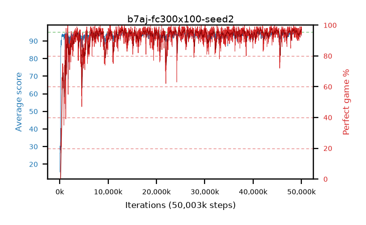

# b7aj-fc300x100-seed2

step **50,003,968** · 3052 evals · trailing **94.12** · peak **94.41** @48,758,784 · sef **95.1** · best30 **96.9** @48,513,024

## Config

| | |
|---|---|
| algo | ppo |
| collect_envs | 128 |
| discount | 0.99 |
| eval_interval | 16384 |
| eval_queue | True |
| eval_queue_depth | 16 |
| eval_workers | 8 |
| fc_layers | (300, 100) |
| graph_eval_episodes | 100 |
| max_steps | 50003968 |
| min_checkpoint_score | 40.0 |
| ppo_adam_epsilon | 1e-07 |
| ppo_clip | 0.2 |
| ppo_entropy_coef | 0.01 |
| ppo_entropy_coef_final | None |
| ppo_epochs | 4 |
| ppo_gae_lambda | 0.98 |
| ppo_gradient_clipping | 0.5 |
| ppo_horizon | 33.6 |
| ppo_learning_rate | 0.0003 |
| ppo_minibatch | 256 |
| ppo_normalize_adv | True |
| ppo_rollout | 128 |
| ppo_target_kl | 0.0 |
| ppo_transitions_per_rollout | 16384 |
| ppo_value_loss | huber |
| ppo_vf_coef | 0.5 |
| seed | 2 |
| torch_threads | 1 |

## Evals

| step | avg score | trailing avg | min score | max score | avg reward | perfect % | epsilon |
|---|---|---|---|---|---|---|---|
| 16384 | 15.52 | 15.52 | 1.0 | 31.0 | 10.52 | 0.0 |  |
| 32768 | 26.1 | 22.57 | 1.0 | 52.0 | 21.19 | 0.0 |  |
| 49152 | 26.09 | 20.8 | 7.0 | 47.0 | 21.09 | 0.0 |  |
| ... | ... | ... | ... | ... | ... | ... | ... |
| 49823744 | 94.21 | 93.84 | 53.0 | 95.0 | 191.175 | 98.0 |  |
| 49840128 | 94.61 | 93.91 | 56.0 | 95.0 | 192.615 | 99.0 |  |
| 49856512 | 93.86 | 93.86 | 45.0 | 95.0 | 189.875 | 97.0 |  |
| 49872896 | 94.21 | 93.94 | 70.0 | 95.0 | 187.15 | 94.0 |  |
| 49889280 | 94.72 | 94.06 | 70.0 | 95.0 | 191.685 | 98.0 |  |
| 49905664 | 94.57 | 94.03 | 65.0 | 95.0 | 191.58 | 98.0 |  |
| 49922048 | 94.94 | 94.18 | 89.0 | 95.0 | 192.945 | 99.0 |  |
| 49938432 | 94.54 | 94.21 | 54.0 | 95.0 | 191.505 | 98.0 |  |
| 49954816 | 94.59 | 94.06 | 84.0 | 95.0 | 187.53 | 94.0 |  |
| 49971200 | 94.71 | 94.05 | 66.0 | 95.0 | 192.67 | 99.0 |  |
| 49987584 | 94.88 | 94.12 | 83.0 | 95.0 | 192.885 | 99.0 |  |
| 50003968 | 93.16 | 94.12 | 12.0 | 95.0 | 185.195 | 93.0 |  |
