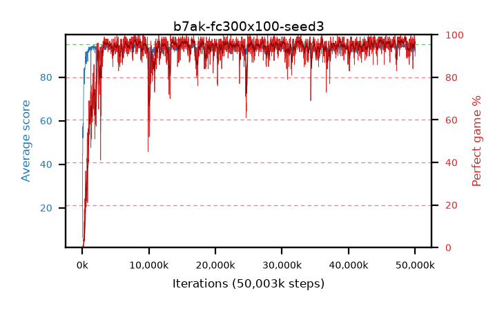

# b7ak-fc300x100-seed3

step **50,003,968** · 3052 evals · trailing **93.41** · peak **94.58** @48,332,800 · sef **94.1** · best30 **97.2** @44,924,928

## Config

| | |
|---|---|
| algo | ppo |
| collect_envs | 128 |
| discount | 0.99 |
| eval_interval | 16384 |
| eval_queue | True |
| eval_queue_depth | 16 |
| eval_workers | 8 |
| fc_layers | (300, 100) |
| graph_eval_episodes | 100 |
| max_steps | 50003968 |
| min_checkpoint_score | 40.0 |
| ppo_adam_epsilon | 1e-07 |
| ppo_clip | 0.2 |
| ppo_entropy_coef | 0.01 |
| ppo_entropy_coef_final | None |
| ppo_epochs | 4 |
| ppo_gae_lambda | 0.98 |
| ppo_gradient_clipping | 0.5 |
| ppo_horizon | 33.6 |
| ppo_learning_rate | 0.0003 |
| ppo_minibatch | 256 |
| ppo_normalize_adv | True |
| ppo_rollout | 128 |
| ppo_target_kl | 0.0 |
| ppo_transitions_per_rollout | 16384 |
| ppo_value_loss | huber |
| ppo_vf_coef | 0.5 |
| seed | 3 |
| torch_threads | 1 |

## Evals

| step | avg score | trailing avg | min score | max score | avg reward | perfect % | epsilon |
|---|---|---|---|---|---|---|---|
| 16384 | 6.19 | 6.19 | 1.0 | 29.0 | 4.79 | 0.0 |  |
| 32768 | 8.39 | 7.29 | 1.0 | 40.0 | 7.485 | 0.0 |  |
| 49152 | 44.42 | 25.85 | 5.0 | 79.0 | 39.42 | 0.0 |  |
| ... | ... | ... | ... | ... | ... | ... | ... |
| 49823744 | 94.82 | 93.45 | 82.0 | 95.0 | 191.785 | 98.0 |  |
| 49840128 | 93.76 | 93.31 | 20.0 | 95.0 | 186.79 | 94.0 |  |
| 49856512 | 94.68 | 93.27 | 80.0 | 95.0 | 190.65 | 97.0 |  |
| 49872896 | 95.0 | 93.24 | 95.0 | 95.0 | 194.0 | 100.0 |  |
| 49889280 | 94.66 | 93.4 | 76.0 | 95.0 | 189.68 | 96.0 |  |
| 49905664 | 92.25 | 93.19 | 3.0 | 95.0 | 187.27 | 96.0 |  |
| 49922048 | 94.72 | 93.32 | 85.0 | 95.0 | 189.74 | 96.0 |  |
| 49938432 | 93.94 | 93.47 | 12.0 | 95.0 | 188.96 | 96.0 |  |
| 49954816 | 94.15 | 93.47 | 22.0 | 95.0 | 191.16 | 98.0 |  |
| 49971200 | 92.25 | 93.47 | 1.0 | 95.0 | 187.27 | 96.0 |  |
| 49987584 | 93.87 | 93.48 | 19.0 | 95.0 | 187.895 | 95.0 |  |
| 50003968 | 91.39 | 93.41 | 1.0 | 95.0 | 180.35 | 90.0 |  |
