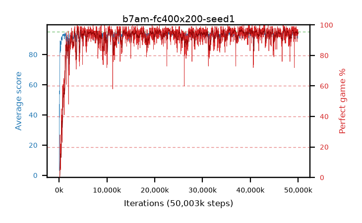

# b7am-fc400x200-seed1

step **50,003,968** · 3052 evals · trailing **93.68** · peak **94.33** @47,316,992 · sef **95.5** · best30 **96.8** @35,733,504

## Config

| | |
|---|---|
| algo | ppo |
| collect_envs | 128 |
| discount | 0.99 |
| eval_interval | 16384 |
| eval_queue | True |
| eval_queue_depth | 16 |
| eval_workers | 8 |
| fc_layers | (400, 200) |
| graph_eval_episodes | 100 |
| max_steps | 50003968 |
| min_checkpoint_score | 40.0 |
| ppo_adam_epsilon | 1e-07 |
| ppo_clip | 0.2 |
| ppo_entropy_coef | 0.01 |
| ppo_entropy_coef_final | None |
| ppo_epochs | 4 |
| ppo_gae_lambda | 0.98 |
| ppo_gradient_clipping | 0.5 |
| ppo_horizon | 33.6 |
| ppo_learning_rate | 0.0003 |
| ppo_minibatch | 256 |
| ppo_normalize_adv | True |
| ppo_rollout | 128 |
| ppo_target_kl | 0.0 |
| ppo_transitions_per_rollout | 16384 |
| ppo_value_loss | huber |
| ppo_vf_coef | 0.5 |
| seed | 1 |
| torch_threads | 1 |

## Evals

| step | avg score | trailing avg | min score | max score | avg reward | perfect % | epsilon |
|---|---|---|---|---|---|---|---|
| 16384 | 3.16 | 3.16 | 0.0 | 18.0 | 2.615 | 0.0 |  |
| 32768 | 38.34 | 26.59 | 1.0 | 84.0 | 35.32 | 0.0 |  |
| 49152 | 47.07 | 31.71 | 22.0 | 75.0 | 42.25 | 0.0 |  |
| ... | ... | ... | ... | ... | ... | ... | ... |
| 49823744 | 94.55 | 94.17 | 82.0 | 95.0 | 188.53 | 95.0 |  |
| 49840128 | 91.81 | 93.94 | 5.0 | 95.0 | 183.845 | 93.0 |  |
| 49856512 | 94.74 | 93.94 | 83.0 | 95.0 | 190.755 | 97.0 |  |
| 49872896 | 90.62 | 93.83 | 1.0 | 95.0 | 182.655 | 93.0 |  |
| 49889280 | 94.56 | 93.83 | 76.0 | 95.0 | 190.575 | 97.0 |  |
| 49905664 | 91.96 | 93.74 | 20.0 | 95.0 | 183.905 | 93.0 |  |
| 49922048 | 93.27 | 93.69 | 13.0 | 95.0 | 187.295 | 95.0 |  |
| 49938432 | 93.97 | 93.74 | 17.0 | 95.0 | 189.985 | 97.0 |  |
| 49954816 | 93.54 | 93.67 | 47.0 | 95.0 | 186.435 | 94.0 |  |
| 49971200 | 93.79 | 93.68 | 50.0 | 95.0 | 186.775 | 94.0 |  |
| 49987584 | 94.09 | 93.71 | 66.0 | 95.0 | 188.07 | 95.0 |  |
| 50003968 | 94.46 | 93.68 | 77.0 | 95.0 | 188.395 | 95.0 |  |
