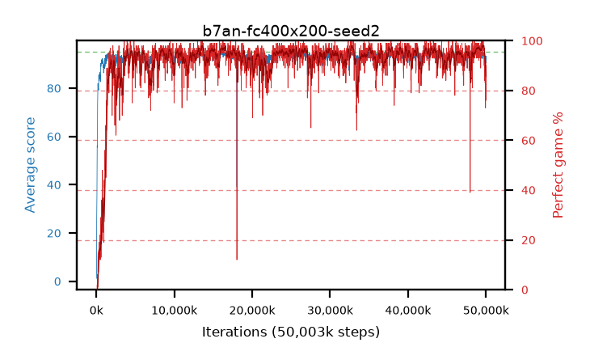

# b7an-fc400x200-seed2

step **50,003,968** · 3052 evals · trailing **93.75** · peak **94.34** @16,302,080 · sef **95.3** · best30 **97.3** @49,659,904

## Config

| | |
|---|---|
| algo | ppo |
| collect_envs | 128 |
| discount | 0.99 |
| eval_interval | 16384 |
| eval_queue | True |
| eval_queue_depth | 16 |
| eval_workers | 8 |
| fc_layers | (400, 200) |
| graph_eval_episodes | 100 |
| max_steps | 50003968 |
| min_checkpoint_score | 40.0 |
| ppo_adam_epsilon | 1e-07 |
| ppo_clip | 0.2 |
| ppo_entropy_coef | 0.01 |
| ppo_entropy_coef_final | None |
| ppo_epochs | 4 |
| ppo_gae_lambda | 0.98 |
| ppo_gradient_clipping | 0.5 |
| ppo_horizon | 33.6 |
| ppo_learning_rate | 0.0003 |
| ppo_minibatch | 256 |
| ppo_normalize_adv | True |
| ppo_rollout | 128 |
| ppo_target_kl | 0.0 |
| ppo_transitions_per_rollout | 16384 |
| ppo_value_loss | huber |
| ppo_vf_coef | 0.5 |
| seed | 2 |
| torch_threads | 1 |

## Evals

| step | avg score | trailing avg | min score | max score | avg reward | perfect % | epsilon |
|---|---|---|---|---|---|---|---|
| 16384 | 1.21 | 1.21 | 0.0 | 5.0 | 0.665 | 0.0 |  |
| 32768 | 4.73 | 2.97 | 0.0 | 26.0 | 4.185 | 0.0 |  |
| 49152 | 25.87 | 15.6 | 4.0 | 52.0 | 22.265 | 0.0 |  |
| ... | ... | ... | ... | ... | ... | ... | ... |
| 49823744 | 94.58 | 94.13 | 70.0 | 95.0 | 190.595 | 97.0 |  |
| 49840128 | 94.02 | 94.14 | 59.0 | 95.0 | 187.005 | 94.0 |  |
| 49856512 | 93.85 | 94.11 | 66.0 | 95.0 | 184.845 | 92.0 |  |
| 49872896 | 93.36 | 94.14 | 16.0 | 95.0 | 183.405 | 91.0 |  |
| 49889280 | 93.09 | 93.99 | 72.0 | 95.0 | 175.13 | 83.0 |  |
| 49905664 | 92.42 | 93.77 | 24.0 | 95.0 | 181.38 | 90.0 |  |
| 49922048 | 91.85 | 94.05 | 14.0 | 95.0 | 176.875 | 86.0 |  |
| 49938432 | 90.55 | 93.86 | 17.0 | 95.0 | 162.685 | 73.0 |  |
| 49954816 | 93.29 | 93.54 | 10.0 | 95.0 | 184.285 | 92.0 |  |
| 49971200 | 90.37 | 93.59 | 7.0 | 95.0 | 165.49 | 76.0 |  |
| 49987584 | 92.81 | 93.48 | 73.0 | 95.0 | 175.8 | 84.0 |  |
| 50003968 | 93.26 | 93.75 | 32.0 | 95.0 | 182.31 | 90.0 |  |
