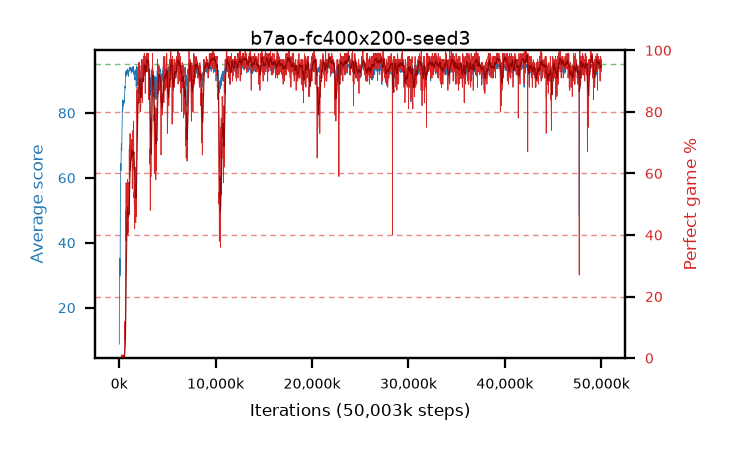

# b7ao-fc400x200-seed3

step **50,003,968** · 3052 evals · trailing **94.25** · peak **94.4** @39,632,896 · sef **93.1** · best30 **97.2** @9,879,552

## Config

| | |
|---|---|
| algo | ppo |
| collect_envs | 128 |
| discount | 0.99 |
| eval_interval | 16384 |
| eval_queue | True |
| eval_queue_depth | 16 |
| eval_workers | 8 |
| fc_layers | (400, 200) |
| graph_eval_episodes | 100 |
| max_steps | 50003968 |
| min_checkpoint_score | 40.0 |
| ppo_adam_epsilon | 1e-07 |
| ppo_clip | 0.2 |
| ppo_entropy_coef | 0.01 |
| ppo_entropy_coef_final | None |
| ppo_epochs | 4 |
| ppo_gae_lambda | 0.98 |
| ppo_gradient_clipping | 0.5 |
| ppo_horizon | 33.6 |
| ppo_learning_rate | 0.0003 |
| ppo_minibatch | 256 |
| ppo_normalize_adv | True |
| ppo_rollout | 128 |
| ppo_target_kl | 0.0 |
| ppo_transitions_per_rollout | 16384 |
| ppo_value_loss | huber |
| ppo_vf_coef | 0.5 |
| seed | 3 |
| torch_threads | 1 |

## Evals

| step | avg score | trailing avg | min score | max score | avg reward | perfect % | epsilon |
|---|---|---|---|---|---|---|---|
| 16384 | 8.79 | 8.79 | 0.0 | 18.0 | 5.41 | 0.0 |  |
| 32768 | 26.79 | 25.01 | 2.0 | 48.0 | 22.645 | 0.0 |  |
| 49152 | 29.29 | 19.04 | 0.0 | 49.0 | 24.65 | 0.0 |  |
| ... | ... | ... | ... | ... | ... | ... | ... |
| 49823744 | 94.64 | 94.24 | 73.0 | 95.0 | 189.615 | 96.0 |  |
| 49840128 | 93.72 | 94.21 | 4.0 | 95.0 | 189.735 | 97.0 |  |
| 49856512 | 94.08 | 94.25 | 77.0 | 95.0 | 186.07 | 93.0 |  |
| 49872896 | 93.88 | 94.27 | 62.0 | 95.0 | 182.93 | 90.0 |  |
| 49889280 | 94.39 | 94.27 | 70.0 | 95.0 | 188.415 | 95.0 |  |
| 49905664 | 93.56 | 94.23 | 10.0 | 95.0 | 185.595 | 93.0 |  |
| 49922048 | 94.56 | 94.27 | 73.0 | 95.0 | 190.575 | 97.0 |  |
| 49938432 | 94.58 | 94.27 | 68.0 | 95.0 | 191.545 | 98.0 |  |
| 49954816 | 94.32 | 94.23 | 62.0 | 95.0 | 188.345 | 95.0 |  |
| 49971200 | 93.33 | 94.19 | 16.0 | 95.0 | 185.32 | 93.0 |  |
| 49987584 | 93.82 | 94.26 | 22.0 | 95.0 | 189.835 | 97.0 |  |
| 50003968 | 94.4 | 94.25 | 60.0 | 95.0 | 189.42 | 96.0 |  |
