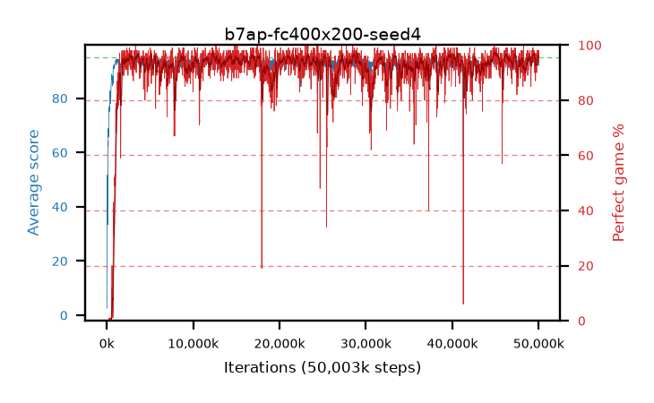

# b7ap-fc400x200-seed4

step **50,003,968** · 3052 evals · trailing **94.01** · peak **94.27** @45,154,304 · sef **95.2** · best30 **96.8** @45,154,304

## Config

| | |
|---|---|
| algo | ppo |
| collect_envs | 128 |
| discount | 0.99 |
| eval_interval | 16384 |
| eval_queue | True |
| eval_queue_depth | 16 |
| eval_workers | 8 |
| fc_layers | (400, 200) |
| graph_eval_episodes | 100 |
| max_steps | 50003968 |
| min_checkpoint_score | 40.0 |
| ppo_adam_epsilon | 1e-07 |
| ppo_clip | 0.2 |
| ppo_entropy_coef | 0.01 |
| ppo_entropy_coef_final | None |
| ppo_epochs | 4 |
| ppo_gae_lambda | 0.98 |
| ppo_gradient_clipping | 0.5 |
| ppo_horizon | 33.6 |
| ppo_learning_rate | 0.0003 |
| ppo_minibatch | 256 |
| ppo_normalize_adv | True |
| ppo_rollout | 128 |
| ppo_target_kl | 0.0 |
| ppo_transitions_per_rollout | 16384 |
| ppo_value_loss | huber |
| ppo_vf_coef | 0.5 |
| seed | 4 |
| torch_threads | 1 |

## Evals

| step | avg score | trailing avg | min score | max score | avg reward | perfect % | epsilon |
|---|---|---|---|---|---|---|---|
| 16384 | 2.61 | 2.61 | 0.0 | 13.0 | 1.435 | 0.0 |  |
| 32768 | 32.6 | 29.31 | 0.0 | 81.0 | 29.715 | 0.0 |  |
| 49152 | 32.89 | 17.75 | 1.0 | 63.0 | 28.205 | 0.0 |  |
| ... | ... | ... | ... | ... | ... | ... | ... |
| 49823744 | 94.51 | 93.99 | 54.0 | 95.0 | 191.475 | 98.0 |  |
| 49840128 | 94.28 | 94.04 | 56.0 | 95.0 | 188.26 | 95.0 |  |
| 49856512 | 94.67 | 94.01 | 76.0 | 95.0 | 189.69 | 96.0 |  |
| 49872896 | 94.66 | 94.04 | 73.0 | 95.0 | 191.67 | 98.0 |  |
| 49889280 | 93.23 | 94.03 | 12.0 | 95.0 | 187.21 | 95.0 |  |
| 49905664 | 94.1 | 94.03 | 60.0 | 95.0 | 189.12 | 96.0 |  |
| 49922048 | 94.17 | 94.07 | 68.0 | 95.0 | 188.195 | 95.0 |  |
| 49938432 | 94.49 | 94.1 | 68.0 | 95.0 | 191.455 | 98.0 |  |
| 49954816 | 94.54 | 94.1 | 72.0 | 95.0 | 189.515 | 96.0 |  |
| 49971200 | 92.07 | 94.01 | 3.0 | 95.0 | 185.1 | 94.0 |  |
| 49987584 | 94.87 | 94.03 | 86.0 | 95.0 | 191.88 | 98.0 |  |
| 50003968 | 94.02 | 94.01 | 60.0 | 95.0 | 186.055 | 93.0 |  |
