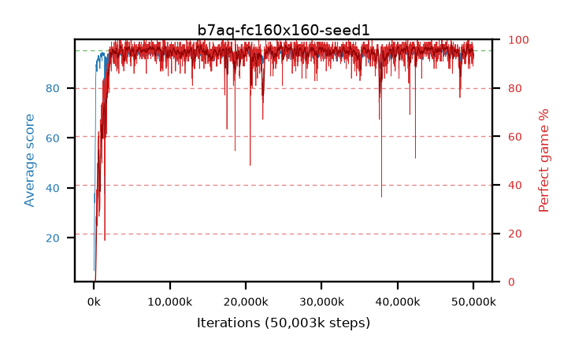

# b7aq-fc160x160-seed1

step **50,003,968** · 3052 evals · trailing **93.72** · peak **94.62** @45,727,744 · sef **95.7** · best30 **96.9** @24,707,072

## Config

| | |
|---|---|
| algo | ppo |
| collect_envs | 128 |
| discount | 0.99 |
| eval_interval | 16384 |
| eval_queue | True |
| eval_queue_depth | 16 |
| eval_workers | 8 |
| fc_layers | (160, 160) |
| graph_eval_episodes | 100 |
| max_steps | 50003968 |
| min_checkpoint_score | 40.0 |
| ppo_adam_epsilon | 1e-07 |
| ppo_clip | 0.2 |
| ppo_entropy_coef | 0.01 |
| ppo_entropy_coef_final | None |
| ppo_epochs | 4 |
| ppo_gae_lambda | 0.98 |
| ppo_gradient_clipping | 0.5 |
| ppo_horizon | 33.6 |
| ppo_learning_rate | 0.0003 |
| ppo_minibatch | 256 |
| ppo_normalize_adv | True |
| ppo_rollout | 128 |
| ppo_target_kl | 0.0 |
| ppo_transitions_per_rollout | 16384 |
| ppo_value_loss | huber |
| ppo_vf_coef | 0.5 |
| seed | 1 |
| torch_threads | 1 |

## Evals

| step | avg score | trailing avg | min score | max score | avg reward | perfect % | epsilon |
|---|---|---|---|---|---|---|---|
| 16384 | 6.84 | 6.84 | 0.0 | 20.0 | 2.695 | 0.0 |  |
| 32768 | 19.56 | 16.09 | 1.0 | 39.0 | 15.415 | 0.0 |  |
| 49152 | 21.86 | 14.35 | 7.0 | 40.0 | 16.86 | 0.0 |  |
| ... | ... | ... | ... | ... | ... | ... | ... |
| 49823744 | 93.77 | 94.14 | 15.0 | 95.0 | 189.785 | 97.0 |  |
| 49840128 | 93.89 | 94.12 | 1.0 | 95.0 | 189.905 | 97.0 |  |
| 49856512 | 94.16 | 94.13 | 19.0 | 95.0 | 191.125 | 98.0 |  |
| 49872896 | 94.46 | 93.88 | 78.0 | 95.0 | 187.31 | 94.0 |  |
| 49889280 | 92.85 | 93.99 | 8.0 | 95.0 | 188.82 | 97.0 |  |
| 49905664 | 90.71 | 93.59 | 4.0 | 95.0 | 178.72 | 89.0 |  |
| 49922048 | 93.24 | 93.55 | 13.0 | 95.0 | 187.22 | 95.0 |  |
| 49938432 | 92.61 | 93.47 | 8.0 | 95.0 | 183.65 | 92.0 |  |
| 49954816 | 92.47 | 93.45 | 4.0 | 95.0 | 183.33 | 92.0 |  |
| 49971200 | 91.79 | 93.38 | 8.0 | 95.0 | 182.83 | 92.0 |  |
| 49987584 | 93.84 | 93.88 | 49.0 | 95.0 | 186.825 | 94.0 |  |
| 50003968 | 92.67 | 93.72 | 15.0 | 95.0 | 184.66 | 93.0 |  |
