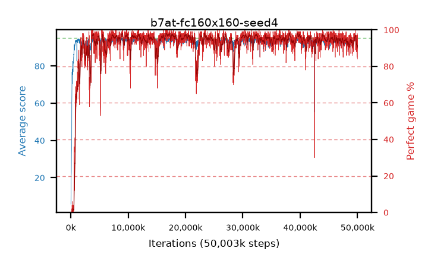

# b7at-fc160x160-seed4

step **50,003,968** · 3052 evals · trailing **93.44** · peak **94.49** @17,448,960 · sef **95.2** · best30 **97.5** @16,891,904

## Config

| | |
|---|---|
| algo | ppo |
| collect_envs | 128 |
| discount | 0.99 |
| eval_interval | 16384 |
| eval_queue | True |
| eval_queue_depth | 16 |
| eval_workers | 8 |
| fc_layers | (160, 160) |
| graph_eval_episodes | 100 |
| max_steps | 50003968 |
| min_checkpoint_score | 40.0 |
| ppo_adam_epsilon | 1e-07 |
| ppo_clip | 0.2 |
| ppo_entropy_coef | 0.01 |
| ppo_entropy_coef_final | None |
| ppo_epochs | 4 |
| ppo_gae_lambda | 0.98 |
| ppo_gradient_clipping | 0.5 |
| ppo_horizon | 33.6 |
| ppo_learning_rate | 0.0003 |
| ppo_minibatch | 256 |
| ppo_normalize_adv | True |
| ppo_rollout | 128 |
| ppo_target_kl | 0.0 |
| ppo_transitions_per_rollout | 16384 |
| ppo_value_loss | huber |
| ppo_vf_coef | 0.5 |
| seed | 4 |
| torch_threads | 1 |

## Evals

| step | avg score | trailing avg | min score | max score | avg reward | perfect % | epsilon |
|---|---|---|---|---|---|---|---|
| 16384 | 5.76 | 5.76 | 0.0 | 12.0 | 0.94 | 0.0 |  |
| 32768 | 14.84 | 10.3 | 0.0 | 26.0 | 10.155 | 0.0 |  |
| 49152 | 21.15 | 13.92 | 6.0 | 39.0 | 16.15 | 0.0 |  |
| ... | ... | ... | ... | ... | ... | ... | ... |
| 49823744 | 94.26 | 94.04 | 78.0 | 95.0 | 185.255 | 92.0 |  |
| 49840128 | 92.16 | 94.02 | 9.0 | 95.0 | 180.17 | 89.0 |  |
| 49856512 | 94.61 | 93.99 | 75.0 | 95.0 | 190.625 | 97.0 |  |
| 49872896 | 91.07 | 93.86 | 14.0 | 95.0 | 182.11 | 92.0 |  |
| 49889280 | 93.08 | 93.98 | 20.0 | 95.0 | 182.13 | 90.0 |  |
| 49905664 | 90.47 | 93.72 | 3.0 | 95.0 | 174.545 | 85.0 |  |
| 49922048 | 91.95 | 93.58 | 10.0 | 95.0 | 178.965 | 88.0 |  |
| 49938432 | 93.13 | 93.67 | 11.0 | 95.0 | 181.185 | 89.0 |  |
| 49954816 | 94.23 | 93.68 | 44.0 | 95.0 | 191.195 | 98.0 |  |
| 49971200 | 92.44 | 93.51 | 7.0 | 95.0 | 181.445 | 90.0 |  |
| 49987584 | 93.91 | 93.44 | 11.0 | 95.0 | 189.925 | 97.0 |  |
| 50003968 | 92.45 | 93.44 | 26.0 | 95.0 | 175.53 | 84.0 |  |
