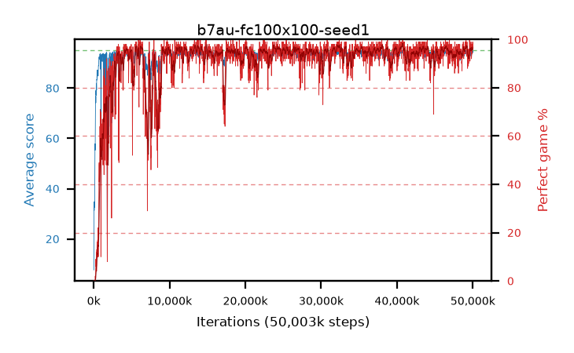

# b7au-fc100x100-seed1

step **50,003,968** · 3052 evals · trailing **94.03** · peak **94.36** @35,749,888 · sef **91.7** · best30 **97.2** @40,747,008

## Config

| | |
|---|---|
| algo | ppo |
| collect_envs | 128 |
| discount | 0.99 |
| eval_interval | 16384 |
| eval_queue | True |
| eval_queue_depth | 16 |
| eval_workers | 8 |
| fc_layers | (100, 100) |
| graph_eval_episodes | 100 |
| max_steps | 50003968 |
| min_checkpoint_score | 40.0 |
| ppo_adam_epsilon | 1e-07 |
| ppo_clip | 0.2 |
| ppo_entropy_coef | 0.01 |
| ppo_entropy_coef_final | None |
| ppo_epochs | 4 |
| ppo_gae_lambda | 0.98 |
| ppo_gradient_clipping | 0.5 |
| ppo_horizon | 33.6 |
| ppo_learning_rate | 0.0003 |
| ppo_minibatch | 256 |
| ppo_normalize_adv | True |
| ppo_rollout | 128 |
| ppo_target_kl | 0.0 |
| ppo_transitions_per_rollout | 16384 |
| ppo_value_loss | huber |
| ppo_vf_coef | 0.5 |
| seed | 1 |
| torch_threads | 1 |

## Evals

| step | avg score | trailing avg | min score | max score | avg reward | perfect % | epsilon |
|---|---|---|---|---|---|---|---|
| 16384 | 7.66 | 7.66 | 0.0 | 31.0 | 2.66 | 0.0 |  |
| 32768 | 26.87 | 27.93 | 1.0 | 70.0 | 22.545 | 0.0 |  |
| 49152 | 34.8 | 26.94 | 13.0 | 71.0 | 29.935 | 0.0 |  |
| ... | ... | ... | ... | ... | ... | ... | ... |
| 49823744 | 92.89 | 93.9 | 13.0 | 95.0 | 183.84 | 92.0 |  |
| 49840128 | 93.14 | 93.95 | 31.0 | 95.0 | 185.085 | 93.0 |  |
| 49856512 | 94.75 | 94.11 | 85.0 | 95.0 | 189.725 | 96.0 |  |
| 49872896 | 94.39 | 94.0 | 58.0 | 95.0 | 190.405 | 97.0 |  |
| 49889280 | 93.93 | 94.01 | 58.0 | 95.0 | 186.915 | 94.0 |  |
| 49905664 | 94.28 | 94.17 | 30.0 | 95.0 | 191.29 | 98.0 |  |
| 49922048 | 93.61 | 94.18 | 8.0 | 95.0 | 187.635 | 95.0 |  |
| 49938432 | 94.73 | 94.21 | 78.0 | 95.0 | 191.74 | 98.0 |  |
| 49954816 | 93.94 | 94.22 | 44.0 | 95.0 | 188.96 | 96.0 |  |
| 49971200 | 94.89 | 93.95 | 84.0 | 95.0 | 192.895 | 99.0 |  |
| 49987584 | 94.87 | 93.97 | 82.0 | 95.0 | 192.875 | 99.0 |  |
| 50003968 | 94.32 | 94.03 | 56.0 | 95.0 | 189.34 | 96.0 |  |
