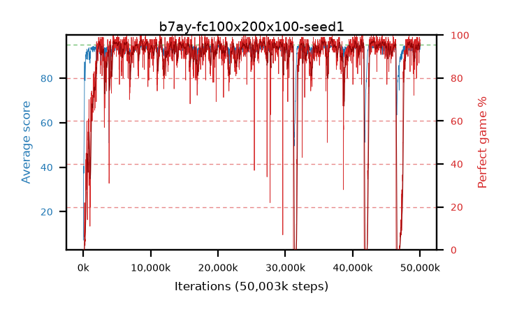

# b7ay-fc100x200x100-seed1

step **50,003,968** · 3052 evals · trailing **93.87** · peak **94.51** @35,667,968 · sef **89.4** · best30 **97.4** @36,962,304

## Config

| | |
|---|---|
| algo | ppo |
| collect_envs | 128 |
| discount | 0.99 |
| eval_interval | 16384 |
| eval_queue | True |
| eval_queue_depth | 16 |
| eval_workers | 8 |
| fc_layers | (100, 200, 100) |
| graph_eval_episodes | 100 |
| max_steps | 50003968 |
| min_checkpoint_score | 40.0 |
| ppo_adam_epsilon | 1e-07 |
| ppo_clip | 0.2 |
| ppo_entropy_coef | 0.01 |
| ppo_entropy_coef_final | None |
| ppo_epochs | 4 |
| ppo_gae_lambda | 0.98 |
| ppo_gradient_clipping | 0.5 |
| ppo_horizon | 33.6 |
| ppo_learning_rate | 0.0003 |
| ppo_minibatch | 256 |
| ppo_normalize_adv | True |
| ppo_rollout | 128 |
| ppo_target_kl | 0.0 |
| ppo_transitions_per_rollout | 16384 |
| ppo_value_loss | huber |
| ppo_vf_coef | 0.5 |
| seed | 1 |
| torch_threads | 1 |

## Evals

| step | avg score | trailing avg | min score | max score | avg reward | perfect % | epsilon |
|---|---|---|---|---|---|---|---|
| 16384 | 7.21 | 7.21 | 0.0 | 17.0 | 4.1 | 0.0 |  |
| 32768 | 22.63 | 26.24 | 2.0 | 52.0 | 19.115 | 0.0 |  |
| 49152 | 37.82 | 22.52 | 13.0 | 66.0 | 32.955 | 0.0 |  |
| ... | ... | ... | ... | ... | ... | ... | ... |
| 49823744 | 94.19 | 93.89 | 76.0 | 95.0 | 181.75 | 89.0 |  |
| 49840128 | 92.37 | 94.05 | 7.0 | 95.0 | 177.94 | 87.0 |  |
| 49856512 | 91.68 | 94.02 | 3.0 | 95.0 | 183.625 | 93.0 |  |
| 49872896 | 92.11 | 93.95 | 3.0 | 95.0 | 186.135 | 95.0 |  |
| 49889280 | 94.68 | 94.04 | 76.0 | 95.0 | 191.69 | 98.0 |  |
| 49905664 | 94.67 | 93.91 | 62.0 | 95.0 | 192.675 | 99.0 |  |
| 49922048 | 92.99 | 93.8 | 5.0 | 95.0 | 189.005 | 97.0 |  |
| 49938432 | 94.5 | 93.82 | 72.0 | 95.0 | 190.47 | 97.0 |  |
| 49954816 | 94.68 | 93.9 | 81.0 | 95.0 | 190.65 | 97.0 |  |
| 49971200 | 94.9 | 93.91 | 89.0 | 95.0 | 191.82 | 98.0 |  |
| 49987584 | 93.77 | 93.83 | 12.0 | 95.0 | 187.66 | 95.0 |  |
| 50003968 | 92.97 | 93.87 | 9.0 | 95.0 | 186.905 | 95.0 |  |
