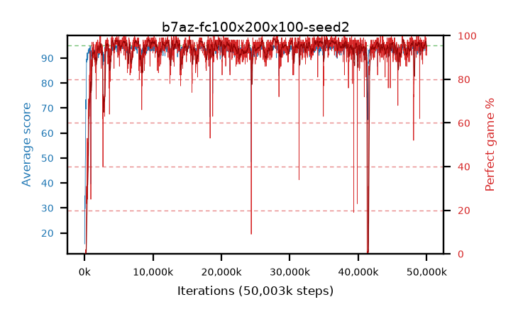

# b7az-fc100x200x100-seed2

step **50,003,968** · 3052 evals · trailing **94.18** · peak **94.51** @35,438,592 · sef **96.0** · best30 **97.9** @28,000,256

## Config

| | |
|---|---|
| algo | ppo |
| collect_envs | 128 |
| discount | 0.99 |
| eval_interval | 16384 |
| eval_queue | True |
| eval_queue_depth | 16 |
| eval_workers | 8 |
| fc_layers | (100, 200, 100) |
| graph_eval_episodes | 100 |
| max_steps | 50003968 |
| min_checkpoint_score | 40.0 |
| ppo_adam_epsilon | 1e-07 |
| ppo_clip | 0.2 |
| ppo_entropy_coef | 0.01 |
| ppo_entropy_coef_final | None |
| ppo_epochs | 4 |
| ppo_gae_lambda | 0.98 |
| ppo_gradient_clipping | 0.5 |
| ppo_horizon | 33.6 |
| ppo_learning_rate | 0.0003 |
| ppo_minibatch | 256 |
| ppo_normalize_adv | True |
| ppo_rollout | 128 |
| ppo_target_kl | 0.0 |
| ppo_transitions_per_rollout | 16384 |
| ppo_value_loss | huber |
| ppo_vf_coef | 0.5 |
| seed | 2 |
| torch_threads | 1 |

## Evals

| step | avg score | trailing avg | min score | max score | avg reward | perfect % | epsilon |
|---|---|---|---|---|---|---|---|
| 16384 | 15.6 | 29.91 | 1.0 | 27.0 | 10.825 | 0.0 |  |
| 32768 | 34.92 | 31.93 | 12.0 | 59.0 | 29.92 | 0.0 |  |
| 49152 | 32.25 | 32.25 | 12.0 | 54.0 | 27.25 | 0.0 |  |
| ... | ... | ... | ... | ... | ... | ... | ... |
| 49823744 | 94.05 | 94.01 | 30.0 | 95.0 | 187.985 | 95.0 |  |
| 49840128 | 94.47 | 94.08 | 69.0 | 95.0 | 190.44 | 97.0 |  |
| 49856512 | 94.06 | 94.21 | 1.0 | 95.0 | 192.065 | 99.0 |  |
| 49872896 | 93.72 | 94.11 | 3.0 | 95.0 | 188.605 | 96.0 |  |
| 49889280 | 93.77 | 94.07 | 65.0 | 95.0 | 183.455 | 91.0 |  |
| 49905664 | 94.89 | 94.21 | 84.0 | 95.0 | 192.85 | 99.0 |  |
| 49922048 | 93.66 | 94.22 | 3.0 | 95.0 | 188.635 | 96.0 |  |
| 49938432 | 94.45 | 94.2 | 68.0 | 95.0 | 188.34 | 95.0 |  |
| 49954816 | 94.17 | 94.14 | 60.0 | 95.0 | 186.025 | 93.0 |  |
| 49971200 | 94.39 | 94.23 | 66.0 | 95.0 | 187.24 | 94.0 |  |
| 49987584 | 94.45 | 94.22 | 76.0 | 95.0 | 188.385 | 95.0 |  |
| 50003968 | 93.83 | 94.18 | 73.0 | 95.0 | 183.695 | 91.0 |  |
