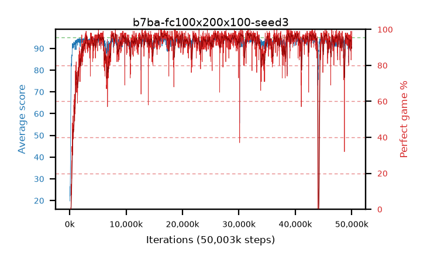

# b7ba-fc100x200x100-seed3

step **50,003,968** · 3052 evals · trailing **91.97** · peak **94.44** @26,132,480 · sef **93.5** · best30 **97.0** @17,186,816

## Config

| | |
|---|---|
| algo | ppo |
| collect_envs | 128 |
| discount | 0.99 |
| eval_interval | 16384 |
| eval_queue | True |
| eval_queue_depth | 16 |
| eval_workers | 8 |
| fc_layers | (100, 200, 100) |
| graph_eval_episodes | 100 |
| max_steps | 50003968 |
| min_checkpoint_score | 40.0 |
| ppo_adam_epsilon | 1e-07 |
| ppo_clip | 0.2 |
| ppo_entropy_coef | 0.01 |
| ppo_entropy_coef_final | None |
| ppo_epochs | 4 |
| ppo_gae_lambda | 0.98 |
| ppo_gradient_clipping | 0.5 |
| ppo_horizon | 33.6 |
| ppo_learning_rate | 0.0003 |
| ppo_minibatch | 256 |
| ppo_normalize_adv | True |
| ppo_rollout | 128 |
| ppo_target_kl | 0.0 |
| ppo_transitions_per_rollout | 16384 |
| ppo_value_loss | huber |
| ppo_vf_coef | 0.5 |
| seed | 3 |
| torch_threads | 1 |

## Evals

| step | avg score | trailing avg | min score | max score | avg reward | perfect % | epsilon |
|---|---|---|---|---|---|---|---|
| 16384 | 19.75 | 19.75 | 5.0 | 43.0 | 14.885 | 0.0 |  |
| 32768 | 26.5 | 23.12 | 1.0 | 52.0 | 21.635 | 0.0 |  |
| 49152 | 23.64 | 23.3 | 11.0 | 46.0 | 18.685 | 0.0 |  |
| ... | ... | ... | ... | ... | ... | ... | ... |
| 49823744 | 93.72 | 92.01 | 69.0 | 95.0 | 180.78 | 88.0 |  |
| 49840128 | 93.12 | 92.75 | 3.0 | 95.0 | 184.115 | 92.0 |  |
| 49856512 | 93.73 | 91.69 | 77.0 | 95.0 | 182.78 | 90.0 |  |
| 49872896 | 93.03 | 91.73 | 74.0 | 95.0 | 175.115 | 83.0 |  |
| 49889280 | 92.72 | 91.99 | 72.0 | 95.0 | 174.805 | 83.0 |  |
| 49905664 | 92.57 | 92.52 | 1.0 | 95.0 | 175.65 | 84.0 |  |
| 49922048 | 93.67 | 92.01 | 56.0 | 95.0 | 183.67 | 91.0 |  |
| 49938432 | 93.82 | 92.32 | 11.0 | 95.0 | 187.845 | 95.0 |  |
| 49954816 | 94.41 | 92.84 | 75.0 | 95.0 | 189.43 | 96.0 |  |
| 49971200 | 92.72 | 92.79 | 9.0 | 95.0 | 182.72 | 91.0 |  |
| 49987584 | 94.12 | 92.02 | 7.0 | 95.0 | 192.125 | 99.0 |  |
| 50003968 | 91.54 | 91.97 | 9.0 | 95.0 | 185.565 | 95.0 |  |
