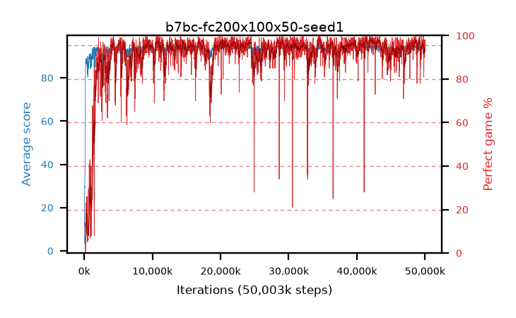

# b7bc-fc200x100x50-seed1

step **50,003,968** · 3052 evals · trailing **93.55** · peak **94.51** @39,649,280 · sef **93.2** · best30 **97.8** @42,303,488

## Config

| | |
|---|---|
| algo | ppo |
| collect_envs | 128 |
| discount | 0.99 |
| eval_interval | 16384 |
| eval_queue | True |
| eval_queue_depth | 16 |
| eval_workers | 8 |
| fc_layers | (200, 100, 50) |
| graph_eval_episodes | 100 |
| max_steps | 50003968 |
| min_checkpoint_score | 40.0 |
| ppo_adam_epsilon | 1e-07 |
| ppo_clip | 0.2 |
| ppo_entropy_coef | 0.01 |
| ppo_entropy_coef_final | None |
| ppo_epochs | 4 |
| ppo_gae_lambda | 0.98 |
| ppo_gradient_clipping | 0.5 |
| ppo_horizon | 33.6 |
| ppo_learning_rate | 0.0003 |
| ppo_minibatch | 256 |
| ppo_normalize_adv | True |
| ppo_rollout | 128 |
| ppo_target_kl | 0.0 |
| ppo_transitions_per_rollout | 16384 |
| ppo_value_loss | huber |
| ppo_vf_coef | 0.5 |
| seed | 1 |
| torch_threads | 1 |

## Evals

| step | avg score | trailing avg | min score | max score | avg reward | perfect % | epsilon |
|---|---|---|---|---|---|---|---|
| 16384 | 3.87 | 3.87 | 0.0 | 19.0 | 3.145 | 0.0 |  |
| 32768 | 3.57 | 3.72 | 0.0 | 15.0 | 2.935 | 0.0 |  |
| 49152 | 24.08 | 10.51 | 0.0 | 43.0 | 19.26 | 0.0 |  |
| ... | ... | ... | ... | ... | ... | ... | ... |
| 49823744 | 89.89 | 93.65 | 14.0 | 95.0 | 169.31 | 81.0 |  |
| 49840128 | 93.3 | 93.51 | 33.0 | 95.0 | 182.985 | 91.0 |  |
| 49856512 | 91.5 | 93.67 | 8.0 | 95.0 | 180.325 | 90.0 |  |
| 49872896 | 92.1 | 93.63 | 22.0 | 95.0 | 181.965 | 91.0 |  |
| 49889280 | 94.66 | 93.51 | 79.0 | 95.0 | 190.54 | 97.0 |  |
| 49905664 | 92.32 | 93.73 | 20.0 | 95.0 | 181.1 | 90.0 |  |
| 49922048 | 94.29 | 93.58 | 66.0 | 95.0 | 187.32 | 94.0 |  |
| 49938432 | 94.89 | 93.61 | 86.0 | 95.0 | 191.9 | 98.0 |  |
| 49954816 | 93.39 | 93.53 | 26.0 | 95.0 | 186.42 | 94.0 |  |
| 49971200 | 94.02 | 93.61 | 21.0 | 95.0 | 191.03 | 98.0 |  |
| 49987584 | 94.6 | 93.55 | 78.0 | 95.0 | 188.625 | 95.0 |  |
| 50003968 | 92.75 | 93.55 | 6.0 | 95.0 | 184.785 | 93.0 |  |
