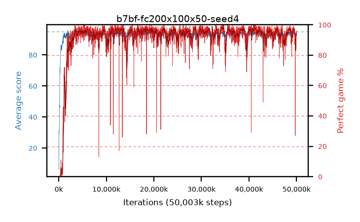

# b7bf-fc200x100x50-seed4

step **50,003,968** · 3052 evals · trailing **93.38** · peak **94.55** @41,369,600 · sef **94.6** · best30 **98.0** @34,635,776

## Config

| | |
|---|---|
| algo | ppo |
| collect_envs | 128 |
| discount | 0.99 |
| eval_interval | 16384 |
| eval_queue | True |
| eval_queue_depth | 16 |
| eval_workers | 8 |
| fc_layers | (200, 100, 50) |
| graph_eval_episodes | 100 |
| max_steps | 50003968 |
| min_checkpoint_score | 40.0 |
| ppo_adam_epsilon | 1e-07 |
| ppo_clip | 0.2 |
| ppo_entropy_coef | 0.01 |
| ppo_entropy_coef_final | None |
| ppo_epochs | 4 |
| ppo_gae_lambda | 0.98 |
| ppo_gradient_clipping | 0.5 |
| ppo_horizon | 33.6 |
| ppo_learning_rate | 0.0003 |
| ppo_minibatch | 256 |
| ppo_normalize_adv | True |
| ppo_rollout | 128 |
| ppo_target_kl | 0.0 |
| ppo_transitions_per_rollout | 16384 |
| ppo_value_loss | huber |
| ppo_vf_coef | 0.5 |
| seed | 4 |
| torch_threads | 1 |

## Evals

| step | avg score | trailing avg | min score | max score | avg reward | perfect % | epsilon |
|---|---|---|---|---|---|---|---|
| 16384 | 6.04 | 6.04 | 0.0 | 21.0 | 3.785 | 0.0 |  |
| 32768 | 31.44 | 23.91 | 2.0 | 57.0 | 26.44 | 0.0 |  |
| 49152 | 28.84 | 17.44 | 6.0 | 56.0 | 23.885 | 0.0 |  |
| ... | ... | ... | ... | ... | ... | ... | ... |
| 49823744 | 94.11 | 93.79 | 78.0 | 95.0 | 184.065 | 91.0 |  |
| 49840128 | 93.31 | 93.69 | 12.0 | 95.0 | 182.36 | 90.0 |  |
| 49856512 | 94.26 | 93.67 | 81.0 | 95.0 | 184.26 | 91.0 |  |
| 49872896 | 93.66 | 93.63 | 18.0 | 95.0 | 185.65 | 93.0 |  |
| 49889280 | 93.69 | 93.5 | 31.0 | 95.0 | 187.67 | 95.0 |  |
| 49905664 | 92.97 | 93.51 | 9.0 | 95.0 | 184.915 | 93.0 |  |
| 49922048 | 94.03 | 93.51 | 56.0 | 95.0 | 188.96 | 96.0 |  |
| 49938432 | 94.5 | 93.5 | 74.0 | 95.0 | 189.475 | 96.0 |  |
| 49954816 | 92.73 | 93.44 | 1.0 | 95.0 | 187.75 | 96.0 |  |
| 49971200 | 92.97 | 93.39 | 3.0 | 95.0 | 187.945 | 96.0 |  |
| 49987584 | 93.39 | 93.4 | 1.0 | 95.0 | 186.42 | 94.0 |  |
| 50003968 | 93.96 | 93.38 | 67.0 | 95.0 | 185.95 | 93.0 |  |
