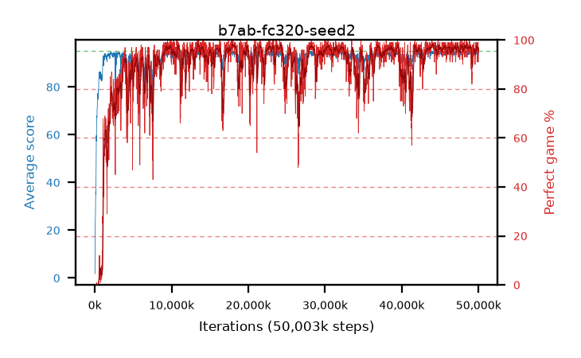

# b7ab-fc320-seed2

step **50,003,968** · 3052 evals · trailing **94.29** · peak **94.48** @48,611,328 · sef **87.8** · best30 **97.8** @18,251,776

## Config

| | |
|---|---|
| algo | ppo |
| collect_envs | 128 |
| discount | 0.99 |
| eval_interval | 16384 |
| eval_queue | True |
| eval_queue_depth | 16 |
| eval_workers | 8 |
| fc_layers | (320,) |
| graph_eval_episodes | 100 |
| max_steps | 50003968 |
| min_checkpoint_score | 40.0 |
| ppo_adam_epsilon | 1e-07 |
| ppo_clip | 0.2 |
| ppo_entropy_coef | 0.01 |
| ppo_entropy_coef_final | None |
| ppo_epochs | 4 |
| ppo_gae_lambda | 0.98 |
| ppo_gradient_clipping | 0.5 |
| ppo_horizon | 33.6 |
| ppo_learning_rate | 0.0003 |
| ppo_minibatch | 256 |
| ppo_normalize_adv | True |
| ppo_rollout | 128 |
| ppo_target_kl | 0.0 |
| ppo_transitions_per_rollout | 16384 |
| ppo_value_loss | huber |
| ppo_vf_coef | 0.5 |
| seed | 2 |
| torch_threads | 1 |

## Evals

| step | avg score | trailing avg | min score | max score | avg reward | perfect % | epsilon |
|---|---|---|---|---|---|---|---|
| 16384 | 1.78 | 1.78 | 0.0 | 5.0 | -0.79 | 0.0 |  |
| 32768 | 16.48 | 16.32 | 4.0 | 35.0 | 11.84 | 0.0 |  |
| 49152 | 22.58 | 12.18 | 6.0 | 42.0 | 17.58 | 0.0 |  |
| ... | ... | ... | ... | ... | ... | ... | ... |
| 49823744 | 94.85 | 94.29 | 80.0 | 95.0 | 192.855 | 99.0 |  |
| 49840128 | 94.68 | 94.2 | 68.0 | 95.0 | 191.69 | 98.0 |  |
| 49856512 | 94.58 | 94.21 | 80.0 | 95.0 | 190.595 | 97.0 |  |
| 49872896 | 94.14 | 94.29 | 61.0 | 95.0 | 189.16 | 96.0 |  |
| 49889280 | 94.7 | 94.23 | 75.0 | 95.0 | 190.715 | 97.0 |  |
| 49905664 | 94.29 | 94.26 | 66.0 | 95.0 | 189.31 | 96.0 |  |
| 49922048 | 93.86 | 94.27 | 18.0 | 95.0 | 186.89 | 94.0 |  |
| 49938432 | 94.72 | 94.28 | 67.0 | 95.0 | 192.725 | 99.0 |  |
| 49954816 | 93.54 | 94.26 | 62.0 | 95.0 | 183.585 | 91.0 |  |
| 49971200 | 94.07 | 94.25 | 32.0 | 95.0 | 188.095 | 95.0 |  |
| 49987584 | 94.54 | 94.29 | 65.0 | 95.0 | 189.56 | 96.0 |  |
| 50003968 | 94.51 | 94.29 | 66.0 | 95.0 | 190.525 | 97.0 |  |
