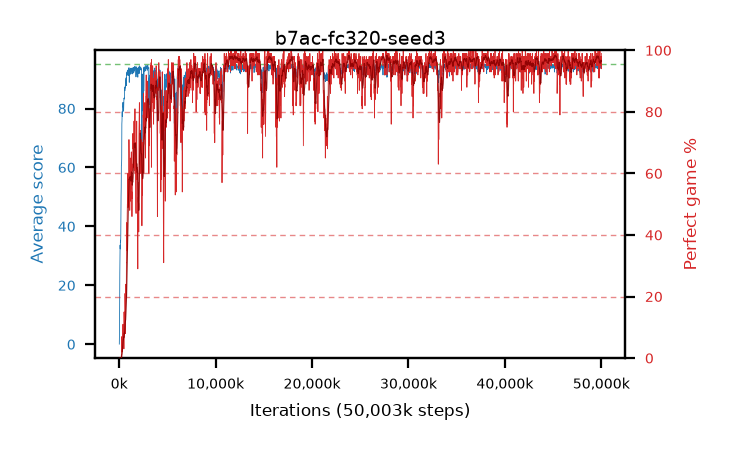

# b7ac-fc320-seed3

step **50,003,968** · 3052 evals · trailing **94.33** · peak **94.45** @38,092,800 · sef **90.0** · best30 **97.7** @11,960,320

## Config

| | |
|---|---|
| algo | ppo |
| collect_envs | 128 |
| discount | 0.99 |
| eval_interval | 16384 |
| eval_queue | True |
| eval_queue_depth | 16 |
| eval_workers | 8 |
| fc_layers | (320,) |
| graph_eval_episodes | 100 |
| max_steps | 50003968 |
| min_checkpoint_score | 40.0 |
| ppo_adam_epsilon | 1e-07 |
| ppo_clip | 0.2 |
| ppo_entropy_coef | 0.01 |
| ppo_entropy_coef_final | None |
| ppo_epochs | 4 |
| ppo_gae_lambda | 0.98 |
| ppo_gradient_clipping | 0.5 |
| ppo_horizon | 33.6 |
| ppo_learning_rate | 0.0003 |
| ppo_minibatch | 256 |
| ppo_normalize_adv | True |
| ppo_rollout | 128 |
| ppo_target_kl | 0.0 |
| ppo_transitions_per_rollout | 16384 |
| ppo_value_loss | huber |
| ppo_vf_coef | 0.5 |
| seed | 3 |
| torch_threads | 1 |

## Evals

| step | avg score | trailing avg | min score | max score | avg reward | perfect % | epsilon |
|---|---|---|---|---|---|---|---|
| 16384 | 0.04 | 0.04 | 0.0 | 1.0 | -4.195 | 0.0 |  |
| 32768 | 3.75 | 1.9 | 0.0 | 13.0 | 2.35 | 0.0 |  |
| 49152 | 18.5 | 11.59 | 0.0 | 42.0 | 14.13 | 0.0 |  |
| ... | ... | ... | ... | ... | ... | ... | ... |
| 49823744 | 94.34 | 94.36 | 57.0 | 95.0 | 191.35 | 98.0 |  |
| 49840128 | 94.78 | 94.35 | 83.0 | 95.0 | 191.79 | 98.0 |  |
| 49856512 | 95.0 | 94.32 | 95.0 | 95.0 | 194.0 | 100.0 |  |
| 49872896 | 94.07 | 94.29 | 58.0 | 95.0 | 188.095 | 95.0 |  |
| 49889280 | 94.46 | 94.33 | 69.0 | 95.0 | 189.48 | 96.0 |  |
| 49905664 | 93.69 | 94.33 | 24.0 | 95.0 | 188.62 | 96.0 |  |
| 49922048 | 93.79 | 94.33 | 53.0 | 95.0 | 187.815 | 95.0 |  |
| 49938432 | 94.19 | 94.3 | 57.0 | 95.0 | 189.165 | 96.0 |  |
| 49954816 | 93.83 | 94.33 | 56.0 | 95.0 | 188.85 | 96.0 |  |
| 49971200 | 94.37 | 94.32 | 63.0 | 95.0 | 191.38 | 98.0 |  |
| 49987584 | 93.85 | 94.29 | 57.0 | 95.0 | 186.88 | 94.0 |  |
| 50003968 | 94.66 | 94.33 | 61.0 | 95.0 | 192.665 | 99.0 |  |
