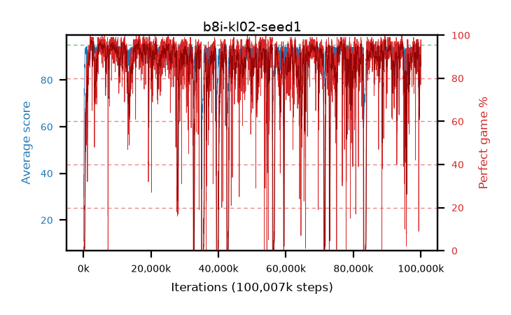

# b8i-kl02-seed1

step **100,007,936** · 6104 evals · trailing **92.89** · peak **94.38** @68,009,984 · sef **80.4** · best30 **97.2** @2,473,984

## Config

| | |
|---|---|
| algo | ppo |
| collect_envs | 128 |
| discount | 0.99 |
| eval_interval | 16384 |
| eval_queue | True |
| eval_queue_depth | 16 |
| eval_workers | 8 |
| fc_layers | (200, 100) |
| graph_eval_episodes | 100 |
| max_steps | 100007936 |
| min_checkpoint_score | 40.0 |
| ppo_adam_epsilon | 1e-07 |
| ppo_clip | 0.2 |
| ppo_entropy_coef | 0.01 |
| ppo_entropy_coef_final | None |
| ppo_epochs | 8 |
| ppo_gae_lambda | 0.98 |
| ppo_gradient_clipping | 0.5 |
| ppo_horizon | 33.6 |
| ppo_learning_rate | 0.0003 |
| ppo_minibatch | 256 |
| ppo_normalize_adv | True |
| ppo_rollout | 128 |
| ppo_target_kl | 0.02 |
| ppo_transitions_per_rollout | 16384 |
| ppo_value_loss | huber |
| ppo_vf_coef | 0.5 |
| seed | 1 |
| torch_threads | 1 |

## Evals

| step | avg score | trailing avg | min score | max score | avg reward | perfect % | epsilon |
|---|---|---|---|---|---|---|---|
| 16384 | 11.07 | 11.07 | 3.0 | 21.0 | 6.52 | 0.0 |  |
| 32768 | 39.46 | 27.98 | 1.0 | 77.0 | 34.64 | 0.0 |  |
| 49152 | 33.4 | 22.23 | 7.0 | 53.0 | 28.4 | 0.0 |  |
| ... | ... | ... | ... | ... | ... | ... | ... |
| 99827712 | 88.48 | 92.77 | 9.0 | 95.0 | 165.64 | 79.0 |  |
| 99844096 | 91.02 | 92.7 | 18.0 | 95.0 | 174.465 | 85.0 |  |
| 99860480 | 92.78 | 91.86 | 37.0 | 95.0 | 182.465 | 91.0 |  |
| 99876864 | 92.37 | 91.82 | 36.0 | 95.0 | 176.81 | 86.0 |  |
| 99893248 | 92.89 | 92.62 | 51.0 | 95.0 | 174.21 | 83.0 |  |
| 99909632 | 92.11 | 92.48 | 59.0 | 95.0 | 171.35 | 81.0 |  |
| 99926016 | 91.97 | 92.9 | 39.0 | 95.0 | 167.05 | 77.0 |  |
| 99942400 | 92.83 | 92.74 | 32.0 | 95.0 | 179.35 | 88.0 |  |
| 99958784 | 94.83 | 92.43 | 84.0 | 95.0 | 191.75 | 98.0 |  |
| 99975168 | 93.81 | 92.23 | 52.0 | 95.0 | 183.45 | 91.0 |  |
| 99991552 | 92.91 | 92.95 | 34.0 | 95.0 | 179.43 | 88.0 |  |
| 100007936 | 94.41 | 92.89 | 84.0 | 95.0 | 184.05 | 91.0 |  |
